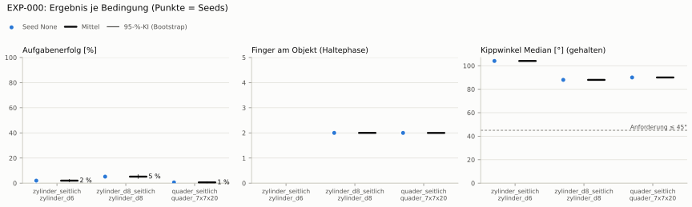
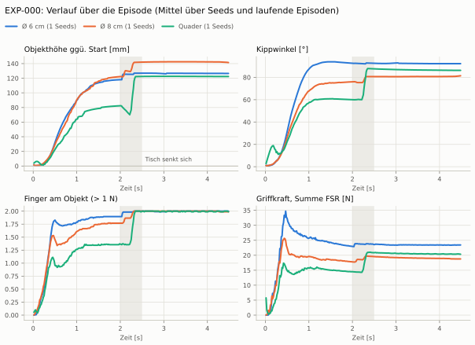
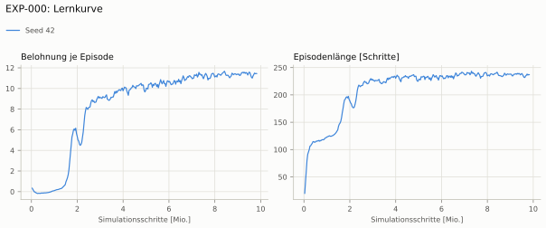
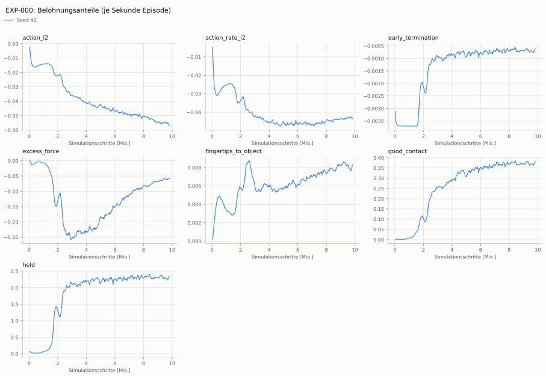
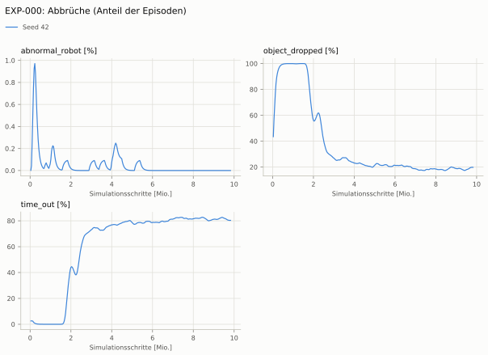
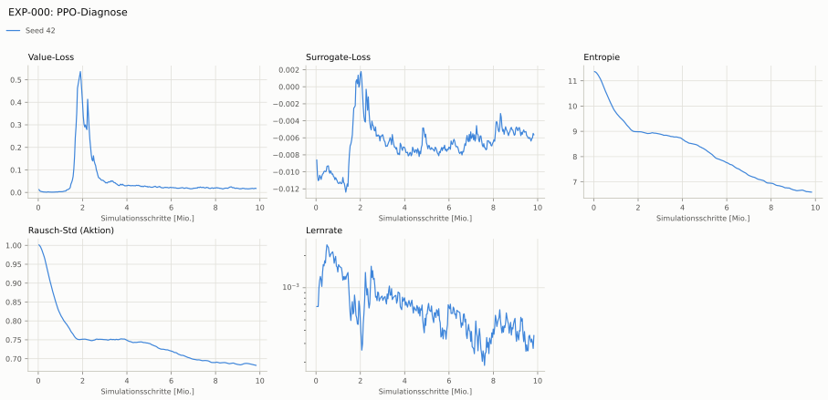

# EXP-000: Probelauf Dexsuite-Muster (Ausgangswert)

> **Nachtrag 2026-10-09 (ADR-021/022):** Bewertet unter eval-v1: beim Reset steckte die Hand in bis zu 81 % der Starts im Objekt (ADR-021) — besonders Quader-Werte und der Abstand zu den Regel-Baselines sind verzerrt.

> **Nachtrag 2026-10-09 (ADR-021/022):** Der Annäherungsterm maß bis EXP-018 alle Handkörper (Unterarmansatz) statt der Fingerspitzen und wäre auch korrigiert für 3–4 cm Fingerweg zu flach: ein Signal fürs Zugreifen fehlte, Seeds scheiterten deshalb am Entdecken des Griffs (ADR-022).

> **Nachtrag 2026-10-09 (ADR-021/022):** Aktionen unbegrenzt (rsl_rl ohne NVIDIAs bounds_loss): Aktionsstrafen und Leitplanke Unruhe messen großteils Rauschen und Überziehen jenseits der Servo-Sättigung, nicht Bewegung (ADR-022).

**Leistung** – (kein erfolgreicher Seed)

**Zuverlässigkeit** 0/1 Seeds erfolgreich [0–98 %]

**Leitplanken** – (keine Eltern)

**Befund** ohne Erfolg: Seed None (hält, aber gekippt)

**Urteilsvorschlag** (auswertung-v2): **Ausgangswert**

Ergebnisse je Bedingung (eval-v1, Leitplanken, Fehlerarten, Fingernutzung)

Bedingung `zylinder_seitlich` (Objekt `zylinder_d6`, Kippwinkel ≤ 20°), Protokoll eval-v1, 1 Seed(s); Spalte Eltern unter derselben Anforderung

| Metrik | Mittel | 95-%-KI | IQM | Fehlschlag-Seeds (< 50 %) | Eltern (Mittel / IQM) |
|---|---|---|---|---|---|
| aufgabenerfolg | 0.0 % | 0.0 % – 0.0 % | 0.0 % | 100.0 % | – |
| haltequote | 86.1 % | 83.9 % – 88.2 % | 86.1 % | 0.0 % | – |
| Kippwinkel Median [°] | 104 | | | | – |
| Unterarm Median [°] | 90 | | | | – |
| Griffkraft Mittel [N] | 23.9 | | | | – |
| Kraft > 15 N [Anteil] | 9.3 % | | | | – |
| Stall-Anteil [Anteil] | 99.6 % | | | | – |
| Absinken [mm] | 0 | | | | – |
| Unruhe | 0.244 | | | | – |
| Unruhe wirksam (Aktion auf ±1 begrenzt) | – | | | | – |

Fehlerarten: startfehler 1.9 %, gefallen 12.1 %, instabil 0.0 %, anforderung_verletzt 86.1 %

**Urteilsvorschlag: kein Vergleich (keine Eltern-Bewertung mit gleichem Protokoll)**

Je Seed: 0.0 %

Trainingsverlauf

Seeds dünn, Mittel kräftig, Eltern gestrichelt (nur Abbrüche/PPO — Trainings-Belohnung ist zwischen Experimenten nicht vergleichbar); geglättet, x = Simulationsschritte. Endwerte = Mittel der letzten 10 Iterationen (Belohnungsanteile je Sekunde Episode).

| Größe | Seed 42 | Mittel |
|---|---|---|
| mean_reward | 11.3 | 11.3 |
| action_l2 | -0.0562 | -0.0562 |
| action_rate_l2 | -0.043 | -0.043 |
| early_termination | -0.000681 | -0.000681 |
| excess_force | -0.0595 | -0.0595 |
| fingertips_to_object | 0.00796 | 0.00796 |
| good_contact | 0.374 | 0.374 |
| held | 2.3 | 2.3 |
| object_dropped | 19.6 % | 19.6 % |
| mean_noise_std | 0.683 | 0.683 |

Videos aller Seeds

16 Umgebungen, eine Episode (nicht im Git, Hugging Face).

| Objekt | Seed 0 |
|---|---|
| `quader_7x7x20` | [▶](videos/EXP-000_quader_7x7x20_s0.mp4) |
| `zylinder_d6` | [▶](videos/EXP-000_zylinder_d6_s0.mp4) |
| `zylinder_d8` | [▶](videos/EXP-000_zylinder_d8_s0.mp4) |

Netz, Training und Konfiguration

Actor [256, 128, 64] (elu), 68808 Parameter, 105 Eingänge (Verlauf 5) · Critic [512, 256, 128] · PPO: Lernrate 0.001, Entropie 0.005, 5 Epochen × 4 Mini-Batches, 32 Schritte/Umgebung · 1024 Umgebungen × 300 Iterationen

