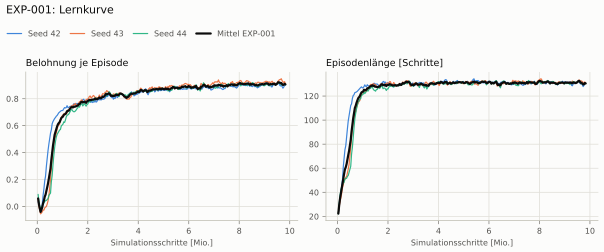
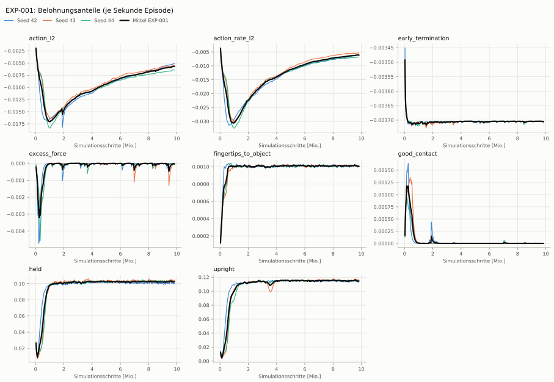
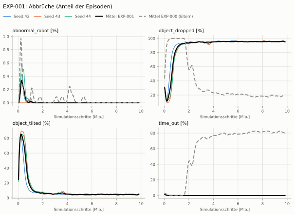
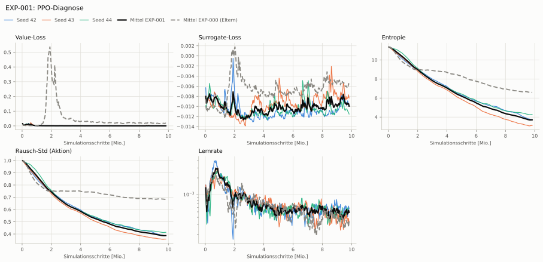

# EXP-001: Kippabbruch + Aufrecht-Belohnung

Bedingung `zylinder_seitlich` (Objekt `zylinder_d6`, Kippwinkel ≤ 20°), Protokoll eval-v1, 3 Seed(s); Spalte EXP-000 unter derselben Anforderung

| Metrik | Mittel | 95-%-KI | IQM | Fehlschlag-Seeds (< 50 %) | EXP-000 (Mittel / IQM) |
|---|---|---|---|---|---|
| aufgabenerfolg | 0.0 % | 0.0 % – 0.0 % | 0.0 % | 100.0 % | 0.0 % / 0.0 % |
| haltequote | 0.0 % | 0.0 % – 0.0 % | 0.0 % | 100.0 % | 86.1 % / 86.1 % |
| Kippwinkel Median [°] | – | | | | 104 |
| Unterarm Median [°] | – | | | | 90 |
| Griffkraft Mittel [N] | – | | | | 23.9 |
| Kraft > 15 N [Anteil] | – | | | | 9.3 % |
| Stall-Anteil [Anteil] | – | | | | 99.6 % |
| Absinken [mm] | – | | | | 0 |
| Unruhe | – | | | | 0.244 |

Fehlerarten: startfehler 1.8 %, gefallen 98.2 %, instabil 0.0 %, anforderung_verletzt 0.0 %

**Urteilsvorschlag: kein messbarer Unterschied (vorläufig: < 3 Seeds)** (gegenüber EXP-000)
Unterschied Aufgabenerfolg +0.0 Prozentpunkte (95-%-KI +0.0 … +0.0)

Je Seed: 0.0 %, 0.0 %, 0.0 %

## Trainingsverlauf

Seeds dünn, Mittel kräftig, Eltern gestrichelt (nur Abbrüche/PPO — Trainings-Belohnung ist zwischen Experimenten nicht vergleichbar); geglättet, x = Simulationsschritte. Endwerte = Mittel der letzten 10 Iterationen (Belohnungsanteile je Sekunde Episode).

| Größe | Seed 42 | Seed 43 | Seed 44 | Mittel |
|---|---|---|---|---|
| mean_reward | 0.897 | 0.93 | 0.905 | 0.911 |
| action_l2 | -0.00517 | -0.00553 | -0.00645 | -0.00572 |
| action_rate_l2 | -0.00612 | -0.00544 | -0.00688 | -0.00615 |
| early_termination | -0.0037 | -0.0037 | -0.00371 | -0.0037 |
| excess_force | -1.98e-05 | -6.15e-06 | -2.57e-05 | -1.72e-05 |
| fingertips_to_object | 0.001 | 0.00101 | 0.00101 | 0.00101 |
| good_contact | 0 | 0 | 0 | 0 |
| held | 0.1 | 0.104 | 0.103 | 0.102 |
| upright | 0.113 | 0.117 | 0.114 | 0.115 |
| object_dropped | 95.1 % | 96.1 % | 95.1 % | 95.5 % |
| mean_noise_std | 0.387 | 0.358 | 0.413 | 0.386 |

## Netz und Training

Actor [256, 128, 64] (elu), 68808 Parameter, 105 Eingänge (Verlauf 5) · Critic [512, 256, 128] · PPO: Lernrate 0.001, Entropie 0.005, 5 Epochen × 4 Mini-Batches, 32 Schritte/Umgebung · 1024 Umgebungen × 300 Iterationen

## Konfiguration gegenüber EXP-000 (15 Unterschiede)

Geplante Änderung: Abbruch object_tilted (> 20°), Belohnung upright (Gewicht 2, ab dem Absenken), Objektorientierung im Critic

- `env.observations.critic.object_quat.clip: ∅ → None`
- `env.observations.critic.object_quat.flatten_history_dim: ∅ → True`
- `env.observations.critic.object_quat.func: ∅ → pib_grasp.mdp:object_quat_in_root`
- `env.observations.critic.object_quat.history_length: ∅ → 0`
- `env.observations.critic.object_quat.modifiers: ∅ → None`
- `env.observations.critic.object_quat.noise: ∅ → None`
- `env.observations.critic.object_quat.scale: ∅ → None`
- `env.rewards.early_termination.params.term_keys: ['object_dropped', 'abnormal_robot'] → ['object_dropped', 'object_tilted', 'abnormal_robot']`
- `env.rewards.upright.func: ∅ → pib_grasp.mdp:object_upright`
- `env.rewards.upright.params.drop_start_s: ∅ → 2.0`
- `env.rewards.upright.params.std: ∅ → 0.2`
- `env.rewards.upright.weight: ∅ → 2.0`
- `env.terminations.object_tilted.func: ∅ → pib_grasp.mdp:object_tilted`
- `env.terminations.object_tilted.params.max_tilt_deg: ∅ → 20.0`
- `env.terminations.object_tilted.time_out: ∅ → False`
