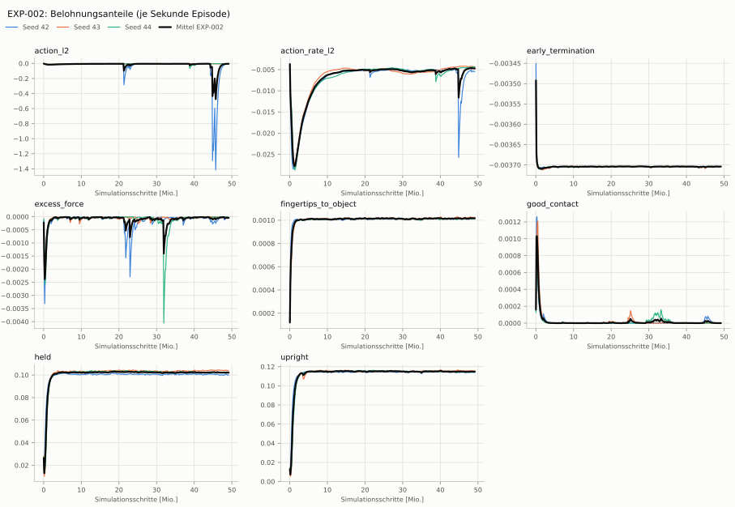

# EXP-002: Langer Lauf (Lift-Rezept: 1500 Iterationen)

Bedingung `zylinder_seitlich` (Objekt `zylinder_d6`, Kippwinkel ≤ 20°), Protokoll eval-v1, 3 Seed(s); Spalte EXP-001 unter derselben Anforderung

| Metrik | Mittel | 95-%-KI | IQM | Fehlschlag-Seeds (< 50 %) | EXP-001 (Mittel / IQM) |
|---|---|---|---|---|---|
| aufgabenerfolg | 0.0 % | 0.0 % – 0.0 % | 0.0 % | 100.0 % | 0.0 % / 0.0 % |
| haltequote | 0.0 % | 0.0 % – 0.0 % | 0.0 % | 100.0 % | 0.0 % / 0.0 % |
| Kippwinkel Median [°] | – | | | | – |
| Unterarm Median [°] | – | | | | – |
| Griffkraft Mittel [N] | – | | | | – |
| Kraft > 15 N [Anteil] | – | | | | – |
| Stall-Anteil [Anteil] | – | | | | – |
| Absinken [mm] | – | | | | – |
| Unruhe | – | | | | – |

Fehlerarten: startfehler 2.1 %, gefallen 97.9 %, instabil 0.0 %, anforderung_verletzt 0.0 %

**Urteilsvorschlag: kein messbarer Unterschied** (gegenüber EXP-001)
Unterschied Aufgabenerfolg +0.0 Prozentpunkte (95-%-KI +0.0 … +0.0)

Je Seed: 0.0 %, 0.0 %, 0.0 %

## Trainingsverlauf

Seeds dünn, Mittel kräftig, Eltern gestrichelt (nur Abbrüche/PPO — Trainings-Belohnung ist zwischen Experimenten nicht vergleichbar); geglättet, x = Simulationsschritte. Endwerte = Mittel der letzten 10 Iterationen (Belohnungsanteile je Sekunde Episode).

| Größe | Seed 42 | Seed 43 | Seed 44 | Mittel |
|---|---|---|---|---|
| mean_reward | 0.909 | 0.94 | 0.931 | 0.927 |
| action_l2 | -0.0043 | -0.00374 | -0.00311 | -0.00372 |
| action_rate_l2 | -0.00551 | -0.00437 | -0.00434 | -0.00474 |
| early_termination | -0.0037 | -0.0037 | -0.0037 | -0.0037 |
| excess_force | -8.52e-06 | -2.6e-05 | -7.41e-05 | -3.62e-05 |
| fingertips_to_object | 0.00101 | 0.00103 | 0.00102 | 0.00102 |
| good_contact | 0 | 0 | 0 | 0 |
| held | 0.1 | 0.104 | 0.103 | 0.102 |
| upright | 0.114 | 0.116 | 0.114 | 0.115 |
| object_dropped | 95.5 % | 95.4 % | 94.9 % | 95.3 % |
| mean_noise_std | 0.346 | 0.302 | 0.317 | 0.321 |

## Netz und Training

Actor [256, 128, 64] (elu), 68808 Parameter, 105 Eingänge (Verlauf 5) · Critic [512, 256, 128] · PPO: Lernrate 0.001, Entropie 0.005, 5 Epochen × 4 Mini-Batches, 32 Schritte/Umgebung · 1024 Umgebungen × 1500 Iterationen

## Konfiguration gegenüber EXP-001 (1 Unterschiede)

Geplante Änderung: Trainingsdauer 1500 statt 300 Iterationen (Umgebungen unverändert 1024)

- `agent.max_iterations: 300 → 1500`
