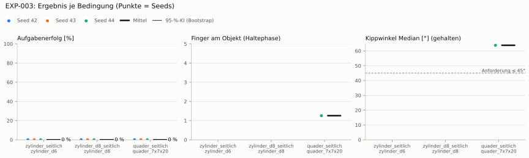
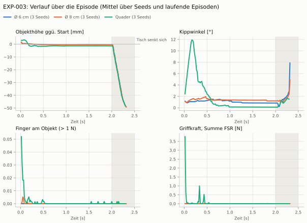
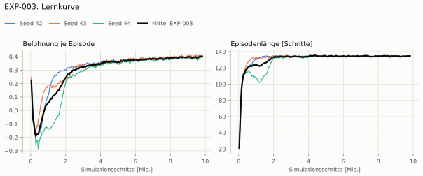
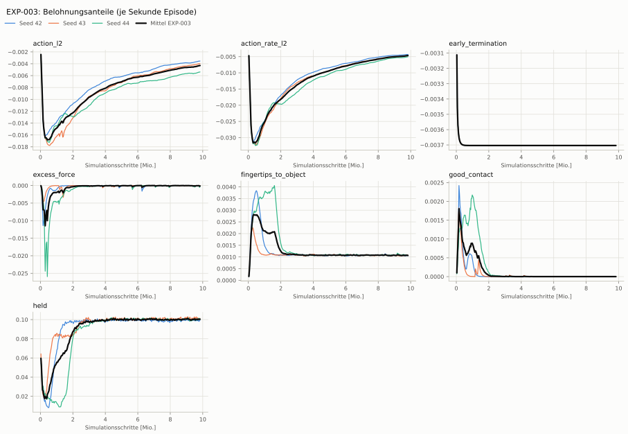
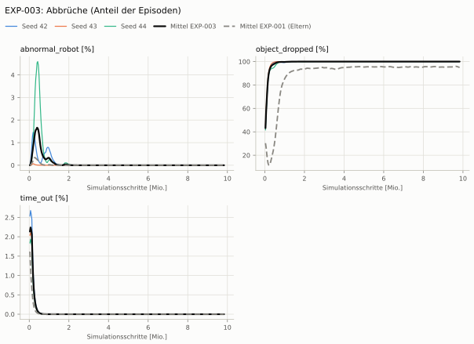
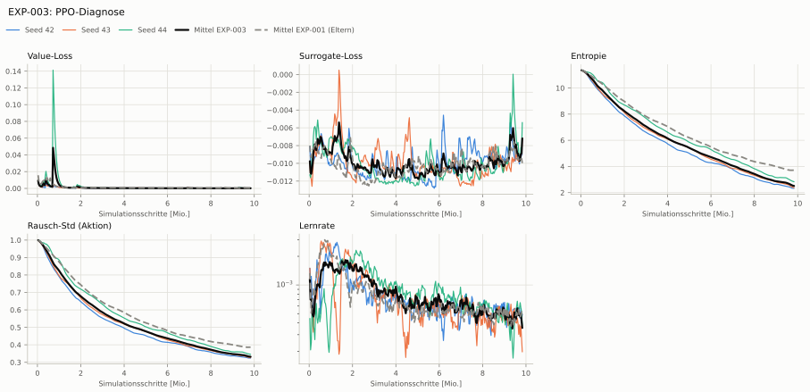

# EXP-003: Kippen über multiplikative Belohnung statt Abbruch (Dexsuite)

**Leistung** – (kein erfolgreicher Seed)

**Zuverlässigkeit** 0/3 Seeds erfolgreich [0–71 %] — EXP-001: 0/3, exakter Fisher-Test p = 1.00 → nicht unterscheidbar (für eine Aussage ≥ 10 Seeds je Experiment)

**Leitplanken** eingehalten

**Befund** ohne Erfolg: Seed 42 (lernt nicht zu greifen), Seed 43 (lernt nicht zu greifen), Seed 44 (lernt nicht zu greifen)

**Urteilsvorschlag** (auswertung-v2): **kein Unterschied**

Ergebnisse je Bedingung (eval-v1, Leitplanken, Fehlerarten, Fingernutzung)

Bedingung `zylinder_seitlich` (Objekt `zylinder_d6`, Kippwinkel ≤ 45°), Protokoll eval-v1, 3 Seed(s); Spalte EXP-001 unter derselben Anforderung

| Metrik | Mittel | 95-%-KI | IQM | Fehlschlag-Seeds (< 50 %) | EXP-001 (Mittel / IQM) |
|---|---|---|---|---|---|
| aufgabenerfolg | 0.0 % | 0.0 % – 0.0 % | 0.0 % | 100.0 % | 0.0 % / 0.0 % |
| haltequote | 0.0 % | 0.0 % – 0.0 % | 0.0 % | 100.0 % | 0.0 % / 0.0 % |
| Kippwinkel Median [°] | – | | | | – |
| Unterarm Median [°] | – | | | | – |
| Griffkraft Mittel [N] | – | | | | – |
| Kraft > 15 N [Anteil] | – | | | | – |
| Stall-Anteil [Anteil] | – | | | | – |
| Absinken [mm] | – | | | | – |
| Unruhe | – | | | | – |

Fehlerarten: startfehler 0.5 %, gefallen 99.5 %, instabil 0.0 %, anforderung_verletzt 0.0 %

**Urteilsvorschlag: kein messbarer Unterschied** (gegenüber EXP-001)
Unterschied Aufgabenerfolg +0.0 Prozentpunkte (95-%-KI +0.0 … +0.0)

Je Seed: 0.0 %, 0.0 %, 0.0 %

Trainingsverlauf

Seeds dünn, Mittel kräftig, Eltern gestrichelt (nur Abbrüche/PPO — Trainings-Belohnung ist zwischen Experimenten nicht vergleichbar); geglättet, x = Simulationsschritte. Endwerte = Mittel der letzten 10 Iterationen (Belohnungsanteile je Sekunde Episode).

| Größe | Seed 42 | Seed 43 | Seed 44 | Mittel |
|---|---|---|---|---|
| mean_reward | 0.405 | 0.405 | 0.393 | 0.401 |
| action_l2 | -0.00357 | -0.00402 | -0.00544 | -0.00434 |
| action_rate_l2 | -0.00434 | -0.00466 | -0.0051 | -0.0047 |
| early_termination | -0.0037 | -0.0037 | -0.0037 | -0.0037 |
| excess_force | -3.25e-05 | -1.91e-05 | -0.000168 | -7.33e-05 |
| fingertips_to_object | 0.00106 | 0.00107 | 0.00108 | 0.00107 |
| good_contact | 0 | 0 | 0 | 0 |
| held | 0.0989 | 0.101 | 0.1 | 0.1 |
| object_dropped | 100.0 % | 100.0 % | 100.0 % | 100.0 % |
| mean_noise_std | 0.325 | 0.328 | 0.347 | 0.333 |

Videos aller Seeds

16 Umgebungen, eine Episode (nicht im Git, Hugging Face).

| Objekt | Seed 42 | Seed 43 | Seed 44 |
|---|---|---|---|
| `quader_7x7x20` | [▶](videos/EXP-003_quader_7x7x20_s42.mp4) | [▶](videos/EXP-003_quader_7x7x20_s43.mp4) | [▶](videos/EXP-003_quader_7x7x20_s44.mp4) |
| `zylinder_d6` | [▶](videos/EXP-003_zylinder_d6_s42.mp4) | [▶](videos/EXP-003_zylinder_d6_s43.mp4) | [▶](videos/EXP-003_zylinder_d6_s44.mp4) |
| `zylinder_d8` | [▶](videos/EXP-003_zylinder_d8_s42.mp4) | [▶](videos/EXP-003_zylinder_d8_s43.mp4) | [▶](videos/EXP-003_zylinder_d8_s44.mp4) |

Netz, Training und Konfiguration

Actor [256, 128, 64] (elu), 68808 Parameter, 105 Eingänge (Verlauf 5) · Critic [512, 256, 128] · PPO: Lernrate 0.001, Entropie 0.005, 5 Epochen × 4 Mini-Batches, 32 Schritte/Umgebung · 1024 Umgebungen × 300 Iterationen

Geplante Änderung: Kippabbruch entfernt; Halte-Belohnung multiplikativ mit Aufrecht-Faktor (rot_std 0,5 rad wie Dexsuite success_reward) statt additiver Aufrecht-Belohnung. Bedingung: Anforderung ≤ 45° (Leon 2026-10-07, verschlossene Packung) — wird bei der Auswertung angewandt, Eltern unter derselben Bedingung.

Konfiguration gegenüber EXP-001 (10 Unterschiede):

- `env.rewards.early_termination.params.term_keys: ['object_dropped', 'object_tilted', 'abnormal_robot'] → ['object_dropped', 'abnormal_robot']`
- `env.rewards.held.func: pib_grasp.mdp:object_held → pib_grasp.mdp:object_held_upright`
- `env.rewards.held.params.rot_std: ∅ → 0.5`
- `env.rewards.upright.func: pib_grasp.mdp:object_upright → ∅`
- `env.rewards.upright.params.drop_start_s: 2.0 → ∅`
- `env.rewards.upright.params.std: 0.2 → ∅`
- `env.rewards.upright.weight: 2.0 → ∅`
- `env.terminations.object_tilted.func: pib_grasp.mdp:object_tilted → ∅`
- `env.terminations.object_tilted.params.max_tilt_deg: 20.0 → ∅`
- `env.terminations.object_tilted.time_out: False → ∅`

