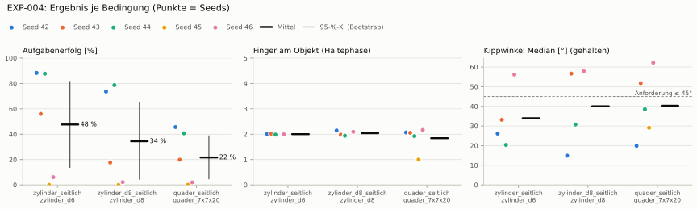
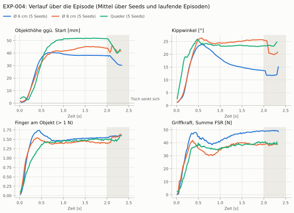
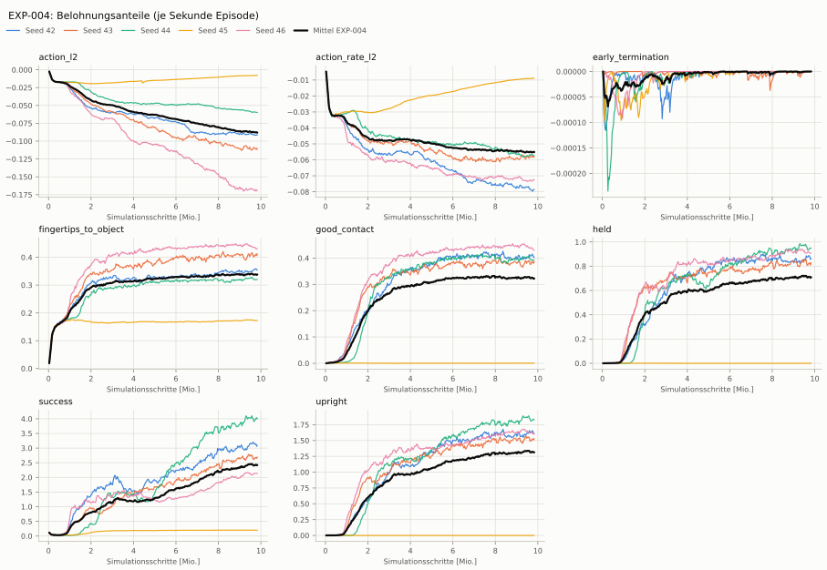
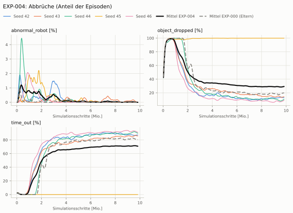
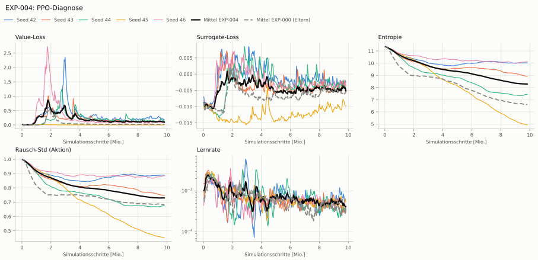

# EXP-004: Belohnungssatz wie Dexsuite (dicht + scharf, kontaktgekoppelt)

**Leistung** 73 % [70–76 %] (erfolgreiche Seeds, IQM über die Objekte; je Objekt Ø 6 cm 88 % · Ø 8 cm 76 % · Quader 43 %)

**Testobjekte** (nie trainiert, erfolgreiche Seeds, Median): Flasche 70 % · Saftpackung 55 %

**Zuverlässigkeit** 2/5 Seeds erfolgreich [5–85 %] — EXP-000: 0/1, exakter Fisher-Test p = 1.00 → nicht unterscheidbar (für eine Aussage ≥ 10 Seeds je Experiment)

**Leitplanken** Griffkraft Mittel [N]: 59.6 > 28.7; Kraft > 15 N [Anteil]: 0.993 > 0.143; Unruhe: 0.863 > 0.293 ✗

**Befund** ohne Erfolg: Seed 43 (hält, aber gekippt), Seed 45 (lernt nicht zu greifen), Seed 46 (hält, aber gekippt); Engpass Quader (43 %); Kippwinkel 34° (EXP-000: 104°); Unruhe 0.86 (EXP-000: 0.24)

**Urteilsvorschlag** (auswertung-v2): **kein Unterschied, Leitplanke verletzt**

**Beste Videos** (Seed 42, 3 Episoden): [Ø 6 cm](beste_videos/EXP-004_zylinder_d6_s42.mp4) · [Ø 8 cm](beste_videos/EXP-004_zylinder_d8_s42.mp4) · [Quader](beste_videos/EXP-004_quader_7x7x20_s42.mp4)

Ergebnisse je Bedingung (eval-v1, Leitplanken, Fehlerarten, Fingernutzung)

Bedingung `zylinder_seitlich` (Objekt `zylinder_d6`, Kippwinkel ≤ 45°), Protokoll eval-v1, 5 Seed(s); Spalte EXP-000 unter derselben Anforderung

| Metrik | Mittel | 95-%-KI | IQM | Fehlschlag-Seeds (< 50 %) | EXP-000 (Mittel / IQM) |
|---|---|---|---|---|---|
| aufgabenerfolg | 47.6 % | 13.9 % – 81.5 % | 50.5 % | 40.0 % | 2.0 % / 2.0 % |
| haltequote | 73.1 % | 36.4 % – 93.0 % | 90.2 % | 20.0 % | 86.1 % / 86.1 % |
| Kippwinkel Median [°] | 34 | | | | 104 |
| Unterarm Median [°] | 35.7 | | | | 90 |
| Griffkraft Mittel [N] | 59.6 | | | | 23.9 |
| Kraft > 15 N [Anteil] | 99.3 % | | | | 9.3 % |
| Stall-Anteil [Anteil] | 99.6 % | | | | 99.6 % |
| Absinken [mm] | 0.0191 | | | | 0 |
| Unruhe | 0.863 | | | | 0.244 |

Fehlerarten: startfehler 0.7 %, gefallen 26.3 %, instabil 0.0 %, anforderung_verletzt 25.5 %

**Urteilsvorschlag: Leitplanke verletzt (vorläufig: < 3 Seeds)** (gegenüber EXP-000)
Unterschied Aufgabenerfolg +45.8 Prozentpunkte (95-%-KI +11.8 … +79.6)
- Leitplanke: Griffkraft Mittel [N]: 59.6 > 28.7
- Leitplanke: Kraft > 15 N [Anteil]: 0.993 > 0.143
- Leitplanke: Unruhe: 0.863 > 0.293

Je Seed: 88.3 %, 56.0 %, 87.7 %, 0.0 %, 6.1 %

Fingernutzung (Haltephase): im Mittel 2.00 Finger am Objekt; Kontaktanteil je Seed (Daumen, Zeige, Mittel, Ring, klein): 98/100/0/1/2 · 99/5/1/6/91 · 100/0/99/0/0 · –/–/–/–/– · 100/0/0/99/0

Trainingsverlauf

Seeds dünn, Mittel kräftig, Eltern gestrichelt (nur Abbrüche/PPO — Trainings-Belohnung ist zwischen Experimenten nicht vergleichbar); geglättet, x = Simulationsschritte. Endwerte = Mittel der letzten 10 Iterationen (Belohnungsanteile je Sekunde Episode).

| Größe | Seed 42 | Seed 43 | Seed 44 | Seed 45 | Seed 46 | Mittel |
|---|---|---|---|---|---|---|
| mean_reward | 27.8 | 25.6 | 32.8 | 1.58 | 23.8 | 22.3 |
| action_l2 | -0.0915 | -0.111 | -0.0598 | -0.00786 | -0.169 | -0.0878 |
| action_rate_l2 | -0.0788 | -0.0583 | -0.0571 | -0.00896 | -0.0726 | -0.0552 |
| early_termination | 0 | 0 | 0 | 0 | 0 | 0 |
| fingertips_to_object | 0.355 | 0.41 | 0.321 | 0.173 | 0.432 | 0.338 |
| good_contact | 0.408 | 0.383 | 0.394 | 0.00031 | 0.433 | 0.324 |
| held | 0.872 | 0.822 | 0.947 | 0 | 0.905 | 0.709 |
| success | 3.12 | 2.66 | 4 | 0.197 | 2.12 | 2.42 |
| upright | 1.63 | 1.52 | 1.83 | 0 | 1.61 | 1.32 |
| object_dropped | 13.1 % | 13.7 % | 9.6 % | 100.0 % | 8.3 % | 28.9 % |
| mean_noise_std | 0.889 | 0.748 | 0.675 | 0.454 | 0.884 | 0.73 |

Videos aller Seeds

16 Umgebungen, eine Episode (nicht im Git, Hugging Face).

| Objekt | Seed 42 | Seed 43 | Seed 44 | Seed 45 | Seed 46 |
|---|---|---|---|---|---|
| `quader_7x7x20` | [▶](videos/EXP-004_quader_7x7x20_s42.mp4) | [▶](videos/EXP-004_quader_7x7x20_s43.mp4) | [▶](videos/EXP-004_quader_7x7x20_s44.mp4) | [▶](videos/EXP-004_quader_7x7x20_s45.mp4) | [▶](videos/EXP-004_quader_7x7x20_s46.mp4) |
| `zylinder_d6` | [▶](videos/EXP-004_zylinder_d6_s42.mp4) | [▶](videos/EXP-004_zylinder_d6_s43.mp4) | [▶](videos/EXP-004_zylinder_d6_s44.mp4) | [▶](videos/EXP-004_zylinder_d6_s45.mp4) | [▶](videos/EXP-004_zylinder_d6_s46.mp4) |
| `zylinder_d8` | [▶](videos/EXP-004_zylinder_d8_s42.mp4) | [▶](videos/EXP-004_zylinder_d8_s43.mp4) | [▶](videos/EXP-004_zylinder_d8_s44.mp4) | [▶](videos/EXP-004_zylinder_d8_s45.mp4) | [▶](videos/EXP-004_zylinder_d8_s46.mp4) |

Netz, Training und Konfiguration

Actor [256, 128, 64] (elu), 68808 Parameter, 105 Eingänge (Verlauf 5) · Critic [512, 256, 128] · PPO: Lernrate 0.001, Entropie 0.005, 5 Epochen × 4 Mini-Batches, 32 Schritte/Umgebung · 1024 Umgebungen × 300 Iterationen

Geplante Änderung: Belohnungssatz nach Dexsuite (dexsuite_env_cfg.RewardsCfg) statt Eigenbau: Annäherung std 0,4; Halten (2) und Aufrecht (4, std 1,5 rad) dicht, ab dem Absenken, × Gegengriff; Erfolg (10) = Halten × Aufrecht (rot_std 0,5); Aktionsstrafen gekappt (Dexsuite-Funktionen); Kraftstrafe entfällt; Abbruchstrafe nur für instabile Physik; Absinken gegen die Höhe beim Absenken (Fehlerbehebung). Kein Kippabbruch (wie EXP-000). Belohnungsterme vorab geprüft (isaac_sim/tools/_reward_diag.txt).

Konfiguration gegenüber EXP-000 (27 Unterschiede):

- `env.observations.critic.object_quat.clip: ∅ → None`
- `env.observations.critic.object_quat.flatten_history_dim: ∅ → True`
- `env.observations.critic.object_quat.func: ∅ → pib_grasp.mdp:object_quat_in_root`
- `env.observations.critic.object_quat.history_length: ∅ → 0`
- `env.observations.critic.object_quat.modifiers: ∅ → None`
- `env.observations.critic.object_quat.noise: ∅ → None`
- `env.observations.critic.object_quat.scale: ∅ → None`
- `env.rewards.action_l2.func: isaaclab.envs.mdp.rewards:action_l2 → isaaclab_tasks.manager_based.manipulation.dexsuite.mdp.rewards:action_l2_clamped`
- `env.rewards.action_rate_l2.func: isaaclab.envs.mdp.rewards:action_rate_l2 → isaaclab_tasks.manager_based.manipulation.dexsuite.mdp.rewards:action_rate_l2_clamped`
- `env.rewards.early_termination.params.term_keys: ['object_dropped', 'abnormal_robot'] → ['abnormal_robot']`
- `env.rewards.excess_force.func: pib_grasp.mdp:excess_fingertip_force → ∅`
- `env.rewards.excess_force.params.limit: 15.0 → ∅`
- `env.rewards.excess_force.weight: -0.02 → ∅`
- `env.rewards.fingertips_to_object.params.std: 0.1 → 0.4`
- `env.rewards.held.func: pib_grasp.mdp:object_held → pib_grasp.mdp:held_in_grasp`
- `env.rewards.held.params.threshold: ∅ → 1.0`
- `env.rewards.held.weight: 5.0 → 2.0`
- `env.rewards.success.func: ∅ → pib_grasp.mdp:object_held_upright`
- `env.rewards.success.params.drop_start_s: ∅ → 2.0`
- `env.rewards.success.params.rot_std: ∅ → 0.5`
- `env.rewards.success.params.std: ∅ → 0.02`
- `env.rewards.success.weight: ∅ → 10.0`
- `env.rewards.upright.func: ∅ → pib_grasp.mdp:upright_in_grasp`
- `env.rewards.upright.params.drop_start_s: ∅ → 2.0`
- `env.rewards.upright.params.rot_std: ∅ → 1.5`
- `env.rewards.upright.params.threshold: ∅ → 1.0`
- `env.rewards.upright.weight: ∅ → 4.0`

