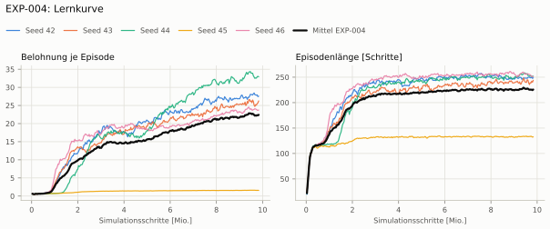
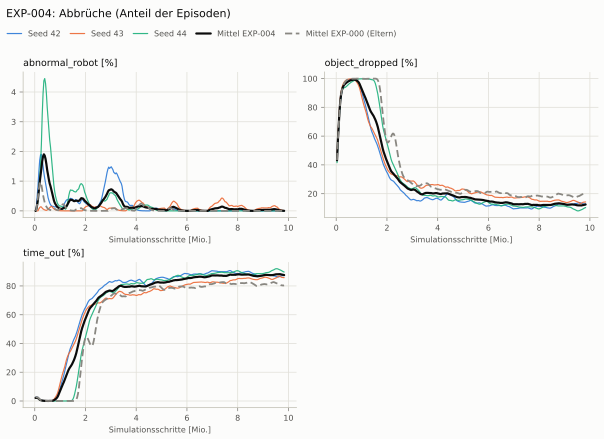
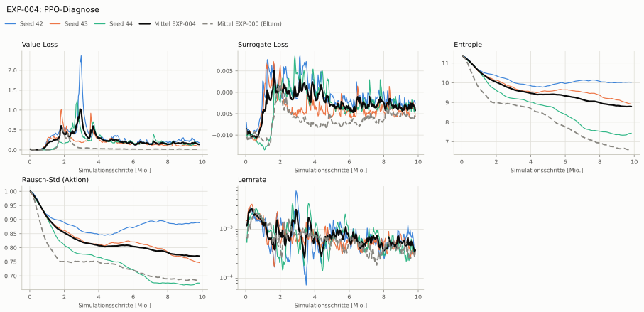

# EXP-004: Belohnungssatz wie Dexsuite (dicht + scharf, kontaktgekoppelt)

Bedingung `zylinder_seitlich` (Kippwinkel ≤ 45°), Protokoll eval-v1, 3 Seed(s); Eltern-Spalte unter derselben Bedingung

| Metrik | Mittel | 95-%-KI | IQM | Fehlschlag-Seeds (< 50 %) | Eltern (Mittel / IQM) |
|---|---|---|---|---|---|
| aufgabenerfolg | 77.3 % | 56.4 % – 88.9 % | 82.5 % | 0.0 % | 2.0 % / 2.0 % |
| haltequote | 90.1 % | 88.7 % – 91.5 % | 90.3 % | 0.0 % | 86.1 % / 86.1 % |
| Kippwinkel Median [°] | 26.6 | | | | 104 |
| Unterarm Median [°] | 25.8 | | | | 90 |
| Griffkraft Mittel [N] | 58.4 | | | | 23.9 |
| Kraft > 15 N [Anteil] | 99.2 % | | | | 9.3 % |
| Stall-Anteil [Anteil] | 99.7 % | | | | 99.6 % |
| Absinken [mm] | 0.0255 | | | | 0 |
| Unruhe | 1.01 | | | | 0.244 |

Fehlerarten: startfehler 0.5 %, gefallen 9.4 %, instabil 0.0 %, anforderung_verletzt 12.8 %

**Urteilsvorschlag: Leitplanke verletzt (vorläufig: < 3 Seeds)**
Unterschied Aufgabenerfolg +75.0 Prozentpunkte (95-%-KI +54.5 … +87.1)
- Leitplanke: Griffkraft Mittel [N]: 58.4 > 28.7
- Leitplanke: Kraft > 15 N [Anteil]: 0.992 > 0.143
- Leitplanke: Unruhe: 1.01 > 0.293

Je Seed: 88.3 %, 56.0 %, 87.7 %

Fingernutzung (Haltephase): im Mittel 2.00 Finger an der Dose; Kontaktanteil je Seed (Daumen, Zeige, Mittel, Ring, klein): 98/100/0/1/2 · 99/5/1/6/91 · 100/0/99/0/0

## Trainingsverlauf

Seeds dünn, Mittel kräftig, Eltern gestrichelt (nur Abbrüche/PPO — Trainings-Belohnung ist zwischen Experimenten nicht vergleichbar); geglättet, x = Simulationsschritte. Endwerte = Mittel der letzten 10 Iterationen (Belohnungsanteile je Sekunde Episode).

| Größe | Seed 42 | Seed 43 | Seed 44 | Mittel |
|---|---|---|---|---|
| mean_reward | 27.8 | 25.6 | 32.8 | 28.7 |
| action_l2 | -0.0915 | -0.111 | -0.0598 | -0.0874 |
| action_rate_l2 | -0.0788 | -0.0583 | -0.0571 | -0.0647 |
| early_termination | 0 | 0 | 0 | 0 |
| fingertips_to_object | 0.355 | 0.41 | 0.321 | 0.362 |
| good_contact | 0.408 | 0.383 | 0.394 | 0.395 |
| held | 0.872 | 0.822 | 0.947 | 0.881 |
| success | 3.12 | 2.66 | 4 | 3.26 |
| upright | 1.63 | 1.52 | 1.83 | 1.66 |
| object_dropped | 13.1 % | 13.7 % | 9.6 % | 12.2 % |
| mean_noise_std | 0.889 | 0.748 | 0.675 | 0.771 |

## Netz und Training

Actor [256, 128, 64] (elu), 68808 Parameter, 105 Eingänge (Verlauf 5) · Critic [512, 256, 128] · PPO: Lernrate 0.001, Entropie 0.005, 5 Epochen × 4 Mini-Batches, 32 Schritte/Umgebung · 1024 Umgebungen × 300 Iterationen

## Konfiguration gegenüber EXP-000 (27 Unterschiede)

Geplante Änderung: Belohnungssatz nach Dexsuite (dexsuite_env_cfg.RewardsCfg) statt Eigenbau: Annäherung std 0,4; Halten (2) und Aufrecht (4, std 1,5 rad) dicht, ab dem Absenken, × Gegengriff; Erfolg (10) = Halten × Aufrecht (rot_std 0,5); Aktionsstrafen gekappt (Dexsuite-Funktionen); Kraftstrafe entfällt; Abbruchstrafe nur für instabile Physik; Absinken gegen die Höhe beim Absenken (Fehlerbehebung). Kein Kippabbruch (wie EXP-000). Belohnungsterme vorab geprüft (isaac_sim/tools/_reward_diag.txt).

- `env.observations.critic.object_quat.clip: ∅ → None`
- `env.observations.critic.object_quat.flatten_history_dim: ∅ → True`
- `env.observations.critic.object_quat.func: ∅ → pib_grasp.mdp:object_quat_in_root`
- `env.observations.critic.object_quat.history_length: ∅ → 0`
- `env.observations.critic.object_quat.modifiers: ∅ → None`
- `env.observations.critic.object_quat.noise: ∅ → None`
- `env.observations.critic.object_quat.scale: ∅ → None`
- `env.rewards.action_l2.func: isaaclab.envs.mdp.rewards:action_l2 → isaaclab_tasks.manager_based.manipulation.dexsuite.mdp.rewards:action_l2_clamped`
- `env.rewards.action_rate_l2.func: isaaclab.envs.mdp.rewards:action_rate_l2 → isaaclab_tasks.manager_based.manipulation.dexsuite.mdp.rewards:action_rate_l2_clamped`
- `env.rewards.early_termination.params.term_keys: ['object_dropped', 'abnormal_robot'] → ['abnormal_robot']`
- `env.rewards.excess_force.func: pib_grasp.mdp:excess_fingertip_force → ∅`
- `env.rewards.excess_force.params.limit: 15.0 → ∅`
- `env.rewards.excess_force.weight: -0.02 → ∅`
- `env.rewards.fingertips_to_object.params.std: 0.1 → 0.4`
- `env.rewards.held.func: pib_grasp.mdp:object_held → pib_grasp.mdp:held_in_grasp`
- `env.rewards.held.params.threshold: ∅ → 1.0`
- `env.rewards.held.weight: 5.0 → 2.0`
- `env.rewards.success.func: ∅ → pib_grasp.mdp:object_held_upright`
- `env.rewards.success.params.drop_start_s: ∅ → 2.0`
- `env.rewards.success.params.rot_std: ∅ → 0.5`
- `env.rewards.success.params.std: ∅ → 0.02`
- `env.rewards.success.weight: ∅ → 10.0`
- `env.rewards.upright.func: ∅ → pib_grasp.mdp:upright_in_grasp`
- `env.rewards.upright.params.drop_start_s: ∅ → 2.0`
- `env.rewards.upright.params.rot_std: ∅ → 1.5`
- `env.rewards.upright.params.threshold: ∅ → 1.0`
- `env.rewards.upright.weight: ∅ → 4.0`
