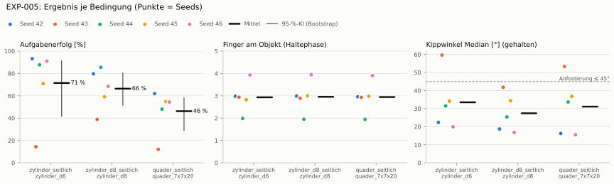
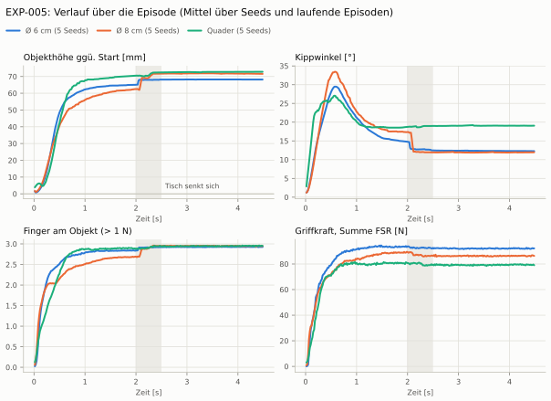
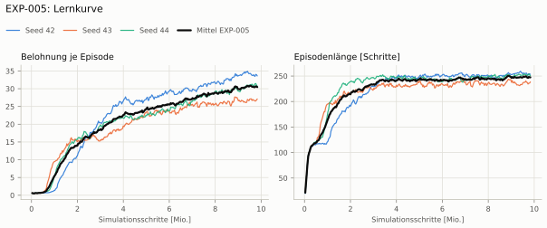
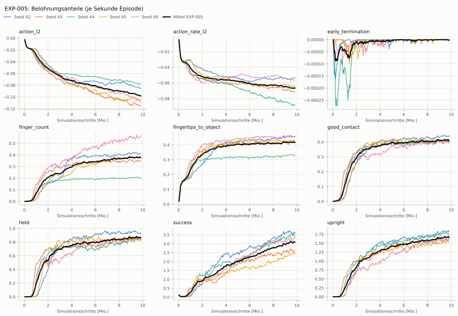
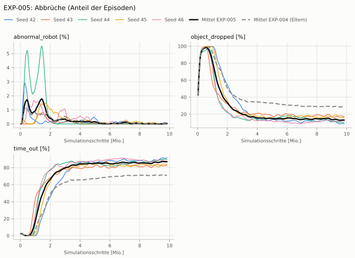
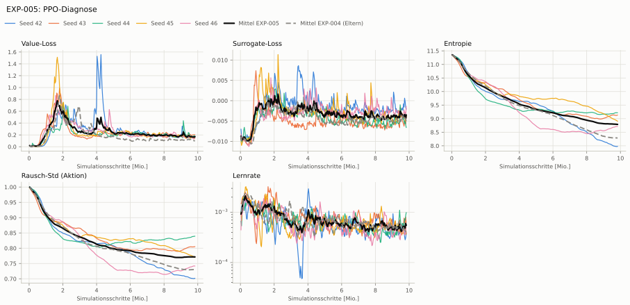

# EXP-005: Kontaktbelohnung nach Fingerzahl

**Leistung** 71 % [64–78 %] (erfolgreiche Seeds, IQM über die Objekte; je Objekt Ø 6 cm 89 % · Ø 8 cm 74 % · Quader 55 %) — ggü. EXP-004: P(besser) = 0.69 [0.48–0.92] → kein Unterschied

**Testobjekte** (nie trainiert, erfolgreiche Seeds, Median): Flasche 67 % · Saftpackung 61 %

**Zuverlässigkeit** 4/5 Seeds erfolgreich [28–99 %] — EXP-004: 2/5, exakter Fisher-Test p = 0.52 → nicht unterscheidbar (für eine Aussage ≥ 10 Seeds je Experiment)

**Leitplanken** Griffkraft Mittel [N]: 92.6 > 71.6 ✗

**Befund** ohne Erfolg: Seed 43 (hält, aber gekippt); Engpass Quader (55 %); Finger am Objekt 2.9 (EXP-004: 2.0); Unruhe 0.49 (EXP-004: 0.86)

**Urteilsvorschlag** (auswertung-v2): **kein Unterschied, Leitplanke verletzt**

**Beste Videos** (Seed 42, 3 Episoden): [Ø 6 cm](beste_videos/zylinder_d6_s42.mp4) · [Ø 8 cm](beste_videos/zylinder_d8_s42.mp4) · [Quader](beste_videos/quader_7x7x20_s42.mp4)

Ergebnisse je Bedingung (eval-v1, Leitplanken, Fehlerarten, Fingernutzung)

Bedingung `zylinder_seitlich` (Objekt `zylinder_d6`, Kippwinkel ≤ 45°), Protokoll eval-v1, 5 Seed(s); Spalte EXP-004 unter derselben Anforderung

| Metrik | Mittel | 95-%-KI | IQM | Fehlschlag-Seeds (< 50 %) | EXP-004 (Mittel / IQM) |
|---|---|---|---|---|---|
| aufgabenerfolg | 71.4 % | 41.7 % – 91.3 % | 83.7 % | 20.0 % | 47.6 % / 50.5 % |
| haltequote | 90.0 % | 86.0 % – 93.6 % | 91.2 % | 0.0 % | 73.1 % / 90.2 % |
| Kippwinkel Median [°] | 33.5 | | | | 34 |
| Unterarm Median [°] | 43.7 | | | | 35.7 |
| Griffkraft Mittel [N] | 92.6 | | | | 59.6 |
| Kraft > 15 N [Anteil] | 99.8 % | | | | 99.3 % |
| Stall-Anteil [Anteil] | 99.9 % | | | | 99.6 % |
| Absinken [mm] | 0.0453 | | | | 0.0191 |
| Unruhe | 0.49 | | | | 0.863 |

Fehlerarten: startfehler 0.5 %, gefallen 9.4 %, instabil 0.0 %, anforderung_verletzt 18.6 %

**Urteilsvorschlag: kein messbarer Unterschied** (gegenüber EXP-004)
Unterschied Aufgabenerfolg +24.1 Prozentpunkte (95-%-KI -15.1 … +64.7)
- Leitplanke: Griffkraft Mittel [N]: 92.6 > 71.6

Je Seed: 93.2 %, 14.4 %, 87.7 %, 70.8 %, 91.0 %

Fingernutzung (Haltephase): im Mittel 2.93 Finger am Objekt; Kontaktanteil je Seed (Daumen, Zeige, Mittel, Ring, klein): 100/94/99/4/0 · 100/0/0/99/95 · 99/100/0/0/0 · 100/0/99/83/0 · 97/98/98/2/98

Trainingsverlauf

Seeds dünn, Mittel kräftig, Eltern gestrichelt (nur Abbrüche/PPO — Trainings-Belohnung ist zwischen Experimenten nicht vergleichbar); geglättet, x = Simulationsschritte. Endwerte = Mittel der letzten 10 Iterationen (Belohnungsanteile je Sekunde Episode).

| Größe | Seed 42 | Seed 43 | Seed 44 | Seed 45 | Seed 46 | Mittel |
|---|---|---|---|---|---|---|
| mean_reward | 33.7 | 26.9 | 31 | 26.8 | 31 | 29.9 |
| action_l2 | -0.0845 | -0.115 | -0.0775 | -0.104 | -0.107 | -0.0976 |
| action_rate_l2 | -0.0533 | -0.0712 | -0.0879 | -0.0638 | -0.0562 | -0.0665 |
| early_termination | 0 | 0 | 0 | -2.31e-06 | -1.93e-06 | -8.49e-07 |
| finger_count | 0.411 | 0.35 | 0.201 | 0.376 | 0.55 | 0.378 |
| fingertips_to_object | 0.455 | 0.42 | 0.327 | 0.427 | 0.453 | 0.416 |
| good_contact | 0.438 | 0.406 | 0.401 | 0.411 | 0.4 | 0.411 |
| held | 0.922 | 0.831 | 0.848 | 0.847 | 0.86 | 0.862 |
| success | 3.58 | 2.59 | 3.44 | 2.45 | 3.26 | 3.06 |
| upright | 1.83 | 1.59 | 1.74 | 1.55 | 1.62 | 1.66 |
| object_dropped | 8.7 % | 17.4 % | 10.3 % | 16.1 % | 12.4 % | 13.0 % |
| mean_noise_std | 0.701 | 0.805 | 0.839 | 0.772 | 0.741 | 0.772 |

Videos aller Seeds

16 Umgebungen, eine Episode (nicht im Git, Hugging Face).

| Objekt | Seed 42 | Seed 43 | Seed 44 | Seed 45 | Seed 46 |
|---|---|---|---|---|---|
| `quader_7x7x20` | [▶](videos/quader_7x7x20_s42.mp4) | [▶](videos/quader_7x7x20_s43.mp4) | [▶](videos/quader_7x7x20_s44.mp4) | [▶](videos/quader_7x7x20_s45.mp4) | [▶](videos/quader_7x7x20_s46.mp4) |
| `zylinder_d6` | [▶](videos/zylinder_d6_s42.mp4) | [▶](videos/zylinder_d6_s43.mp4) | [▶](videos/zylinder_d6_s44.mp4) | [▶](videos/zylinder_d6_s45.mp4) | [▶](videos/zylinder_d6_s46.mp4) |
| `zylinder_d8` | [▶](videos/zylinder_d8_s42.mp4) | [▶](videos/zylinder_d8_s43.mp4) | [▶](videos/zylinder_d8_s44.mp4) | [▶](videos/zylinder_d8_s45.mp4) | [▶](videos/zylinder_d8_s46.mp4) |

Netz, Training und Konfiguration

Actor [256, 128, 64] (elu), 68808 Parameter, 105 Eingänge (Verlauf 5) · Critic [512, 256, 128] · PPO: Lernrate 0.001, Entropie 0.005, 5 Epochen × 4 Mini-Batches, 32 Schritte/Umgebung · 1024 Umgebungen × 300 Iterationen

Geplante Änderung: Zusätzlicher Belohnungsterm finger_count = 1 · (Finger mit Objektkontakt > 1 N)/4 · 𝟙[Daumen in Kontakt], ganze Episode (Task Pib-Grasp-Hand-Left-FingerCount-v0).

Konfiguration gegenüber EXP-004 (3 Unterschiede):

- `env.rewards.finger_count.func: ∅ → pib_grasp.mdp:fingers_in_contact`
- `env.rewards.finger_count.params.threshold: ∅ → 1.0`
- `env.rewards.finger_count.weight: ∅ → 1.0`

