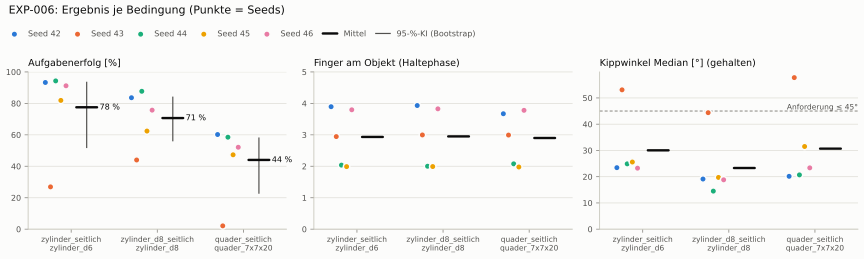
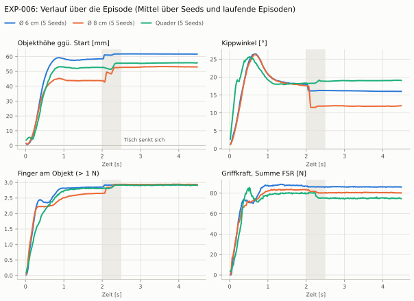
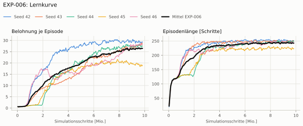
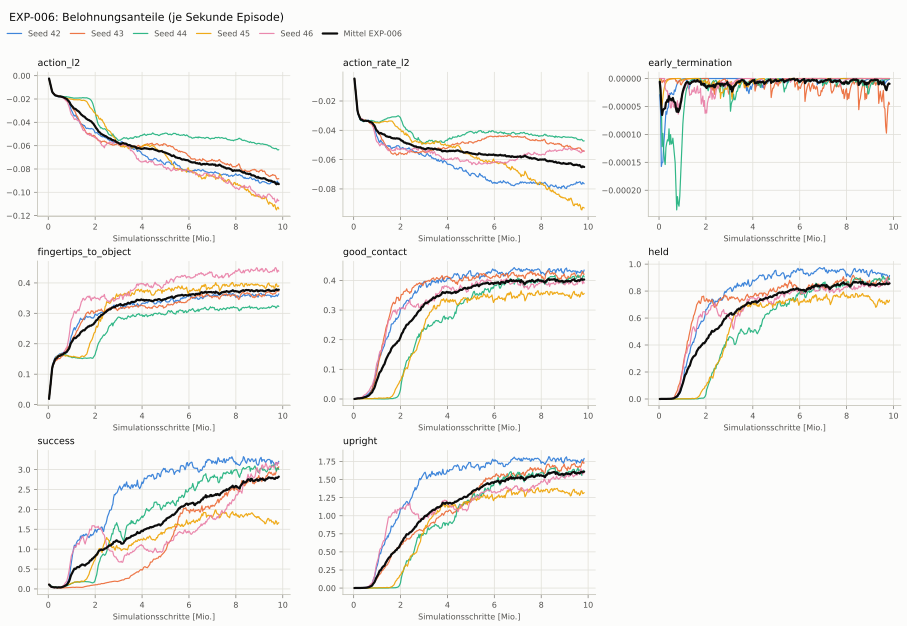
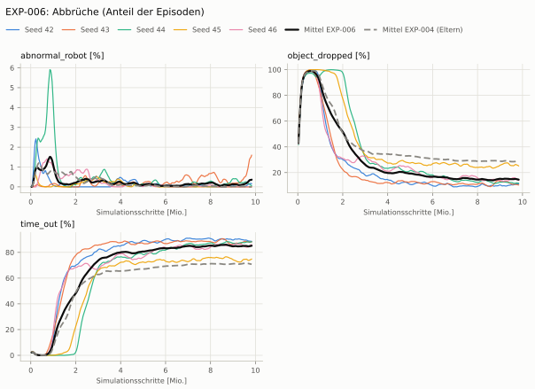

# EXP-006: Objektmasse wie Dexsuite (0,04–0,4 kg)

**Leistung** 75 % [69–82 %] (erfolgreiche Seeds, IQM über die Objekte; je Objekt Ø 6 cm 92 % · Ø 8 cm 80 % · Quader 55 %) — ggü. EXP-004: P(besser) = 0.79 [0.58–1.00] → gesichert besser

**Testobjekte** (nie trainiert, erfolgreiche Seeds, Median): Flasche 75 % · Saftpackung 64 %

**Zuverlässigkeit** 4/5 Seeds erfolgreich [28–99 %] — EXP-004: 2/5, exakter Fisher-Test p = 0.52 → nicht unterscheidbar (für eine Aussage ≥ 10 Seeds je Experiment)

**Leitplanken** Griffkraft Mittel [N]: 85.7 > 71.6 ✗

**Befund** ohne Erfolg: Seed 43 (hält, aber gekippt); Engpass Quader (55 %); Finger am Objekt 2.9 (EXP-004: 2.0); Unruhe 0.31 (EXP-004: 0.86)

**Urteilsvorschlag** (auswertung-v2): **kein Unterschied, Leitplanke verletzt**

**Beste Videos** (Seed 44, 3 Episoden): [Ø 6 cm](beste_videos/EXP-006_zylinder_d6_s44.mp4) · [Ø 8 cm](beste_videos/EXP-006_zylinder_d8_s44.mp4) · [Quader](beste_videos/EXP-006_quader_7x7x20_s44.mp4)

Ergebnisse je Bedingung (eval-v1, Leitplanken, Fehlerarten, Fingernutzung)

Bedingung `zylinder_seitlich` (Objekt `zylinder_d6`, Kippwinkel ≤ 45°), Protokoll eval-v1, 5 Seed(s); Spalte EXP-004 unter derselben Anforderung

| Metrik | Mittel | 95-%-KI | IQM | Fehlschlag-Seeds (< 50 %) | EXP-004 (Mittel / IQM) |
|---|---|---|---|---|---|
| aufgabenerfolg | 77.5 % | 52.0 % – 93.4 % | 89.0 % | 20.0 % | 47.6 % / 50.5 % |
| haltequote | 92.3 % | 87.8 % – 95.1 % | 94.3 % | 0.0 % | 73.1 % / 90.2 % |
| Kippwinkel Median [°] | 30 | | | | 34 |
| Unterarm Median [°] | 40 | | | | 35.7 |
| Griffkraft Mittel [N] | 85.7 | | | | 59.6 |
| Kraft > 15 N [Anteil] | 99.9 % | | | | 99.3 % |
| Stall-Anteil [Anteil] | 99.8 % | | | | 99.6 % |
| Absinken [mm] | 0.0206 | | | | 0.0191 |
| Unruhe | 0.312 | | | | 0.863 |

Fehlerarten: startfehler 0.5 %, gefallen 7.2 %, instabil 0.0 %, anforderung_verletzt 14.8 %

**Urteilsvorschlag: kein messbarer Unterschied** (gegenüber EXP-004)
Unterschied Aufgabenerfolg +30.1 Prozentpunkte (95-%-KI -8.0 … +68.4)
- Leitplanke: Griffkraft Mittel [N]: 85.7 > 71.6

Je Seed: 93.3 %, 26.9 %, 94.3 %, 81.9 %, 91.2 %

Fingernutzung (Haltephase): im Mittel 2.93 Finger am Objekt; Kontaktanteil je Seed (Daumen, Zeige, Mittel, Ring, klein): 100/95/100/95/0 · 100/0/94/0/100 · 97/99/4/3/0 · 99/0/0/100/0 · 98/90/0/100/92

Trainingsverlauf

Seeds dünn, Mittel kräftig, Eltern gestrichelt (nur Abbrüche/PPO — Trainings-Belohnung ist zwischen Experimenten nicht vergleichbar); geglättet, x = Simulationsschritte. Endwerte = Mittel der letzten 10 Iterationen (Belohnungsanteile je Sekunde Episode).

| Größe | Seed 42 | Seed 43 | Seed 44 | Seed 45 | Seed 46 | Mittel |
|---|---|---|---|---|---|---|
| mean_reward | 29.4 | 28.3 | 27.6 | 18.8 | 28.4 | 26.5 |
| action_l2 | -0.0915 | -0.0873 | -0.0632 | -0.114 | -0.107 | -0.0926 |
| action_rate_l2 | -0.0762 | -0.0535 | -0.047 | -0.0927 | -0.0545 | -0.0648 |
| early_termination | -4.34e-06 | -5.58e-05 | 0 | 0 | 0 | -1.2e-05 |
| fingertips_to_object | 0.361 | 0.37 | 0.323 | 0.389 | 0.442 | 0.377 |
| good_contact | 0.433 | 0.42 | 0.412 | 0.353 | 0.398 | 0.403 |
| held | 0.919 | 0.883 | 0.888 | 0.719 | 0.869 | 0.856 |
| success | 3.19 | 2.98 | 3.04 | 1.65 | 3.15 | 2.8 |
| upright | 1.77 | 1.71 | 1.62 | 1.31 | 1.61 | 1.6 |
| object_dropped | 11.1 % | 10.6 % | 11.7 % | 25.6 % | 14.9 % | 14.8 % |
| mean_noise_std | 0.846 | 0.712 | 0.687 | 0.974 | 0.769 | 0.798 |

Videos aller Seeds

16 Umgebungen, eine Episode (nicht im Git, Hugging Face).

| Objekt | Seed 42 | Seed 43 | Seed 44 | Seed 45 | Seed 46 |
|---|---|---|---|---|---|
| `quader_7x7x20` | [▶](videos/EXP-006_quader_7x7x20_s42.mp4) | [▶](videos/EXP-006_quader_7x7x20_s43.mp4) | [▶](videos/EXP-006_quader_7x7x20_s44.mp4) | [▶](videos/EXP-006_quader_7x7x20_s45.mp4) | [▶](videos/EXP-006_quader_7x7x20_s46.mp4) |
| `zylinder_d6` | [▶](videos/EXP-006_zylinder_d6_s42.mp4) | [▶](videos/EXP-006_zylinder_d6_s43.mp4) | [▶](videos/EXP-006_zylinder_d6_s44.mp4) | [▶](videos/EXP-006_zylinder_d6_s45.mp4) | [▶](videos/EXP-006_zylinder_d6_s46.mp4) |
| `zylinder_d8` | [▶](videos/EXP-006_zylinder_d8_s42.mp4) | [▶](videos/EXP-006_zylinder_d8_s43.mp4) | [▶](videos/EXP-006_zylinder_d8_s44.mp4) | [▶](videos/EXP-006_zylinder_d8_s45.mp4) | [▶](videos/EXP-006_zylinder_d8_s46.mp4) |

Netz, Training und Konfiguration

Actor [256, 128, 64] (elu), 68808 Parameter, 105 Eingänge (Verlauf 5) · Critic [512, 256, 128] · PPO: Lernrate 0.001, Entropie 0.005, 5 Epochen × 4 Mini-Batches, 32 Schritte/Umgebung · 1024 Umgebungen × 300 Iterationen

Geplante Änderung: Trainingsmasse der Dose 0,04–0,4 kg statt 0,05–0,2 kg (Dexsuite: 0,2 kg × 0,2–2; Task Pib-Grasp-Hand-Left-Heavy-v0).

Konfiguration gegenüber EXP-004 (1 Unterschiede):

- `env.events.object_mass.params.mass_distribution_params: (0.05, 0.2) → (0.04, 0.4)`

