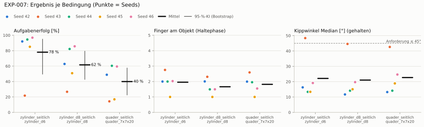
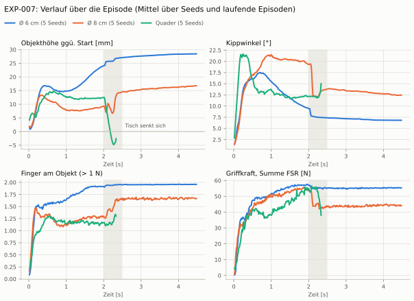
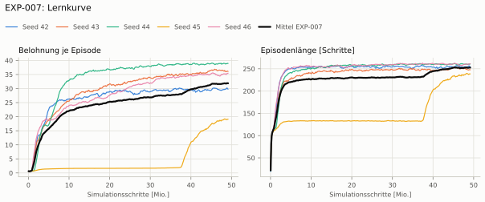
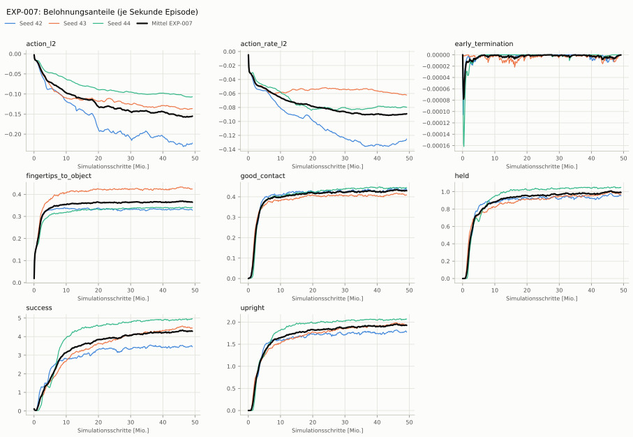
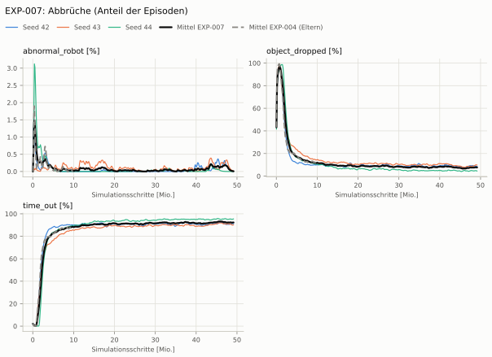
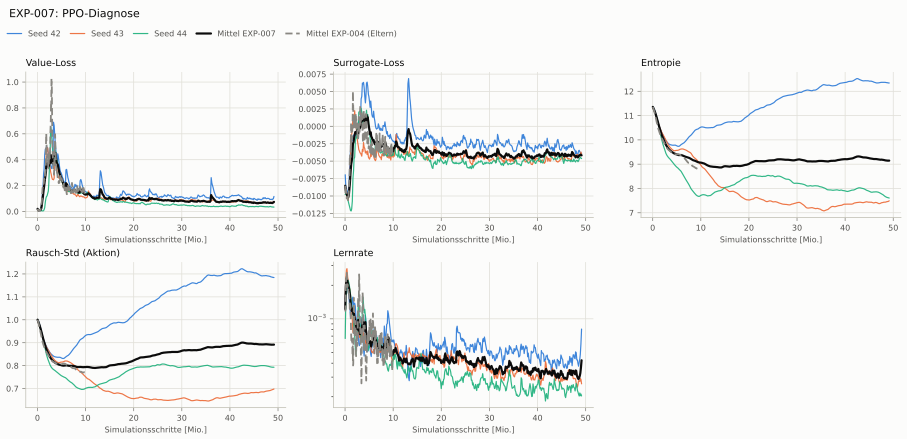

# EXP-007: EXP-004 mit 1500 Iterationen

**Leistung** 73 % [63–81 %] (erfolgreiche Seeds, IQM über die Objekte; je Objekt Ø 6 cm 93 % · Ø 8 cm 72 % · Quader 54 %) — ggü. EXP-004: P(besser) = 0.67 [0.42–0.92] → kein Unterschied

**Testobjekte** (nie trainiert, erfolgreiche Seeds, Median): Flasche 81 % · Saftpackung 63 %

**Zuverlässigkeit** 4/5 Seeds erfolgreich [28–99 %] — EXP-004: 2/5, exakter Fisher-Test p = 0.52 → nicht unterscheidbar (für eine Aussage ≥ 10 Seeds je Experiment)

**Leitplanken** Unruhe: 1.58 > 1.04 ✗

**Befund** ohne Erfolg: Seed 43 (hält, aber gekippt); Engpass Quader (54 %); Kippwinkel 22° (EXP-004: 34°); Unruhe 1.58 (EXP-004: 0.86)

**Urteilsvorschlag** (auswertung-v2): **kein Unterschied, Leitplanke verletzt**

**Beste Videos** (Seed 46, 3 Episoden): [Ø 6 cm](beste_videos/zylinder_d6_s46.mp4) · [Ø 8 cm](beste_videos/zylinder_d8_s46.mp4) · [Quader](beste_videos/quader_7x7x20_s46.mp4)

Ergebnisse je Bedingung (eval-v1, Leitplanken, Fehlerarten, Fingernutzung)

Bedingung `zylinder_seitlich` (Objekt `zylinder_d6`, Kippwinkel ≤ 45°), Protokoll eval-v1, 5 Seed(s); Spalte EXP-004 unter derselben Anforderung

| Metrik | Mittel | 95-%-KI | IQM | Fehlschlag-Seeds (< 50 %) | EXP-004 (Mittel / IQM) |
|---|---|---|---|---|---|
| aufgabenerfolg | 78.0 % | 49.6 % – 94.9 % | 90.7 % | 20.0 % | 47.6 % / 50.5 % |
| haltequote | 92.1 % | 88.4 % – 95.3 % | 92.8 % | 0.0 % | 73.1 % / 90.2 % |
| Kippwinkel Median [°] | 22.1 | | | | 34 |
| Unterarm Median [°] | 21.2 | | | | 35.7 |
| Griffkraft Mittel [N] | 55 | | | | 59.6 |
| Kraft > 15 N [Anteil] | 89.3 % | | | | 99.3 % |
| Stall-Anteil [Anteil] | 85.9 % | | | | 99.6 % |
| Absinken [mm] | 0.47 | | | | 0.0191 |
| Unruhe | 1.58 | | | | 0.863 |

Fehlerarten: startfehler 0.5 %, gefallen 7.4 %, instabil 0.0 %, anforderung_verletzt 14.0 %

**Urteilsvorschlag: kein messbarer Unterschied** (gegenüber EXP-004)
Unterschied Aufgabenerfolg +30.6 Prozentpunkte (95-%-KI -10.6 … +72.3)
- Leitplanke: Unruhe: 1.58 > 1.04

Je Seed: 92.0 %, 21.7 %, 94.5 %, 85.1 %, 96.9 %

Fingernutzung (Haltephase): im Mittel 1.96 Finger am Objekt; Kontaktanteil je Seed (Daumen, Zeige, Mittel, Ring, klein): 97/100/0/0/2 · 100/75/0/0/100 · 100/0/100/0/0 · 0/0/0/0/100 · 99/15/0/88/0

Trainingsverlauf

Seeds dünn, Mittel kräftig, Eltern gestrichelt (nur Abbrüche/PPO — Trainings-Belohnung ist zwischen Experimenten nicht vergleichbar); geglättet, x = Simulationsschritte. Endwerte = Mittel der letzten 10 Iterationen (Belohnungsanteile je Sekunde Episode).

| Größe | Seed 42 | Seed 43 | Seed 44 | Seed 45 | Seed 46 | Mittel |
|---|---|---|---|---|---|---|
| mean_reward | 29.7 | 36.3 | 39.1 | 19.2 | 35.7 | 32 |
| action_l2 | -0.222 | -0.136 | -0.107 | -0.0238 | -0.192 | -0.136 |
| action_rate_l2 | -0.123 | -0.0627 | -0.0801 | -0.0206 | -0.0866 | -0.0747 |
| early_termination | 0 | 0 | 0 | 0 | 0 | 0 |
| fingertips_to_object | 0.325 | 0.424 | 0.343 | 0.441 | 0.436 | 0.394 |
| good_contact | 0.433 | 0.41 | 0.449 | 0.00115 | 0.438 | 0.346 |
| held | 0.948 | 0.973 | 1.06 | 9.26e-06 | 1.04 | 0.804 |
| success | 3.42 | 4.47 | 4.99 | 3.9 | 4.29 | 4.21 |
| upright | 1.76 | 1.94 | 2.09 | 1.52e-05 | 1.98 | 1.55 |
| object_dropped | 8.5 % | 9.7 % | 4.3 % | 18.6 % | 4.3 % | 9.1 % |
| mean_noise_std | 1.18 | 0.701 | 0.793 | 0.398 | 0.875 | 0.79 |

Videos aller Seeds

16 Umgebungen, eine Episode (nicht im Git, Hugging Face).

| Objekt | Seed 42 | Seed 43 | Seed 44 | Seed 45 | Seed 46 |
|---|---|---|---|---|---|
| `quader_7x7x20` | [▶](videos/quader_7x7x20_s42.mp4) | [▶](videos/quader_7x7x20_s43.mp4) | [▶](videos/quader_7x7x20_s44.mp4) | [▶](videos/quader_7x7x20_s45.mp4) | [▶](videos/quader_7x7x20_s46.mp4) |
| `zylinder_d6` | [▶](videos/zylinder_d6_s42.mp4) | [▶](videos/zylinder_d6_s43.mp4) | [▶](videos/zylinder_d6_s44.mp4) | [▶](videos/zylinder_d6_s45.mp4) | [▶](videos/zylinder_d6_s46.mp4) |
| `zylinder_d8` | [▶](videos/zylinder_d8_s42.mp4) | [▶](videos/zylinder_d8_s43.mp4) | [▶](videos/zylinder_d8_s44.mp4) | [▶](videos/zylinder_d8_s45.mp4) | [▶](videos/zylinder_d8_s46.mp4) |

Netz, Training und Konfiguration

Actor [256, 128, 64] (elu), 68808 Parameter, 105 Eingänge (Verlauf 5) · Critic [512, 256, 128] · PPO: Lernrate 0.001, Entropie 0.005, 5 Epochen × 4 Mini-Batches, 32 Schritte/Umgebung · 1024 Umgebungen × 1500 Iterationen

Geplante Änderung: Trainingsdauer 1500 statt 300 Iterationen.

Konfiguration gegenüber EXP-004 (1 Unterschiede):

- `agent.max_iterations: 300 → 1500`

