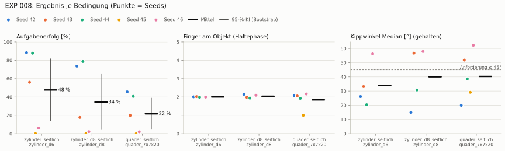

# EXP-008: Objekttransfer ohne Nachtraining (EXP-004-Policy an Becher und Milchpackung)

**Transfer** (Läufe von EXP-004, erfolgreiche Seeds, Median): Ø 6 cm 88 % · Ø 8 cm 76 % (-12 PP) · Quader 43 % (-45 PP)
**Zuverlässigkeit** 2/5 Seeds erfolgreich [5–85 %] — ohne Erfolg: Seed 43 (hält, aber gekippt), Seed 45 (lernt nicht zu greifen), Seed 46 (hält, aber gekippt)

Ergebnisse je Bedingung (eval-v1, Leitplanken, Fehlerarten, Fingernutzung)

#### Bedingung `zylinder_seitlich`

Bedingung `zylinder_seitlich` (Objekt `zylinder_d6`, Kippwinkel ≤ 45°), Protokoll eval-v1, 5 Seed(s); Spalte Eltern unter derselben Anforderung

| Metrik | Mittel | 95-%-KI | IQM | Fehlschlag-Seeds (< 50 %) | Eltern (Mittel / IQM) |
|---|---|---|---|---|---|
| aufgabenerfolg | 47.6 % | 13.9 % – 81.5 % | 50.5 % | 40.0 % | – |
| haltequote | 73.1 % | 36.4 % – 93.0 % | 90.2 % | 20.0 % | – |
| Kippwinkel Median [°] | 34 | | | | – |
| Unterarm Median [°] | 35.7 | | | | – |
| Griffkraft Mittel [N] | 59.6 | | | | – |
| Kraft > 15 N [Anteil] | 99.3 % | | | | – |
| Stall-Anteil [Anteil] | 99.6 % | | | | – |
| Absinken [mm] | 0.0191 | | | | – |
| Unruhe | 0.863 | | | | – |

Fehlerarten: startfehler 0.7 %, gefallen 26.3 %, instabil 0.0 %, anforderung_verletzt 25.5 %

**Urteilsvorschlag: Referenzbedingung**

Je Seed: 88.3 %, 56.0 %, 87.7 %, 0.0 %, 6.1 %

Fingernutzung (Haltephase): im Mittel 2.00 Finger am Objekt; Kontaktanteil je Seed (Daumen, Zeige, Mittel, Ring, klein): 98/100/0/1/2 · 99/5/1/6/91 · 100/0/99/0/0 · –/–/–/–/– · 100/0/0/99/0

#### Bedingung `zylinder_d8_seitlich`

Bedingung `zylinder_d8_seitlich` (Objekt `zylinder_d8`, Kippwinkel ≤ 45°), Protokoll eval-v1, 5 Seed(s); Spalte Referenz zylinder_seitlich unter derselben Anforderung

| Metrik | Mittel | 95-%-KI | IQM | Fehlschlag-Seeds (< 50 %) | Referenz zylinder_seitlich (Mittel / IQM) |
|---|---|---|---|---|---|
| aufgabenerfolg | 34.4 % | 4.5 % – 64.6 % | 29.8 % | 60.0 % | 47.6 % / 50.5 % |
| haltequote | 56.3 % | 26.8 % – 77.4 % | 65.1 % | 20.0 % | 73.1 % / 90.2 % |
| Kippwinkel Median [°] | 40 | | | | 34 |
| Unterarm Median [°] | 40.6 | | | | 35.7 |
| Griffkraft Mittel [N] | 47.2 | | | | 59.6 |
| Kraft > 15 N [Anteil] | 96.5 % | | | | 99.3 % |
| Stall-Anteil [Anteil] | 99.3 % | | | | 99.6 % |
| Absinken [mm] | 0.0424 | | | | 0.0191 |
| Unruhe | 1.22 | | | | 0.863 |

Fehlerarten: startfehler 0.5 %, gefallen 43.1 %, instabil 0.0 %, anforderung_verletzt 21.9 %

**Urteilsvorschlag: schlechter** (gegenüber Referenz zylinder_seitlich)
Unterschied Aufgabenerfolg -13.1 Prozentpunkte (95-%-KI -25.8 … -3.1)
- Leitplanke: Kippwinkel Median [°]: 40 > 39
- Leitplanke: Unruhe: 1.22 > 1.04

Je Seed: 73.6 %, 17.7 %, 78.7 %, 0.0 %, 2.2 %

Fingernutzung (Haltephase): im Mittel 2.04 Finger am Objekt; Kontaktanteil je Seed (Daumen, Zeige, Mittel, Ring, klein): 100/100/0/14/0 · 99/4/0/76/19 · 98/0/96/0/0 · –/–/–/–/– · 100/23/9/77/0

#### Bedingung `quader_seitlich`

Bedingung `quader_seitlich` (Objekt `quader_7x7x20`, Kippwinkel ≤ 45°), Protokoll eval-v1, 5 Seed(s); Spalte Referenz zylinder_seitlich unter derselben Anforderung

| Metrik | Mittel | 95-%-KI | IQM | Fehlschlag-Seeds (< 50 %) | Referenz zylinder_seitlich (Mittel / IQM) |
|---|---|---|---|---|---|
| aufgabenerfolg | 21.7 % | 4.9 % – 38.7 % | 20.8 % | 100.0 % | 47.6 % / 50.5 % |
| haltequote | 43.7 % | 21.4 % – 58.4 % | 52.7 % | 40.0 % | 73.1 % / 90.2 % |
| Kippwinkel Median [°] | 40.3 | | | | 34 |
| Unterarm Median [°] | 37.7 | | | | 35.7 |
| Griffkraft Mittel [N] | 38.3 | | | | 59.6 |
| Kraft > 15 N [Anteil] | 77.5 % | | | | 99.3 % |
| Stall-Anteil [Anteil] | 79.9 % | | | | 99.6 % |
| Absinken [mm] | 0.0965 | | | | 0.0191 |
| Unruhe | 0.858 | | | | 0.863 |

Fehlerarten: startfehler 6.6 %, gefallen 49.7 %, instabil 0.0 %, anforderung_verletzt 22.1 %

**Urteilsvorschlag: schlechter** (gegenüber Referenz zylinder_seitlich)
Unterschied Aufgabenerfolg -26.0 Prozentpunkte (95-%-KI -43.3 … -8.7)
- Leitplanke: Kippwinkel Median [°]: 40.3 > 39

Je Seed: 45.6 %, 19.9 %, 40.7 %, 0.1 %, 2.0 %

Fingernutzung (Haltephase): im Mittel 1.84 Finger am Objekt; Kontaktanteil je Seed (Daumen, Zeige, Mittel, Ring, klein): 92/100/0/7/8 · 98/15/0/58/35 · 100/0/93/0/0 · 0/0/0/0/100 · 99/25/7/85/0

Trainingsverlauf: siehe Quelle [EXP-004](../EXP-004_dexsuite_belohnung/bericht.md) — [Lernkurve](../EXP-004_dexsuite_belohnung/diagramme/lernkurve.svg) · [Belohnungsanteile](../EXP-004_dexsuite_belohnung/diagramme/belohnung.svg) · [Abbrüche](../EXP-004_dexsuite_belohnung/diagramme/abbrueche.svg) · [PPO-Diagnose](../EXP-004_dexsuite_belohnung/diagramme/ppo.svg)

Videos aller Seeds

16 Umgebungen, eine Episode (nicht im Git, Hugging Face). Quelle: EXP-004.

| Objekt | Seed 42 | Seed 43 | Seed 44 | Seed 45 | Seed 46 |
|---|---|---|---|---|---|
| `quader_7x7x20` | [▶](../EXP-004_dexsuite_belohnung/videos/quader_7x7x20_s42.mp4) | [▶](../EXP-004_dexsuite_belohnung/videos/quader_7x7x20_s43.mp4) | [▶](../EXP-004_dexsuite_belohnung/videos/quader_7x7x20_s44.mp4) | [▶](../EXP-004_dexsuite_belohnung/videos/quader_7x7x20_s45.mp4) | [▶](../EXP-004_dexsuite_belohnung/videos/quader_7x7x20_s46.mp4) |
| `zylinder_d6` | [▶](../EXP-004_dexsuite_belohnung/videos/zylinder_d6_s42.mp4) | [▶](../EXP-004_dexsuite_belohnung/videos/zylinder_d6_s43.mp4) | [▶](../EXP-004_dexsuite_belohnung/videos/zylinder_d6_s44.mp4) | [▶](../EXP-004_dexsuite_belohnung/videos/zylinder_d6_s45.mp4) | [▶](../EXP-004_dexsuite_belohnung/videos/zylinder_d6_s46.mp4) |
| `zylinder_d8` | [▶](../EXP-004_dexsuite_belohnung/videos/zylinder_d8_s42.mp4) | [▶](../EXP-004_dexsuite_belohnung/videos/zylinder_d8_s43.mp4) | [▶](../EXP-004_dexsuite_belohnung/videos/zylinder_d8_s44.mp4) | [▶](../EXP-004_dexsuite_belohnung/videos/zylinder_d8_s45.mp4) | [▶](../EXP-004_dexsuite_belohnung/videos/zylinder_d8_s46.mp4) |

Netz, Training und Konfiguration

Actor [256, 128, 64] (elu), 68808 Parameter, 105 Eingänge (Verlauf 5) · Critic [512, 256, 128] · PPO: Lernrate 0.001, Entropie 0.005, 5 Epochen × 4 Mini-Batches, 32 Schritte/Umgebung · 1024 Umgebungen × 300 Iterationen

