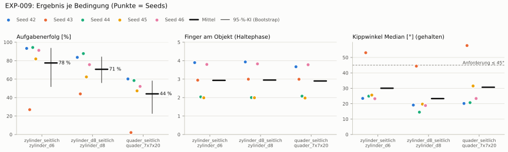

# EXP-009: Objekttransfer ohne Nachtraining (EXP-006-Policy, Masse 0,04–0,4 kg)

**Transfer** (Läufe von EXP-006, erfolgreiche Seeds, Median): Ø 6 cm 92 % · Ø 8 cm 80 % (-13 PP) · Quader 55 % (-37 PP)
**Zuverlässigkeit** 4/5 Seeds erfolgreich [28–99 %] — ohne Erfolg: Seed 43 (hält, aber gekippt)

Ergebnisse je Bedingung (eval-v1, Leitplanken, Fehlerarten, Fingernutzung)

#### Bedingung `zylinder_seitlich`

Bedingung `zylinder_seitlich` (Objekt `zylinder_d6`, Kippwinkel ≤ 45°), Protokoll eval-v1, 5 Seed(s); Spalte Eltern unter derselben Anforderung

| Metrik | Mittel | 95-%-KI | IQM | Fehlschlag-Seeds (< 50 %) | Eltern (Mittel / IQM) |
|---|---|---|---|---|---|
| aufgabenerfolg | 77.5 % | 52.0 % – 93.4 % | 89.0 % | 20.0 % | – |
| haltequote | 92.3 % | 87.8 % – 95.1 % | 94.3 % | 0.0 % | – |
| Kippwinkel Median [°] | 30 | | | | – |
| Unterarm Median [°] | 40 | | | | – |
| Griffkraft Mittel [N] | 85.7 | | | | – |
| Kraft > 15 N [Anteil] | 99.9 % | | | | – |
| Stall-Anteil [Anteil] | 99.8 % | | | | – |
| Absinken [mm] | 0.0206 | | | | – |
| Unruhe | 0.312 | | | | – |

Fehlerarten: startfehler 0.5 %, gefallen 7.2 %, instabil 0.0 %, anforderung_verletzt 14.8 %

**Urteilsvorschlag: Referenzbedingung**

Je Seed: 93.3 %, 26.9 %, 94.3 %, 81.9 %, 91.2 %

Fingernutzung (Haltephase): im Mittel 2.93 Finger am Objekt; Kontaktanteil je Seed (Daumen, Zeige, Mittel, Ring, klein): 100/95/100/95/0 · 100/0/94/0/100 · 97/99/4/3/0 · 99/0/0/100/0 · 98/90/0/100/92

#### Bedingung `zylinder_d8_seitlich`

Bedingung `zylinder_d8_seitlich` (Objekt `zylinder_d8`, Kippwinkel ≤ 45°), Protokoll eval-v1, 5 Seed(s); Spalte Referenz zylinder_seitlich unter derselben Anforderung

| Metrik | Mittel | 95-%-KI | IQM | Fehlschlag-Seeds (< 50 %) | Referenz zylinder_seitlich (Mittel / IQM) |
|---|---|---|---|---|---|
| aufgabenerfolg | 70.7 % | 56.2 % – 83.9 % | 74.1 % | 20.0 % | 77.5 % / 89.0 % |
| haltequote | 79.4 % | 70.9 % – 86.1 % | 82.1 % | 0.0 % | 92.3 % / 94.3 % |
| Kippwinkel Median [°] | 23.3 | | | | 30 |
| Unterarm Median [°] | 33 | | | | 40 |
| Griffkraft Mittel [N] | 80.6 | | | | 85.7 |
| Kraft > 15 N [Anteil] | 99.9 % | | | | 99.9 % |
| Stall-Anteil [Anteil] | 99.8 % | | | | 99.8 % |
| Absinken [mm] | 0.00526 | | | | 0.0206 |
| Unruhe | 0.355 | | | | 0.312 |

Fehlerarten: startfehler 0.6 %, gefallen 20.0 %, instabil 0.0 %, anforderung_verletzt 8.8 %

**Urteilsvorschlag: kein messbarer Unterschied** (gegenüber Referenz zylinder_seitlich)
Unterschied Aufgabenerfolg -6.9 Prozentpunkte (95-%-KI -16.4 … +5.2)

Je Seed: 83.6 %, 43.9 %, 87.7 %, 62.4 %, 75.7 %

Fingernutzung (Haltephase): im Mittel 2.95 Finger am Objekt; Kontaktanteil je Seed (Daumen, Zeige, Mittel, Ring, klein): 100/99/100/94/0 · 100/0/100/0/99 · 100/100/0/0/0 · 99/0/0/100/0 · 99/85/0/100/99

#### Bedingung `quader_seitlich`

Bedingung `quader_seitlich` (Objekt `quader_7x7x20`, Kippwinkel ≤ 45°), Protokoll eval-v1, 5 Seed(s); Spalte Referenz zylinder_seitlich unter derselben Anforderung

| Metrik | Mittel | 95-%-KI | IQM | Fehlschlag-Seeds (< 50 %) | Referenz zylinder_seitlich (Mittel / IQM) |
|---|---|---|---|---|---|
| aufgabenerfolg | 44.0 % | 22.9 % – 57.9 % | 52.6 % | 40.0 % | 77.5 % / 89.0 % |
| haltequote | 57.0 % | 53.0 % – 60.7 % | 57.5 % | 0.0 % | 92.3 % / 94.3 % |
| Kippwinkel Median [°] | 30.7 | | | | 30 |
| Unterarm Median [°] | 35.4 | | | | 40 |
| Griffkraft Mittel [N] | 74.4 | | | | 85.7 |
| Kraft > 15 N [Anteil] | 99.9 % | | | | 99.9 % |
| Stall-Anteil [Anteil] | 99.8 % | | | | 99.8 % |
| Absinken [mm] | 0.00101 | | | | 0.0206 |
| Unruhe | 0.502 | | | | 0.312 |

Fehlerarten: startfehler 6.1 %, gefallen 37.0 %, instabil 0.0 %, anforderung_verletzt 12.9 %

**Urteilsvorschlag: schlechter** (gegenüber Referenz zylinder_seitlich)
Unterschied Aufgabenerfolg -33.5 Prozentpunkte (95-%-KI -37.5 … -29.0)
- Leitplanke: Unruhe: 0.502 > 0.374

Je Seed: 60.2 %, 2.1 %, 58.5 %, 47.3 %, 52.1 %

Fingernutzung (Haltephase): im Mittel 2.90 Finger am Objekt; Kontaktanteil je Seed (Daumen, Zeige, Mittel, Ring, klein): 96/90/97/83/0 · 100/0/99/0/100 · 97/97/13/1/0 · 99/0/0/98/0 · 89/91/0/100/98

Trainingsverlauf: siehe Quelle [EXP-006](../EXP-006_masse_dexsuite/bericht.md) — [Lernkurve](../EXP-006_masse_dexsuite/diagramme/lernkurve.svg) · [Belohnungsanteile](../EXP-006_masse_dexsuite/diagramme/belohnung.svg) · [Abbrüche](../EXP-006_masse_dexsuite/diagramme/abbrueche.svg) · [PPO-Diagnose](../EXP-006_masse_dexsuite/diagramme/ppo.svg)

Videos aller Seeds

16 Umgebungen, eine Episode (nicht im Git, Hugging Face). Quelle: EXP-006.

| Objekt | Seed 42 | Seed 43 | Seed 44 | Seed 45 | Seed 46 |
|---|---|---|---|---|---|
| `quader_7x7x20` | [▶](../EXP-006_masse_dexsuite/videos/quader_7x7x20_s42.mp4) | [▶](../EXP-006_masse_dexsuite/videos/quader_7x7x20_s43.mp4) | [▶](../EXP-006_masse_dexsuite/videos/quader_7x7x20_s44.mp4) | [▶](../EXP-006_masse_dexsuite/videos/quader_7x7x20_s45.mp4) | [▶](../EXP-006_masse_dexsuite/videos/quader_7x7x20_s46.mp4) |
| `zylinder_d6` | [▶](../EXP-006_masse_dexsuite/videos/zylinder_d6_s42.mp4) | [▶](../EXP-006_masse_dexsuite/videos/zylinder_d6_s43.mp4) | [▶](../EXP-006_masse_dexsuite/videos/zylinder_d6_s44.mp4) | [▶](../EXP-006_masse_dexsuite/videos/zylinder_d6_s45.mp4) | [▶](../EXP-006_masse_dexsuite/videos/zylinder_d6_s46.mp4) |
| `zylinder_d8` | [▶](../EXP-006_masse_dexsuite/videos/zylinder_d8_s42.mp4) | [▶](../EXP-006_masse_dexsuite/videos/zylinder_d8_s43.mp4) | [▶](../EXP-006_masse_dexsuite/videos/zylinder_d8_s44.mp4) | [▶](../EXP-006_masse_dexsuite/videos/zylinder_d8_s45.mp4) | [▶](../EXP-006_masse_dexsuite/videos/zylinder_d8_s46.mp4) |

Netz, Training und Konfiguration

Actor [256, 128, 64] (elu), 68808 Parameter, 105 Eingänge (Verlauf 5) · Critic [512, 256, 128] · PPO: Lernrate 0.001, Entropie 0.005, 5 Epochen × 4 Mini-Batches, 32 Schritte/Umgebung · 1024 Umgebungen × 300 Iterationen

