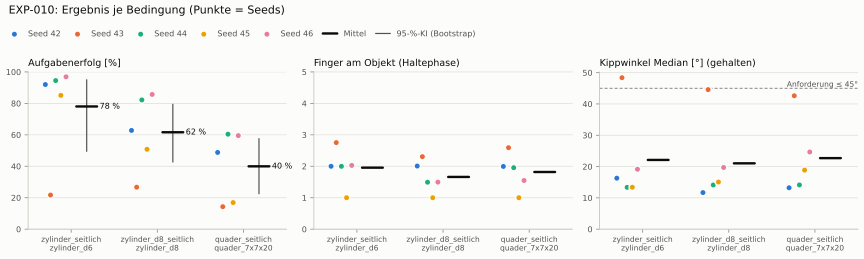

# EXP-010: Objekttransfer ohne Nachtraining (EXP-007-Policy, 1500 Iterationen)

Ohne eigenes Training — bewertet die Läufe von EXP-007.

| Bedingung | Objekt | Kipp ≤ | Aufgabenerfolg [95-%-KI] | IQM | Haltequote | Kipp° | Finger | Urteilsvorschlag |
|---|---|---|---|---|---|---|---|---|
| `zylinder_seitlich` | `zylinder_d6` | 45° | 78.0 % [49.6 % – 94.9 %] | 90.7 % | 92.1 % | 22 | 2.0 | Referenzbedingung |
| `zylinder_d8_seitlich` | `zylinder_d8` | 45° | 61.6 % [42.8 % – 79.3 %] | 65.0 % | 66.8 % | 21 | 1.7 | schlechter (ggü. Referenz zylinder_seitlich) |
| `quader_seitlich` | `quader_7x7x20` | 45° | 40.0 % [22.6 % – 57.5 %] | 42.4 % | 42.0 % | 23 | 1.8 | schlechter (ggü. Referenz zylinder_seitlich) |

## Bedingung `zylinder_seitlich`

Bedingung `zylinder_seitlich` (Objekt `zylinder_d6`, Kippwinkel ≤ 45°), Protokoll eval-v1, 5 Seed(s); Spalte Eltern unter derselben Anforderung

| Metrik | Mittel | 95-%-KI | IQM | Fehlschlag-Seeds (< 50 %) | Eltern (Mittel / IQM) |
|---|---|---|---|---|---|
| aufgabenerfolg | 78.0 % | 49.6 % – 94.9 % | 90.7 % | 20.0 % | – |
| haltequote | 92.1 % | 88.5 % – 95.4 % | 92.8 % | 0.0 % | – |
| Kippwinkel Median [°] | 22.1 | | | | – |
| Unterarm Median [°] | 21.2 | | | | – |
| Griffkraft Mittel [N] | 55 | | | | – |
| Kraft > 15 N [Anteil] | 89.3 % | | | | – |
| Stall-Anteil [Anteil] | 85.9 % | | | | – |
| Absinken [mm] | 0.47 | | | | – |
| Unruhe | 1.58 | | | | – |

Fehlerarten: startfehler 0.5 %, gefallen 7.4 %, instabil 0.0 %, anforderung_verletzt 14.0 %

**Urteilsvorschlag: Referenzbedingung**

Je Seed: 92.0 %, 21.7 %, 94.5 %, 85.1 %, 96.9 %

Fingernutzung (Haltephase): im Mittel 1.96 Finger am Objekt; Kontaktanteil je Seed (Daumen, Zeige, Mittel, Ring, klein): 97/100/0/0/2 · 100/75/0/0/100 · 100/0/100/0/0 · 0/0/0/0/100 · 99/15/0/88/0

## Bedingung `zylinder_d8_seitlich`

Bedingung `zylinder_d8_seitlich` (Objekt `zylinder_d8`, Kippwinkel ≤ 45°), Protokoll eval-v1, 5 Seed(s); Spalte Referenz zylinder_seitlich unter derselben Anforderung

| Metrik | Mittel | 95-%-KI | IQM | Fehlschlag-Seeds (< 50 %) | Referenz zylinder_seitlich (Mittel / IQM) |
|---|---|---|---|---|---|
| aufgabenerfolg | 61.6 % | 42.8 % – 79.3 % | 65.0 % | 20.0 % | 78.0 % / 90.7 % |
| haltequote | 66.8 % | 53.1 % – 80.4 % | 65.8 % | 0.0 % | 92.1 % / 92.8 % |
| Kippwinkel Median [°] | 21 | | | | 22.1 |
| Unterarm Median [°] | 18.4 | | | | 21.2 |
| Griffkraft Mittel [N] | 44.1 | | | | 55 |
| Kraft > 15 N [Anteil] | 87.0 % | | | | 89.3 % |
| Stall-Anteil [Anteil] | 86.2 % | | | | 85.9 % |
| Absinken [mm] | 1.35 | | | | 0.47 |
| Unruhe | 5.48 | | | | 1.58 |

Fehlerarten: startfehler 0.6 %, gefallen 32.6 %, instabil 0.0 %, anforderung_verletzt 5.2 %

**Urteilsvorschlag: schlechter** (gegenüber Referenz zylinder_seitlich)
Unterschied Aufgabenerfolg -16.5 Prozentpunkte (95-%-KI -28.5 … -4.7)
- Leitplanke: Unruhe: 5.48 > 1.89

Je Seed: 62.8 %, 26.6 %, 82.2 %, 50.8 %, 85.7 %

Fingernutzung (Haltephase): im Mittel 1.66 Finger am Objekt; Kontaktanteil je Seed (Daumen, Zeige, Mittel, Ring, klein): 100/100/1/0/0 · 100/43/1/2/85 · 100/0/49/0/0 · 0/0/0/0/100 · 100/23/0/27/0

## Bedingung `quader_seitlich`

Bedingung `quader_seitlich` (Objekt `quader_7x7x20`, Kippwinkel ≤ 45°), Protokoll eval-v1, 5 Seed(s); Spalte Referenz zylinder_seitlich unter derselben Anforderung

| Metrik | Mittel | 95-%-KI | IQM | Fehlschlag-Seeds (< 50 %) | Referenz zylinder_seitlich (Mittel / IQM) |
|---|---|---|---|---|---|
| aufgabenerfolg | 40.0 % | 22.6 % – 57.5 % | 42.4 % | 60.0 % | 78.0 % / 90.7 % |
| haltequote | 42.0 % | 25.7 % – 58.5 % | 44.2 % | 60.0 % | 92.1 % / 92.8 % |
| Kippwinkel Median [°] | 22.7 | | | | 22.1 |
| Unterarm Median [°] | 18 | | | | 21.2 |
| Griffkraft Mittel [N] | 40.8 | | | | 55 |
| Kraft > 15 N [Anteil] | 88.3 % | | | | 89.3 % |
| Stall-Anteil [Anteil] | 85.9 % | | | | 85.9 % |
| Absinken [mm] | 2.81 | | | | 0.47 |
| Unruhe | 7.17 | | | | 1.58 |

Fehlerarten: startfehler 5.9 %, gefallen 52.1 %, instabil 0.0 %, anforderung_verletzt 2.0 %

**Urteilsvorschlag: schlechter** (gegenüber Referenz zylinder_seitlich)
Unterschied Aufgabenerfolg -38.1 Prozentpunkte (95-%-KI -55.9 … -21.7)
- Leitplanke: Unruhe: 7.17 > 1.89

Je Seed: 48.8 %, 14.3 %, 60.4 %, 16.9 %, 59.5 %

Fingernutzung (Haltephase): im Mittel 1.82 Finger am Objekt; Kontaktanteil je Seed (Daumen, Zeige, Mittel, Ring, klein): 92/99/0/0/8 · 96/66/2/3/92 · 99/0/97/0/0 · 0/0/0/0/100 · 96/32/0/26/0

## Trainingsverlauf

Siehe Quelle [EXP-007](../EXP-007_lang_1500/bericht.md#trainingsverlauf): [Lernkurve](../EXP-007_lang_1500/diagramme/lernkurve.svg) · [Belohnungsanteile](../EXP-007_lang_1500/diagramme/belohnung.svg) · [Abbrüche](../EXP-007_lang_1500/diagramme/abbrueche.svg) · [PPO-Diagnose](../EXP-007_lang_1500/diagramme/ppo.svg)

## Netz und Training

Actor [256, 128, 64] (elu), 68808 Parameter, 105 Eingänge (Verlauf 5) · Critic [512, 256, 128] · PPO: Lernrate 0.001, Entropie 0.005, 5 Epochen × 4 Mini-Batches, 32 Schritte/Umgebung · 1024 Umgebungen × 1500 Iterationen
