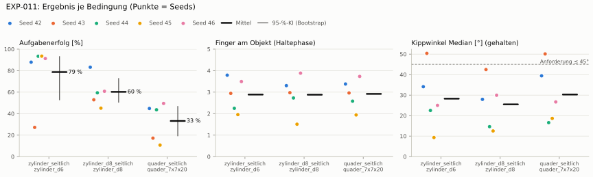
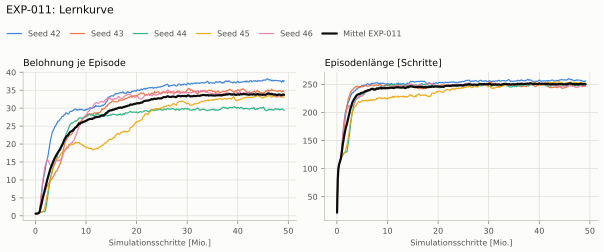
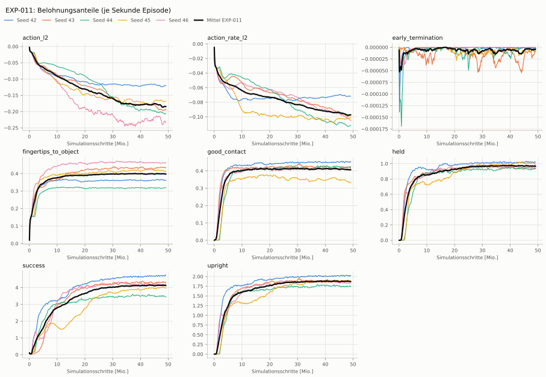
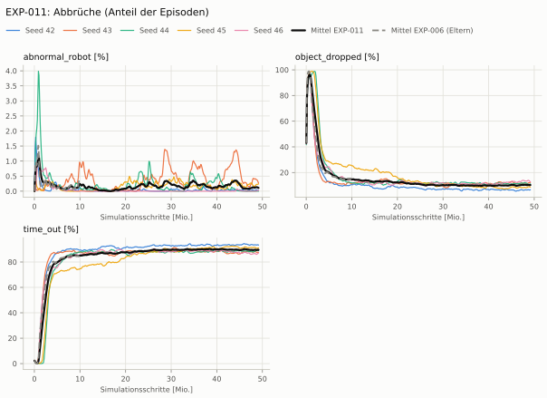
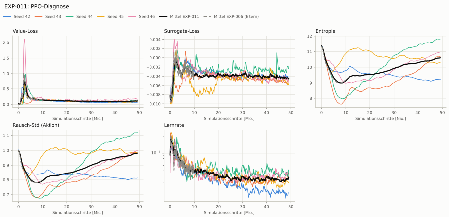
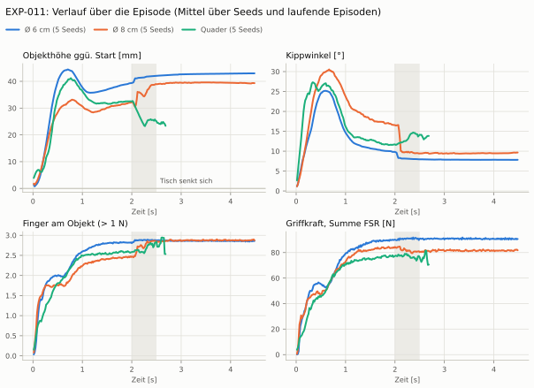

# EXP-011: EXP-006 mit 1500 Iterationen (längeres Training)

**Beste Videos** (Seed 42, bester mittlerer Aufgabenerfolg über alle Objekte, 3 Episoden): [Ø 6 cm](beste_videos/zylinder_d6_s42.mp4) · [Ø 8 cm](beste_videos/zylinder_d8_s42.mp4) · [Quader](beste_videos/quader_7x7x20_s42.mp4)

| Bedingung | Objekt | Kipp ≤ | Aufgabenerfolg [95-%-KI] | IQM | Haltequote | Kipp° | Finger | Urteilsvorschlag |
|---|---|---|---|---|---|---|---|---|
| `zylinder_seitlich` | `zylinder_d6` | 45° | 78.7 % [52.9 % – 93.1 %] | 90.9 % | 94.3 % | 28 | 2.9 | kein messbarer Unterschied (ggü. EXP-006) |
| `zylinder_d8_seitlich` | `zylinder_d8` | 45° | 60.3 % [50.6 % – 72.7 %] | 57.9 % | 66.9 % | 25 | 2.9 | kein messbarer Unterschied (ggü. EXP-006) |
| `quader_seitlich` | `quader_7x7x20` | 45° | 33.2 % [19.3 % – 46.7 %] | 36.0 % | 45.9 % | 30 | 2.9 | kein messbarer Unterschied (ggü. EXP-006) |

## Bedingung `zylinder_seitlich`

Bedingung `zylinder_seitlich` (Objekt `zylinder_d6`, Kippwinkel ≤ 45°), Protokoll eval-v1, 5 Seed(s); Spalte EXP-006 unter derselben Anforderung

| Metrik | Mittel | 95-%-KI | IQM | Fehlschlag-Seeds (< 50 %) | EXP-006 (Mittel / IQM) |
|---|---|---|---|---|---|
| aufgabenerfolg | 78.7 % | 52.9 % – 93.1 % | 90.9 % | 20.0 % | 77.5 % / 89.0 % |
| haltequote | 94.3 % | 93.0 % – 95.7 % | 94.2 % | 0.0 % | 92.3 % / 94.3 % |
| Kippwinkel Median [°] | 28.3 | | | | 30 |
| Unterarm Median [°] | 38.1 | | | | 40 |
| Griffkraft Mittel [N] | 92.3 | | | | 85.7 |
| Kraft > 15 N [Anteil] | 99.7 % | | | | 99.9 % |
| Stall-Anteil [Anteil] | 100.0 % | | | | 99.8 % |
| Absinken [mm] | 0.181 | | | | 0.0206 |
| Unruhe | 1.2 | | | | 0.312 |

Fehlerarten: startfehler 0.4 %, gefallen 5.2 %, instabil 0.0 %, anforderung_verletzt 15.7 %

**Urteilsvorschlag: kein messbarer Unterschied** (gegenüber EXP-006)
Unterschied Aufgabenerfolg +1.1 Prozentpunkte (95-%-KI -3.4 … +6.7)
- Leitplanke: Unruhe: 1.2 > 0.374

Je Seed: 87.9 %, 27.2 %, 93.4 %, 93.5 %, 91.3 %

Fingernutzung (Haltephase): im Mittel 2.89 Finger am Objekt; Kontaktanteil je Seed (Daumen, Zeige, Mittel, Ring, klein): 100/97/85/97/0 · 100/0/95/0/100 · 99/99/0/27/0 · 100/0/0/96/0 · 99/55/0/99/96

## Bedingung `zylinder_d8_seitlich`

Bedingung `zylinder_d8_seitlich` (Objekt `zylinder_d8`, Kippwinkel ≤ 45°), Protokoll eval-v1, 5 Seed(s); Spalte EXP-006 unter derselben Anforderung

| Metrik | Mittel | 95-%-KI | IQM | Fehlschlag-Seeds (< 50 %) | EXP-006 (Mittel / IQM) |
|---|---|---|---|---|---|
| aufgabenerfolg | 60.3 % | 50.6 % – 72.7 % | 57.9 % | 20.0 % | 70.7 % / 74.1 % |
| haltequote | 66.9 % | 54.3 % – 79.5 % | 67.5 % | 20.0 % | 79.4 % / 82.1 % |
| Kippwinkel Median [°] | 25.5 | | | | 23.3 |
| Unterarm Median [°] | 31.2 | | | | 33 |
| Griffkraft Mittel [N] | 81.4 | | | | 80.6 |
| Kraft > 15 N [Anteil] | 96.3 % | | | | 99.9 % |
| Stall-Anteil [Anteil] | 99.9 % | | | | 99.8 % |
| Absinken [mm] | 1.11 | | | | 0.00526 |
| Unruhe | 1.76 | | | | 0.355 |

Fehlerarten: startfehler 0.6 %, gefallen 32.5 %, instabil 0.0 %, anforderung_verletzt 6.7 %

**Urteilsvorschlag: kein messbarer Unterschied** (gegenüber EXP-006)
Unterschied Aufgabenerfolg -10.4 Prozentpunkte (95-%-KI -21.5 … +0.4)
- Leitplanke: Unruhe: 1.76 > 0.426

Je Seed: 83.2 %, 52.9 %, 59.4 %, 45.1 %, 60.8 %

Fingernutzung (Haltephase): im Mittel 2.88 Finger am Objekt; Kontaktanteil je Seed (Daumen, Zeige, Mittel, Ring, klein): 100/99/34/97/0 · 100/0/100/0/98 · 100/97/0/76/0 · 77/0/0/74/0 · 99/91/0/99/99

## Bedingung `quader_seitlich`

Bedingung `quader_seitlich` (Objekt `quader_7x7x20`, Kippwinkel ≤ 45°), Protokoll eval-v1, 5 Seed(s); Spalte EXP-006 unter derselben Anforderung

| Metrik | Mittel | 95-%-KI | IQM | Fehlschlag-Seeds (< 50 %) | EXP-006 (Mittel / IQM) |
|---|---|---|---|---|---|
| aufgabenerfolg | 33.2 % | 19.3 % – 46.7 % | 36.0 % | 100.0 % | 44.0 % / 52.6 % |
| haltequote | 45.9 % | 27.3 % – 59.5 % | 51.8 % | 40.0 % | 57.0 % / 57.5 % |
| Kippwinkel Median [°] | 30.3 | | | | 30.7 |
| Unterarm Median [°] | 32.8 | | | | 35.4 |
| Griffkraft Mittel [N] | 81 | | | | 74.4 |
| Kraft > 15 N [Anteil] | 99.2 % | | | | 99.9 % |
| Stall-Anteil [Anteil] | 99.7 % | | | | 99.8 % |
| Absinken [mm] | 2.6 | | | | 0.00101 |
| Unruhe | 1.91 | | | | 0.502 |

Fehlerarten: startfehler 5.4 %, gefallen 48.9 %, instabil 0.0 %, anforderung_verletzt 12.7 %

**Urteilsvorschlag: kein messbarer Unterschied** (gegenüber EXP-006)
Unterschied Aufgabenerfolg -10.9 Prozentpunkte (95-%-KI -26.0 … +3.2)
- Leitplanke: Unruhe: 1.91 > 0.603

Je Seed: 44.8 %, 17.2 %, 43.6 %, 10.7 %, 49.5 %

Fingernutzung (Haltephase): im Mittel 2.92 Finger am Objekt; Kontaktanteil je Seed (Daumen, Zeige, Mittel, Ring, klein): 96/97/56/89/0 · 100/0/98/0/98 · 97/99/0/63/0 · 98/0/0/95/0 · 98/84/0/97/95

## Trainingsverlauf

Seeds dünn, Mittel kräftig, Eltern gestrichelt (nur Abbrüche/PPO — Trainings-Belohnung ist zwischen Experimenten nicht vergleichbar); geglättet, x = Simulationsschritte. Endwerte = Mittel der letzten 10 Iterationen (Belohnungsanteile je Sekunde Episode).

| Größe | Seed 42 | Seed 43 | Seed 44 | Seed 45 | Seed 46 | Mittel |
|---|---|---|---|---|---|---|
| mean_reward | 37.6 | 34.6 | 29.1 | 33.1 | 34.3 | 33.7 |
| action_l2 | -0.119 | -0.193 | -0.207 | -0.167 | -0.24 | -0.185 |
| action_rate_l2 | -0.0719 | -0.0968 | -0.112 | -0.0999 | -0.107 | -0.0975 |
| early_termination | -5.79e-06 | -2.31e-06 | 0 | -8.1e-06 | -1.65e-06 | -3.57e-06 |
| fingertips_to_object | 0.362 | 0.43 | 0.317 | 0.407 | 0.463 | 0.396 |
| good_contact | 0.451 | 0.413 | 0.423 | 0.327 | 0.413 | 0.405 |
| held | 1.02 | 0.926 | 0.934 | 0.979 | 0.963 | 0.964 |
| success | 4.73 | 4.27 | 3.39 | 3.93 | 4.22 | 4.11 |
| upright | 2.02 | 1.85 | 1.74 | 1.85 | 1.87 | 1.87 |
| object_dropped | 6.6 % | 12.3 % | 11.5 % | 8.3 % | 11.7 % | 10.1 % |
| mean_noise_std | 0.814 | 0.992 | 1.12 | 0.987 | 1 | 0.983 |

## Verlauf über die Episode

Benchmark-Objekte, Mittel über Seeds und laufende Episoden (256 je Lauf); grau: Tisch senkt sich.

## Videos

Bewertung mit der aktuellen Kamera, 16 Umgebungen, eine Episode.

| Objekt | Seed 42 | Seed 43 | Seed 44 | Seed 45 | Seed 46 |
|---|---|---|---|---|---|
| `quader_7x7x20` | [▶](videos/quader_7x7x20_s42.mp4) | [▶](videos/quader_7x7x20_s43.mp4) | [▶](videos/quader_7x7x20_s44.mp4) | [▶](videos/quader_7x7x20_s45.mp4) | [▶](videos/quader_7x7x20_s46.mp4) |
| `zylinder_d6` | [▶](videos/zylinder_d6_s42.mp4) | [▶](videos/zylinder_d6_s43.mp4) | [▶](videos/zylinder_d6_s44.mp4) | [▶](videos/zylinder_d6_s45.mp4) | [▶](videos/zylinder_d6_s46.mp4) |
| `zylinder_d8` | [▶](videos/zylinder_d8_s42.mp4) | [▶](videos/zylinder_d8_s43.mp4) | [▶](videos/zylinder_d8_s44.mp4) | [▶](videos/zylinder_d8_s45.mp4) | [▶](videos/zylinder_d8_s46.mp4) |

## Netz und Training

Actor [256, 128, 64] (elu), 68808 Parameter, 105 Eingänge (Verlauf 5) · Critic [512, 256, 128] · PPO: Lernrate 0.001, Entropie 0.005, 5 Epochen × 4 Mini-Batches, 32 Schritte/Umgebung · 1024 Umgebungen × 1500 Iterationen

## Konfiguration gegenüber EXP-006 (1 Unterschiede)

Geplante Änderung: Nur Trainingsdauer: 1500 statt 300 Iterationen (Lift-Rezept), sonst wie EXP-006 (Task Heavy-v0). Bewertung direkt unter allen drei Objekten.

- `agent.max_iterations: 300 → 1500`
