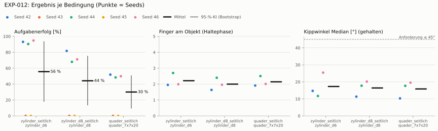
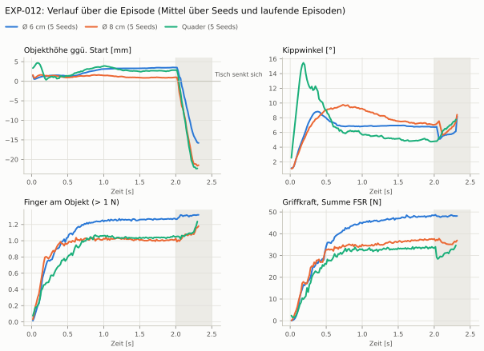
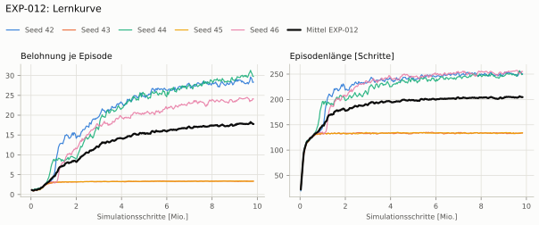
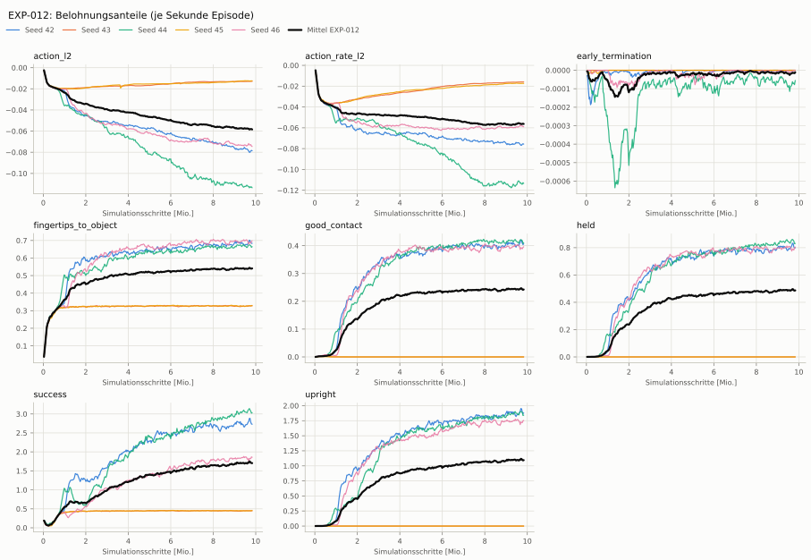
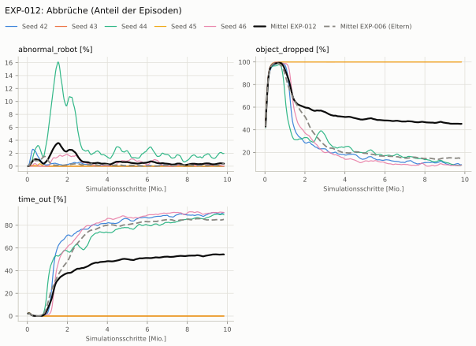
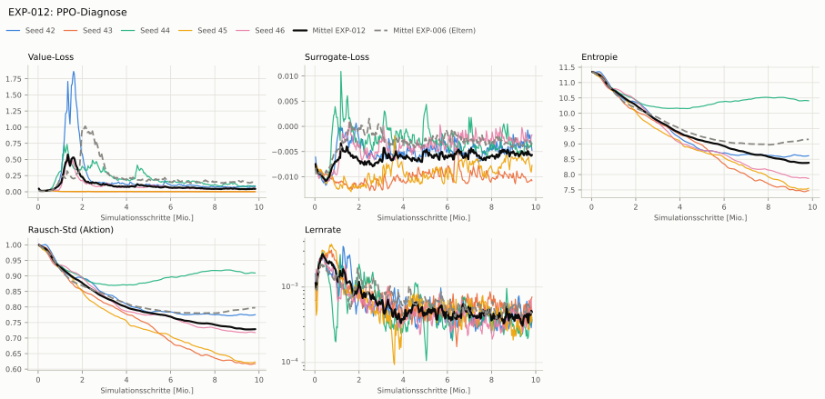

# EXP-012: Belohnung wie Dexsuite (Annäherung mit Handfläche, Position 3D zur Startposition)

**Leistung** 73 % [69–78 %] (erfolgreiche Seeds, IQM über die Objekte; je Objekt Ø 6 cm 93 % · Ø 8 cm 71 % · Quader 50 %) — ggü. EXP-006: P(besser) = 0.39 [0.14–0.67] → kein Unterschied

**Testobjekte** (nie trainiert, erfolgreiche Seeds, Median): Flasche 78 % · Saftpackung 64 %

**Zuverlässigkeit** 3/5 Seeds erfolgreich [15–95 %] — EXP-006: 4/5, exakter Fisher-Test p = 1.00 → nicht unterscheidbar (für eine Aussage ≥ 10 Seeds je Experiment)

**Leitplanken** Unruhe: 2.8 > 0.374 ✗

**Befund** ohne Erfolg: Seed 43 (lernt nicht zu greifen), Seed 45 (lernt nicht zu greifen); Engpass Quader (50 %); Kippwinkel 17° (EXP-006: 30°); Unruhe 2.80 (EXP-006: 0.31)

**Urteilsvorschlag** (auswertung-v2): **kein Unterschied, Leitplanke verletzt**

**Beste Videos** (Seed 42, 3 Episoden): [Ø 6 cm](beste_videos/zylinder_d6_s42.mp4) · [Ø 8 cm](beste_videos/zylinder_d8_s42.mp4) · [Quader](beste_videos/quader_7x7x20_s42.mp4)

Ergebnisse je Bedingung (eval-v1, Leitplanken, Fehlerarten, Fingernutzung)

#### Bedingung `zylinder_seitlich`

Bedingung `zylinder_seitlich` (Objekt `zylinder_d6`, Kippwinkel ≤ 45°), Protokoll eval-v1, 5 Seed(s); Spalte EXP-006 unter derselben Anforderung

| Metrik | Mittel | 95-%-KI | IQM | Fehlschlag-Seeds (< 50 %) | EXP-006 (Mittel / IQM) |
|---|---|---|---|---|---|
| aufgabenerfolg | 55.7 % | 18.2 % – 93.4 % | 64.1 % | 40.0 % | 77.5 % / 89.0 % |
| haltequote | 56.0 % | 18.3 % – 93.7 % | 64.5 % | 40.0 % | 92.3 % / 94.3 % |
| Kippwinkel Median [°] | 17.3 | | | | 30 |
| Unterarm Median [°] | 24 | | | | 40 |
| Griffkraft Mittel [N] | 82.3 | | | | 85.7 |
| Kraft > 15 N [Anteil] | 99.9 % | | | | 99.9 % |
| Stall-Anteil [Anteil] | 99.5 % | | | | 99.8 % |
| Absinken [mm] | 1.14 | | | | 0.0206 |
| Unruhe | 2.8 | | | | 0.312 |

Fehlerarten: startfehler 0.3 %, gefallen 42.9 %, instabil 0.8 %, anforderung_verletzt 0.4 %

**Urteilsvorschlag: kein messbarer Unterschied** (gegenüber EXP-006)
Unterschied Aufgabenerfolg -21.3 Prozentpunkte (95-%-KI -53.3 … +0.7)
- Leitplanke: Unruhe: 2.8 > 0.374

Je Seed: 93.1 %, 0.0 %, 90.4 %, 0.0 %, 94.8 %

Fingernutzung (Haltephase): im Mittel 2.21 Finger am Objekt; Kontaktanteil je Seed (Daumen, Zeige, Mittel, Ring, klein): 100/0/95/0/0 · –/–/–/–/– · 100/100/0/70/0 · –/–/–/–/– · 100/0/0/99/0

#### Bedingung `zylinder_d8_seitlich`

Bedingung `zylinder_d8_seitlich` (Objekt `zylinder_d8`, Kippwinkel ≤ 45°), Protokoll eval-v1, 5 Seed(s); Spalte EXP-006 unter derselben Anforderung

| Metrik | Mittel | 95-%-KI | IQM | Fehlschlag-Seeds (< 50 %) | EXP-006 (Mittel / IQM) |
|---|---|---|---|---|---|
| aufgabenerfolg | 44.2 % | 13.7 % – 75.1 % | 48.5 % | 40.0 % | 70.7 % / 74.1 % |
| haltequote | 44.7 % | 14.0 % – 75.8 % | 49.2 % | 40.0 % | 79.4 % / 82.1 % |
| Kippwinkel Median [°] | 16.4 | | | | 23.3 |
| Unterarm Median [°] | 25.3 | | | | 33 |
| Griffkraft Mittel [N] | 60.8 | | | | 80.6 |
| Kraft > 15 N [Anteil] | 99.6 % | | | | 99.9 % |
| Stall-Anteil [Anteil] | 99.6 % | | | | 99.8 % |
| Absinken [mm] | 6.02 | | | | 0.00526 |
| Unruhe | 7.64 | | | | 0.355 |

Fehlerarten: startfehler 0.5 %, gefallen 53.3 %, instabil 1.6 %, anforderung_verletzt 0.5 %

**Urteilsvorschlag: schlechter** (gegenüber EXP-006)
Unterschied Aufgabenerfolg -26.0 Prozentpunkte (95-%-KI -47.3 … -6.3)
- Leitplanke: Absinken [mm]: 6.02 > 5.01
- Leitplanke: Unruhe: 7.64 > 0.426

Je Seed: 81.7 %, 0.0 %, 68.0 %, 0.0 %, 71.1 %

Fingernutzung (Haltephase): im Mittel 2.00 Finger am Objekt; Kontaktanteil je Seed (Daumen, Zeige, Mittel, Ring, klein): 99/0/64/0/0 · –/–/–/–/– · 99/100/0/41/0 · –/–/–/–/– · 100/0/0/89/7

#### Bedingung `quader_seitlich`

Bedingung `quader_seitlich` (Objekt `quader_7x7x20`, Kippwinkel ≤ 45°), Protokoll eval-v1, 5 Seed(s); Spalte EXP-006 unter derselben Anforderung

| Metrik | Mittel | 95-%-KI | IQM | Fehlschlag-Seeds (< 50 %) | EXP-006 (Mittel / IQM) |
|---|---|---|---|---|---|
| aufgabenerfolg | 30.0 % | 9.7 % – 50.5 % | 34.3 % | 80.0 % | 44.0 % / 52.6 % |
| haltequote | 30.4 % | 9.8 % – 51.1 % | 34.7 % | 60.0 % | 57.0 % / 57.5 % |
| Kippwinkel Median [°] | 15.8 | | | | 30.7 |
| Unterarm Median [°] | 25.6 | | | | 35.4 |
| Griffkraft Mittel [N] | 59.9 | | | | 74.4 |
| Kraft > 15 N [Anteil] | 99.4 % | | | | 99.9 % |
| Stall-Anteil [Anteil] | 99.7 % | | | | 99.8 % |
| Absinken [mm] | 8.48 | | | | 0.00101 |
| Unruhe | 3.76 | | | | 0.502 |

Fehlerarten: startfehler 5.8 %, gefallen 61.6 %, instabil 2.2 %, anforderung_verletzt 0.4 %

**Urteilsvorschlag: schlechter** (gegenüber EXP-006)
Unterschied Aufgabenerfolg -13.8 Prozentpunkte (95-%-KI -31.3 … -3.2)
- Leitplanke: Absinken [mm]: 8.48 > 5
- Leitplanke: Unruhe: 3.76 > 0.603

Je Seed: 51.9 %, 0.0 %, 48.4 %, 0.0 %, 49.9 %

Fingernutzung (Haltephase): im Mittel 2.14 Finger am Objekt; Kontaktanteil je Seed (Daumen, Zeige, Mittel, Ring, klein): 100/0/91/0/0 · –/–/–/–/– · 91/95/0/64/1 · –/–/–/–/– · 100/0/0/100/1

Trainingsverlauf

Seeds dünn, Mittel kräftig, Eltern gestrichelt (nur Abbrüche/PPO — Trainings-Belohnung ist zwischen Experimenten nicht vergleichbar); geglättet, x = Simulationsschritte. Endwerte = Mittel der letzten 10 Iterationen (Belohnungsanteile je Sekunde Episode).

| Größe | Seed 42 | Seed 43 | Seed 44 | Seed 45 | Seed 46 | Mittel |
|---|---|---|---|---|---|---|
| mean_reward | 28.7 | 3.33 | 30.2 | 3.35 | 23.9 | 17.9 |
| action_l2 | -0.0788 | -0.0129 | -0.113 | -0.0125 | -0.0737 | -0.0581 |
| action_rate_l2 | -0.0757 | -0.0159 | -0.112 | -0.0174 | -0.0585 | -0.056 |
| early_termination | 0 | 0 | -6.99e-05 | 0 | -5.79e-06 | -1.51e-05 |
| fingertips_to_object | 0.688 | 0.328 | 0.666 | 0.329 | 0.693 | 0.541 |
| good_contact | 0.41 | 0 | 0.414 | 0 | 0.394 | 0.243 |
| held | 0.809 | 0 | 0.84 | 0 | 0.795 | 0.489 |
| success | 2.78 | 0.449 | 3.06 | 0.452 | 1.83 | 1.72 |
| upright | 1.9 | 0 | 1.86 | 0 | 1.73 | 1.1 |
| object_dropped | 9.5 % | 100.0 % | 8.6 % | 100.0 % | 8.5 % | 45.3 % |
| mean_noise_std | 0.774 | 0.616 | 0.91 | 0.622 | 0.719 | 0.728 |

Videos aller Seeds

16 Umgebungen, eine Episode (nicht im Git, Hugging Face).

| Objekt | Seed 42 | Seed 43 | Seed 44 | Seed 45 | Seed 46 |
|---|---|---|---|---|---|
| `quader_7x7x20` | [▶](videos/quader_7x7x20_s42.mp4) | [▶](videos/quader_7x7x20_s43.mp4) | [▶](videos/quader_7x7x20_s44.mp4) | [▶](videos/quader_7x7x20_s45.mp4) | [▶](videos/quader_7x7x20_s46.mp4) |
| `zylinder_d6` | [▶](videos/zylinder_d6_s42.mp4) | [▶](videos/zylinder_d6_s43.mp4) | [▶](videos/zylinder_d6_s44.mp4) | [▶](videos/zylinder_d6_s45.mp4) | [▶](videos/zylinder_d6_s46.mp4) |
| `zylinder_d8` | [▶](videos/zylinder_d8_s42.mp4) | [▶](videos/zylinder_d8_s43.mp4) | [▶](videos/zylinder_d8_s44.mp4) | [▶](videos/zylinder_d8_s45.mp4) | [▶](videos/zylinder_d8_s46.mp4) |

Netz, Training und Konfiguration

Actor [256, 128, 64] (elu), 68808 Parameter, 105 Eingänge (Verlauf 5) · Critic [512, 256, 128] · PPO: Lernrate 0.001, Entropie 0.005, 5 Epochen × 4 Mini-Batches, 32 Schritte/Umgebung · 1024 Umgebungen × 300 Iterationen

Geplante Änderung: Eigenbau-Belohnung zurück auf Dexsuite (RewardsDexsuiteCfg, Task HeavyDexsuite-v0): Annäherung = Dexsuite object_ee_distance über Handfläche + Fingerspitzen (behebt zugleich, dass unsere Kopie alle Körper inkl. Unterarm maß — Standardargument-SceneEntityCfg nicht aufgelöst); Positionsverfolgung = 3D-Abstand zur Startposition std 0,2 (statt Absinken in z, einseitig, 0,02); Erfolg = 3D-Abstand pos_std 0,1 × Kipp 0,5 (statt 0,02). Startposition bei 0,1 s eingefroren. Größenordnung geprüft (isaac_sim/tools/_reward_diag.txt).

Konfiguration gegenüber EXP-006 (18 Unterschiede):

- `env.rewards.fingertips_to_object.func: pib_grasp.mdp:fingertips_to_object → isaaclab_tasks.manager_based.manipulation.dexsuite.mdp.rewards:object_ee_distance`
- `env.rewards.fingertips_to_object.params.asset_cfg.body_ids: ∅ → object/apply:builtins.slice(None, None, None)`
- `env.rewards.fingertips_to_object.params.asset_cfg.body_names: ∅ → ['urdf_palm_left', 'urdf_thumb_tip', 'urdf_finger_tip', 'urdf_finger_tip_2', 'urdf_finger_tip_3', 'urdf_finger_tip_4']`
- `env.rewards.fingertips_to_object.params.asset_cfg.fixed_tendon_ids: ∅ → object/apply:builtins.slice(None, None, None)`
- `env.rewards.fingertips_to_object.params.asset_cfg.fixed_tendon_names: ∅ → None`
- `env.rewards.fingertips_to_object.params.asset_cfg.joint_ids: ∅ → object/apply:builtins.slice(None, None, None)`
- `env.rewards.fingertips_to_object.params.asset_cfg.joint_names: ∅ → None`
- `env.rewards.fingertips_to_object.params.asset_cfg.name: ∅ → robot`
- `env.rewards.fingertips_to_object.params.asset_cfg.object_collection_ids: ∅ → object/apply:builtins.slice(None, None, None)`
- `env.rewards.fingertips_to_object.params.asset_cfg.object_collection_names: ∅ → None`
- `env.rewards.fingertips_to_object.params.asset_cfg.preserve_order: ∅ → False`
- `env.rewards.held.func: pib_grasp.mdp:held_in_grasp → pib_grasp.mdp:position_tracking_start`
- `env.rewards.held.params.ref_s: ∅ → 0.1`
- `env.rewards.held.params.std: 0.02 → 0.2`
- `env.rewards.success.func: pib_grasp.mdp:object_held_upright → pib_grasp.mdp:success_start`
- `env.rewards.success.params.pos_std: ∅ → 0.1`
- `env.rewards.success.params.ref_s: ∅ → 0.1`
- `env.rewards.success.params.std: 0.02 → ∅`

