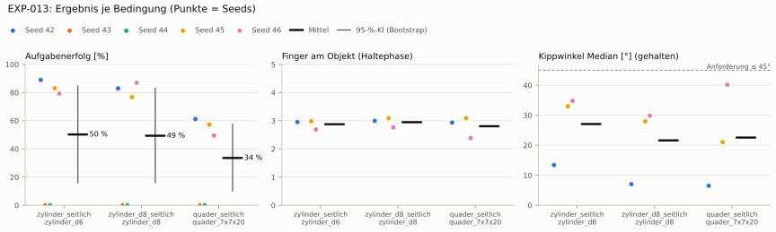
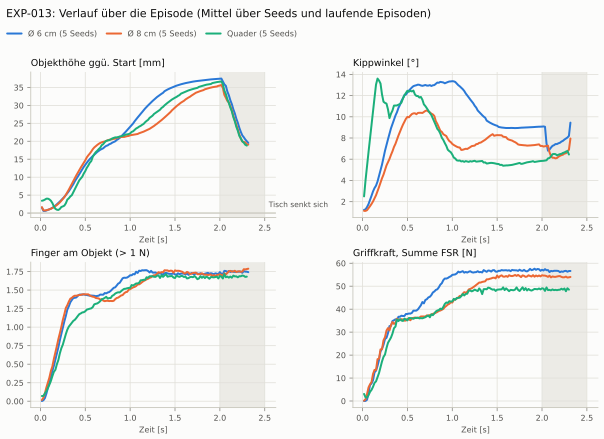
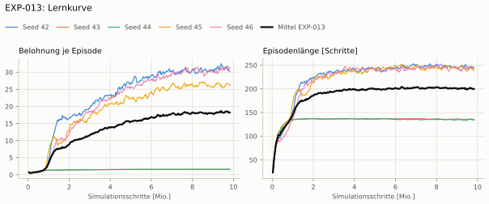
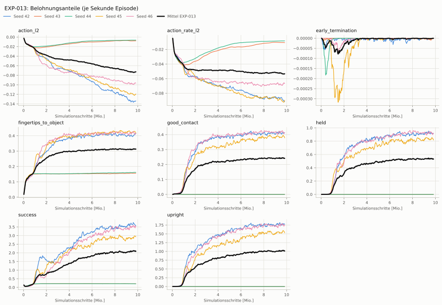
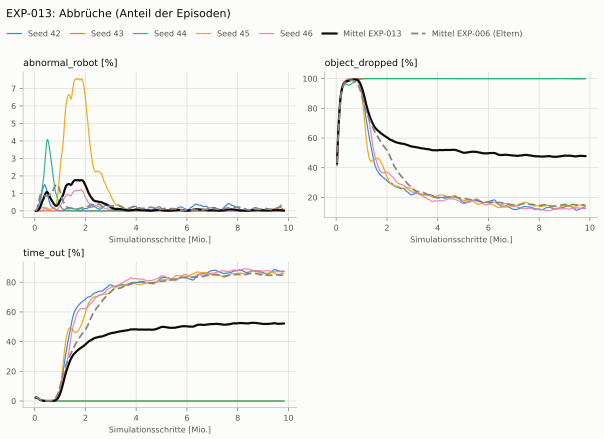
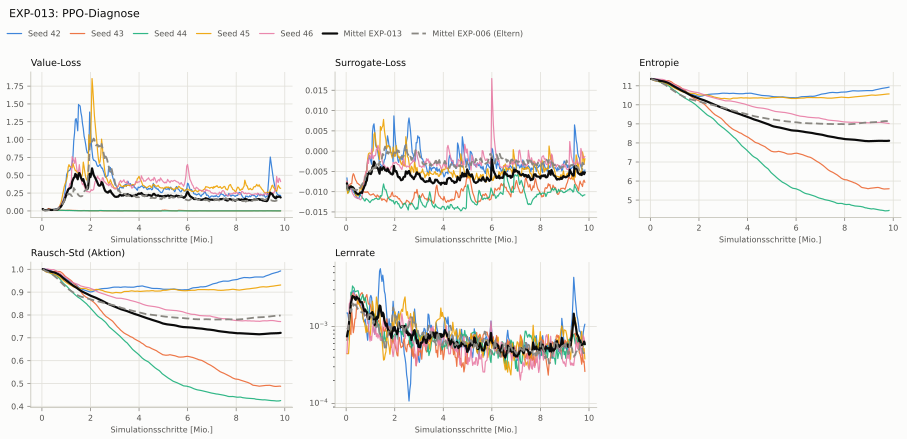

# EXP-013: Objektvielfalt im Training (18 Formen der Kategorie seitlich)

> **Nachtrag 2026-10-09 (ADR-021/022):** Nachbewertet unter eval-v2 (Leistung 83 %, Quader 78 %, YCB 80–86 %); das Training lief noch mit Resten der Reset-Überlappung (Daumen-MCP 0–15°, Handgelenk −3–0°).

> **Nachtrag 2026-10-09 (ADR-021/022):** Der Annäherungsterm maß bis EXP-018 alle Handkörper (Unterarmansatz) statt der Fingerspitzen und wäre auch korrigiert für 3–4 cm Fingerweg zu flach: ein Signal fürs Zugreifen fehlte, Seeds scheiterten deshalb am Entdecken des Griffs (ADR-022).

> **Nachtrag 2026-10-09 (ADR-021/022):** Aktionen unbegrenzt (rsl_rl ohne NVIDIAs bounds_loss): Aktionsstrafen und Leitplanke Unruhe messen großteils Rauschen und Überziehen jenseits der Servo-Sättigung, nicht Bewegung (ADR-022).

**Leistung** 83 % [80–87 %] (erfolgreiche Seeds, IQM über die Objekte; je Objekt Ø 6 cm 84 % · Ø 8 cm 87 % · Quader 78 %)

**Testobjekte** (nie trainiert, erfolgreiche Seeds, Median): Flasche 85 % · Saftpackung 88 % · Cracker (YCB) 83 % · Zucker (YCB) 86 % · Senf (YCB) 80 %

**Zuverlässigkeit** 3/5 Seeds erfolgreich [15–95 %]

**Leitplanken** – (keine Eltern)

**Befund** ohne Erfolg: Seed 43 (lernt nicht zu greifen), Seed 44 (lernt nicht zu greifen); Engpass Quader (78 %)

**Urteilsvorschlag** (auswertung-v2): **kein Vergleich (Eltern unter eval-v1)**

**Beste Videos** (Seed 42, 3 Episoden): [Ø 6 cm](beste_videos/EXP-013_zylinder_d6_s42.mp4) · [Ø 8 cm](beste_videos/EXP-013_zylinder_d8_s42.mp4) · [Quader](beste_videos/EXP-013_quader_7x7x20_s42.mp4)

Ergebnisse je Bedingung (eval-v2, Leitplanken, Fehlerarten, Fingernutzung)

#### Bedingung `zylinder_seitlich`

Bedingung `zylinder_seitlich` (Objekt `zylinder_d6`, Kippwinkel ≤ 45°), Protokoll eval-v2, 5 Seed(s); Spalte Eltern unter derselben Anforderung

| Metrik | Mittel | 95-%-KI | IQM | Fehlschlag-Seeds (< 50 %) | Eltern (Mittel / IQM) |
|---|---|---|---|---|---|
| aufgabenerfolg | 51.0 % | 15.7 % – 86.7 % | 56.4 % | 40.0 % | – |
| haltequote | 58.1 % | 19.1 % – 97.2 % | 67.2 % | 40.0 % | – |
| Kippwinkel Median [°] | 28 | | | | – |
| Unterarm Median [°] | 33 | | | | – |
| Griffkraft Mittel [N] | 93.6 | | | | – |
| Kraft > 15 N [Anteil] | 100.0 % | | | | – |
| Stall-Anteil [Anteil] | 100.0 % | | | | – |
| Absinken [mm] | 0 | | | | – |
| Unruhe | 0.762 | | | | – |
| Unruhe wirksam (Aktion auf ±1 begrenzt) | – | | | | – |

Fehlerarten: startfehler 0.0 %, gefallen 41.9 %, instabil 0.0 %, anforderung_verletzt 7.2 %

**Urteilsvorschlag: kein Vergleich (keine Eltern-Bewertung mit gleichem Protokoll)**

Je Seed: 92.8 %, 0.0 %, 0.0 %, 84.2 %, 77.7 %

Fingernutzung (Haltephase): im Mittel 2.89 Finger am Objekt; Kontaktanteil je Seed (Daumen, Zeige, Mittel, Ring, klein): 100/90/100/0/6 · –/–/–/–/– · –/–/–/–/– · 96/15/100/0/89 · 100/70/0/100/0

#### Bedingung `zylinder_d8_seitlich`

Bedingung `zylinder_d8_seitlich` (Objekt `zylinder_d8`, Kippwinkel ≤ 45°), Protokoll eval-v2, 5 Seed(s); Spalte Referenz zylinder_seitlich unter derselben Anforderung

| Metrik | Mittel | 95-%-KI | IQM | Fehlschlag-Seeds (< 50 %) | Referenz zylinder_seitlich (Mittel / IQM) |
|---|---|---|---|---|---|
| aufgabenerfolg | 53.0 % | 17.3 % – 88.9 % | 60.7 % | 40.0 % | 51.0 % / 56.4 % |
| haltequote | 55.6 % | 18.3 % – 93.1 % | 64.2 % | 40.0 % | 58.1 % / 67.2 % |
| Kippwinkel Median [°] | 22.5 | | | | 28 |
| Unterarm Median [°] | 32 | | | | 33 |
| Griffkraft Mittel [N] | 88.3 | | | | 93.6 |
| Kraft > 15 N [Anteil] | 100.0 % | | | | 100.0 % |
| Stall-Anteil [Anteil] | 100.0 % | | | | 100.0 % |
| Absinken [mm] | 0 | | | | 0 |
| Unruhe | 0.889 | | | | 0.762 |
| Unruhe wirksam (Aktion auf ±1 begrenzt) | – | | | | – |

Fehlerarten: startfehler 0.0 %, gefallen 44.3 %, instabil 0.0 %, anforderung_verletzt 2.6 %

**Urteilsvorschlag: kein messbarer Unterschied** (gegenüber Referenz zylinder_seitlich)
Unterschied Aufgabenerfolg +2.1 Prozentpunkte (95-%-KI -0.7 … +5.8)

Je Seed: 91.6 %, 0.0 %, 0.0 %, 86.8 %, 86.7 %

Fingernutzung (Haltephase): im Mittel 2.90 Finger am Objekt; Kontaktanteil je Seed (Daumen, Zeige, Mittel, Ring, klein): 100/99/100/0/0 · –/–/–/–/– · –/–/–/–/– · 99/22/100/0/88 · 99/62/0/100/0

#### Bedingung `quader_seitlich`

Bedingung `quader_seitlich` (Objekt `quader_7x7x20`, Kippwinkel ≤ 45°), Protokoll eval-v2, 5 Seed(s); Spalte Referenz zylinder_seitlich unter derselben Anforderung

| Metrik | Mittel | 95-%-KI | IQM | Fehlschlag-Seeds (< 50 %) | Referenz zylinder_seitlich (Mittel / IQM) |
|---|---|---|---|---|---|
| aufgabenerfolg | 44.0 % | 12.3 % – 75.7 % | 48.0 % | 40.0 % | 51.0 % / 56.4 % |
| haltequote | 48.3 % | 15.8 % – 80.9 % | 55.6 % | 40.0 % | 58.1 % / 67.2 % |
| Kippwinkel Median [°] | 23.4 | | | | 28 |
| Unterarm Median [°] | 32.5 | | | | 33 |
| Griffkraft Mittel [N] | 82.5 | | | | 93.6 |
| Kraft > 15 N [Anteil] | 100.0 % | | | | 100.0 % |
| Stall-Anteil [Anteil] | 100.0 % | | | | 100.0 % |
| Absinken [mm] | 0.0174 | | | | 0 |
| Unruhe | 0.953 | | | | 0.762 |
| Unruhe wirksam (Aktion auf ±1 begrenzt) | – | | | | – |

Fehlerarten: startfehler 0.0 %, gefallen 51.7 %, instabil 0.0 %, anforderung_verletzt 4.3 %

**Urteilsvorschlag: schlechter** (gegenüber Referenz zylinder_seitlich)
Unterschied Aufgabenerfolg -7.1 Prozentpunkte (95-%-KI -13.3 … -1.7)
- Leitplanke: Unruhe: 0.953 > 0.914

Je Seed: 80.5 %, 0.0 %, 0.0 %, 78.3 %, 61.1 %

Fingernutzung (Haltephase): im Mittel 2.78 Finger am Objekt; Kontaktanteil je Seed (Daumen, Zeige, Mittel, Ring, klein): 100/93/100/0/2 · –/–/–/–/– · –/–/–/–/– · 97/18/100/4/93 · 100/28/0/100/0

#### Bedingung `flasche_seitlich`

Bedingung `flasche_seitlich` (Objekt `flasche_d7x25`, Kippwinkel ≤ 45°), Protokoll eval-v2, 5 Seed(s); Spalte Referenz zylinder_seitlich unter derselben Anforderung

| Metrik | Mittel | 95-%-KI | IQM | Fehlschlag-Seeds (< 50 %) | Referenz zylinder_seitlich (Mittel / IQM) |
|---|---|---|---|---|---|
| aufgabenerfolg | 52.7 % | 16.9 % – 88.7 % | 59.3 % | 40.0 % | 51.0 % / 56.4 % |
| haltequote | 56.3 % | 18.5 % – 94.1 % | 65.1 % | 40.0 % | 58.1 % / 67.2 % |
| Kippwinkel Median [°] | 24.6 | | | | 28 |
| Unterarm Median [°] | 31.4 | | | | 33 |
| Griffkraft Mittel [N] | 90.8 | | | | 93.6 |
| Kraft > 15 N [Anteil] | 99.9 % | | | | 100.0 % |
| Stall-Anteil [Anteil] | 100.0 % | | | | 100.0 % |
| Absinken [mm] | 0.0161 | | | | 0 |
| Unruhe | 0.834 | | | | 0.762 |
| Unruhe wirksam (Aktion auf ±1 begrenzt) | – | | | | – |

Fehlerarten: startfehler 0.0 %, gefallen 43.7 %, instabil 0.0 %, anforderung_verletzt 3.5 %

**Urteilsvorschlag: kein messbarer Unterschied** (gegenüber Referenz zylinder_seitlich)
Unterschied Aufgabenerfolg +1.8 Prozentpunkte (95-%-KI -0.0 … +4.7)

Je Seed: 94.1 %, 0.0 %, 0.0 %, 85.1 %, 84.5 %

Fingernutzung (Haltephase): im Mittel 2.92 Finger am Objekt; Kontaktanteil je Seed (Daumen, Zeige, Mittel, Ring, klein): 100/99/100/0/1 · –/–/–/–/– · –/–/–/–/– · 96/19/99/0/93 · 100/68/0/100/0

#### Bedingung `saftpackung_seitlich`

Bedingung `saftpackung_seitlich` (Objekt `saftpackung_9x6x19`, Kippwinkel ≤ 45°), Protokoll eval-v2, 5 Seed(s); Spalte Referenz zylinder_seitlich unter derselben Anforderung

| Metrik | Mittel | 95-%-KI | IQM | Fehlschlag-Seeds (< 50 %) | Referenz zylinder_seitlich (Mittel / IQM) |
|---|---|---|---|---|---|
| aufgabenerfolg | 51.0 % | 15.6 % – 86.6 % | 57.3 % | 40.0 % | 51.0 % / 56.4 % |
| haltequote | 53.9 % | 17.7 % – 90.3 % | 62.2 % | 40.0 % | 58.1 % / 67.2 % |
| Kippwinkel Median [°] | 24.1 | | | | 28 |
| Unterarm Median [°] | 34.8 | | | | 33 |
| Griffkraft Mittel [N] | 82.4 | | | | 93.6 |
| Kraft > 15 N [Anteil] | 99.9 % | | | | 100.0 % |
| Stall-Anteil [Anteil] | 100.0 % | | | | 100.0 % |
| Absinken [mm] | 0.0045 | | | | 0 |
| Unruhe | 0.856 | | | | 0.762 |
| Unruhe wirksam (Aktion auf ±1 begrenzt) | – | | | | – |

Fehlerarten: startfehler 0.0 %, gefallen 46.0 %, instabil 0.1 %, anforderung_verletzt 3.0 %

**Urteilsvorschlag: kein messbarer Unterschied** (gegenüber Referenz zylinder_seitlich)
Unterschied Aufgabenerfolg -0.0 Prozentpunkte (95-%-KI -2.1 … +2.2)

Je Seed: 89.7 %, 0.0 %, 0.0 %, 87.9 %, 77.3 %

Fingernutzung (Haltephase): im Mittel 2.72 Finger am Objekt; Kontaktanteil je Seed (Daumen, Zeige, Mittel, Ring, klein): 100/100/100/0/2 · –/–/–/–/– · –/–/–/–/– · 94/15/100/3/85 · 100/19/0/100/0

Trainingsverlauf

Seeds dünn, Mittel kräftig, Eltern gestrichelt (nur Abbrüche/PPO — Trainings-Belohnung ist zwischen Experimenten nicht vergleichbar); geglättet, x = Simulationsschritte. Endwerte = Mittel der letzten 10 Iterationen (Belohnungsanteile je Sekunde Episode).

| Größe | Seed 42 | Seed 43 | Seed 44 | Seed 45 | Seed 46 | Mittel |
|---|---|---|---|---|---|---|
| mean_reward | 30.5 | 1.57 | 1.59 | 26.5 | 31.4 | 18.3 |
| action_l2 | -0.135 | -0.00788 | -0.00645 | -0.121 | -0.0971 | -0.0733 |
| action_rate_l2 | -0.0904 | -0.0106 | -0.00829 | -0.0913 | -0.067 | -0.0535 |
| early_termination | 0 | -2.6e-06 | 0 | 0 | 0 | -5.21e-07 |
| fingertips_to_object | 0.409 | 0.156 | 0.162 | 0.425 | 0.417 | 0.314 |
| good_contact | 0.411 | 5.68e-05 | 8.58e-06 | 0.385 | 0.415 | 0.242 |
| held | 0.917 | 0 | 0 | 0.832 | 0.917 | 0.533 |
| success | 3.64 | 0.212 | 0.206 | 2.94 | 3.52 | 2.1 |
| upright | 1.78 | 0 | 0 | 1.56 | 1.75 | 1.02 |
| object_dropped | 12.8 % | 99.9 % | 100.0 % | 14.3 % | 12.6 % | 47.9 % |
| mean_noise_std | 0.99 | 0.488 | 0.424 | 0.93 | 0.772 | 0.721 |

Videos aller Seeds

16 Umgebungen, eine Episode (nicht im Git, Hugging Face).

| Objekt | Seed 42 | Seed 43 | Seed 44 | Seed 45 | Seed 46 |
|---|---|---|---|---|---|
| `quader_7x7x20` | [▶](videos/EXP-013_quader_7x7x20_s42.mp4) | [▶](videos/EXP-013_quader_7x7x20_s43.mp4) | [▶](videos/EXP-013_quader_7x7x20_s44.mp4) | [▶](videos/EXP-013_quader_7x7x20_s45.mp4) | [▶](videos/EXP-013_quader_7x7x20_s46.mp4) |
| `zylinder_d6` | [▶](videos/EXP-013_zylinder_d6_s42.mp4) | [▶](videos/EXP-013_zylinder_d6_s43.mp4) | [▶](videos/EXP-013_zylinder_d6_s44.mp4) | [▶](videos/EXP-013_zylinder_d6_s45.mp4) | [▶](videos/EXP-013_zylinder_d6_s46.mp4) |
| `zylinder_d8` | [▶](videos/EXP-013_zylinder_d8_s42.mp4) | [▶](videos/EXP-013_zylinder_d8_s43.mp4) | [▶](videos/EXP-013_zylinder_d8_s44.mp4) | [▶](videos/EXP-013_zylinder_d8_s45.mp4) | [▶](videos/EXP-013_zylinder_d8_s46.mp4) |

Netz, Training und Konfiguration

Actor [256, 128, 64] (elu), 68808 Parameter, 105 Eingänge (Verlauf 5) · Critic [512, 256, 128] · PPO: Lernrate 0.001, Entropie 0.005, 5 Epochen × 4 Mini-Batches, 32 Schritte/Umgebung · 1024 Umgebungen × 300 Iterationen

Geplante Änderung: Objektvielfalt wie Dexsuite (MultiAssetSpawnerCfg), Task HeavyMulti-v0: je Umgebung eine von 18 Formen (10 Zylinder Ø 5–9 cm × 15/20 cm, 8 Quader 6–8 cm × 16/20 cm), Startlage je Umgebung aus der Bounding Box (Oberfläche 3,5 cm vor der Handfläche), Drehung ±15° für alle. Notwendig dazu (sonst ~1/3 der Starts mit Überlappung, tools/check_multi.py): Startbeugung der Finger 0–4° statt 0–15°, Handgelenk −3–0° statt −10–0°; Daumen unverändert. Belohnung unverändert (inkl. des Annäherungsfehlers, wie EXP-006). Szenenprüfung statt Fenstertest (Leon remote): isaac_sim/tools/_check_multi.txt + Bilder.

Konfiguration gegenüber EXP-006 (30 Unterschiede):

- `env.events.place_objects.func: ∅ → pib_grasp.mdp:place_objects_by_size`
- `env.events.place_objects.interval_range_s: ∅ → None`
- `env.events.place_objects.is_global_time: ∅ → False`
- `env.events.place_objects.min_step_count_between_reset: ∅ → 0`
- `env.events.place_objects.mode: ∅ → startup`
- `env.events.place_objects.params.hand_x: ∅ → 0.0`
- `env.events.place_objects.params.palm_gap: ∅ → 0.035`
- `env.events.place_objects.params.table_top_z: ∅ → 0.415`
- `env.events.reset_hand.params.ranges_deg.index_left_proximal: (0.0, 15.0) → (0.0, 4.0)`
- `env.events.reset_hand.params.ranges_deg.middle_left_proximal: (0.0, 15.0) → (0.0, 4.0)`
- `env.events.reset_hand.params.ranges_deg.pinky_left_proximal: (0.0, 15.0) → (0.0, 4.0)`
- `env.events.reset_hand.params.ranges_deg.ring_left_proximal: (0.0, 15.0) → (0.0, 4.0)`
- `env.events.reset_hand.params.ranges_deg.wrist_left: (-10.0, 0.0) → (-3.0, 0.0)`
- `env.events.reset_object.params.pose_range.yaw: (-3.141592653589793, 3.141592653589793) → (-0.2617993877991494, 0.2617993877991494)`
- `env.scene.object.spawn.assets_cfg: ∅ → [{'func': 'isaaclab.sim.spawners.shapes.shapes:spawn_cylinder', 'visible': True, 'semantic_tags': None, 'copy_from_source': True, 'mass_props': None, 'rigid_props': None, 'collision_props': None, 'activate_contact_sensors': False, 'visual_material_path': 'material', 'visual_material': {'func': 'isaaclab.sim.spawners.materials.visual_materials:spawn_preview_surface', 'diffuse_color': (0.8, 0.2, 0.2), 'emissive_color': (0.0, 0.0, 0.0), 'roughness': 0.5, 'metallic': 0.0, 'opacity': 1.0}, 'physics_material_path': 'material', 'physics_material': {'func': 'isaaclab.sim.spawners.materials.physics_materials:spawn_rigid_body_material', 'static_friction': 0.8, 'dynamic_friction': 0.8, 'restitution': 0.0, 'friction_combine_mode': 'average', 'restitution_combine_mode': 'average', 'compliant_contact_stiffness': 0.0, 'compliant_contact_damping': 0.0}, 'radius': 0.025, 'height': 0.15, 'axis': 'Z'}, {'func': 'isaaclab.sim.spawners.shapes.shapes:spawn_cylinder', 'visible': True, 'semantic_tags': None, 'copy_from_source': True, 'mass_props': None, 'rigid_props': None, 'collision_props': None, 'activate_contact_sensors': False, 'visual_material_path': 'material', 'visual_material': {'func': 'isaaclab.sim.spawners.materials.visual_materials:spawn_preview_surface', 'diffuse_color': (0.8, 0.2, 0.2), 'emissive_color': (0.0, 0.0, 0.0), 'roughness': 0.5, 'metallic': 0.0, 'opacity': 1.0}, 'physics_material_path': 'material', 'physics_material': {'func': 'isaaclab.sim.spawners.materials.physics_materials:spawn_rigid_body_material', 'static_friction': 0.8, 'dynamic_friction': 0.8, 'restitution': 0.0, 'friction_combine_mode': 'average', 'restitution_combine_mode': 'average', 'compliant_contact_stiffness': 0.0, 'compliant_contact_damping': 0.0}, 'radius': 0.025, 'height': 0.2, 'axis': 'Z'}, {'func': 'isaaclab.sim.spawners.shapes.shapes:spawn_cylinder', 'visible': True, 'semantic_tags': None, 'copy_from_source': True, 'mass_props': None, 'rigid_props': None, 'collision_props': None, 'activate_contact_sensors': False, 'visual_material_path': 'material', 'visual_material': {'func': 'isaaclab.sim.spawners.materials.visual_materials:spawn_preview_surface', 'diffuse_color': (0.8, 0.2, 0.2), 'emissive_color': (0.0, 0.0, 0.0), 'roughness': 0.5, 'metallic': 0.0, 'opacity': 1.0}, 'physics_material_path': 'material', 'physics_material': {'func': 'isaaclab.sim.spawners.materials.physics_materials:spawn_rigid_body_material', 'static_friction': 0.8, 'dynamic_friction': 0.8, 'restitution': 0.0, 'friction_combine_mode': 'average', 'restitution_combine_mode': 'average', 'compliant_contact_stiffness': 0.0, 'compliant_contact_damping': 0.0}, 'radius': 0.03, 'height': 0.15, 'axis': 'Z'}, {'func': 'isaaclab.sim.spawners.shapes.shapes:spawn_cylinder', 'visible': True, 'semantic_tags': None, 'copy_from_source': True, 'mass_props': None, 'rigid_props': None, 'collision_props': None, 'activate_contact_sensors': False, 'visual_material_path': 'material', 'visual_material': {'func': 'isaaclab.sim.spawners.materials.visual_materials:spawn_preview_surface', 'diffuse_color': (0.8, 0.2, 0.2), 'emissive_color': (0.0, 0.0, 0.0), 'roughness': 0.5, 'metallic': 0.0, 'opacity': 1.0}, 'physics_material_path': 'material', 'physics_material': {'func': 'isaaclab.sim.spawners.materials.physics_materials:spawn_rigid_body_material', 'static_friction': 0.8, 'dynamic_friction': 0.8, 'restitution': 0.0, 'friction_combine_mode': 'average', 'restitution_combine_mode': 'average', 'compliant_contact_stiffness': 0.0, 'compliant_contact_damping': 0.0}, 'radius': 0.03, 'height': 0.2, 'axis': 'Z'}, {'func': 'isaaclab.sim.spawners.shapes.shapes:spawn_cylinder', 'visible': True, 'semantic_tags': None, 'copy_from_source': True, 'mass_props': None, 'rigid_props': None, 'collision_props': None, 'activate_contact_sensors': False, 'visual_material_path': 'material', 'visual_material': {'func': 'isaaclab.sim.spawners.materials.visual_materials:spawn_preview_surface', 'diffuse_color': (0.8, 0.2, 0.2), 'emissive_color': (0.0, 0.0, 0.0), 'roughness': 0.5, 'metallic': 0.0, 'opacity': 1.0}, 'physics_material_path': 'material', 'physics_material': {'func': 'isaaclab.sim.spawners.materials.physics_materials:spawn_rigid_body_material', 'static_friction': 0.8, 'dynamic_friction': 0.8, 'restitution': 0.0, 'friction_combine_mode': 'average', 'restitution_combine_mode': 'average', 'compliant_contact_stiffness': 0.0, 'compliant_contact_damping': 0.0}, 'radius': 0.035, 'height': 0.15, 'axis': 'Z'}, {'func': 'isaaclab.sim.spawners.shapes.shapes:spawn_cylinder', 'visible': True, 'semantic_tags': None, 'copy_from_source': True, 'mass_props': None, 'rigid_props': None, 'collision_props': None, 'activate_contact_sensors': False, 'visual_material_path': 'material', 'visual_material': {'func': 'isaaclab.sim.spawners.materials.visual_materials:spawn_preview_surface', 'diffuse_color': (0.8, 0.2, 0.2), 'emissive_color': (0.0, 0.0, 0.0), 'roughness': 0.5, 'metallic': 0.0, 'opacity': 1.0}, 'physics_material_path': 'material', 'physics_material': {'func': 'isaaclab.sim.spawners.materials.physics_materials:spawn_rigid_body_material', 'static_friction': 0.8, 'dynamic_friction': 0.8, 'restitution': 0.0, 'friction_combine_mode': 'average', 'restitution_combine_mode': 'average', 'compliant_contact_stiffness': 0.0, 'compliant_contact_damping': 0.0}, 'radius': 0.035, 'height': 0.2, 'axis': 'Z'}, {'func': 'isaaclab.sim.spawners.shapes.shapes:spawn_cylinder', 'visible': True, 'semantic_tags': None, 'copy_from_source': True, 'mass_props': None, 'rigid_props': None, 'collision_props': None, 'activate_contact_sensors': False, 'visual_material_path': 'material', 'visual_material': {'func': 'isaaclab.sim.spawners.materials.visual_materials:spawn_preview_surface', 'diffuse_color': (0.8, 0.2, 0.2), 'emissive_color': (0.0, 0.0, 0.0), 'roughness': 0.5, 'metallic': 0.0, 'opacity': 1.0}, 'physics_material_path': 'material', 'physics_material': {'func': 'isaaclab.sim.spawners.materials.physics_materials:spawn_rigid_body_material', 'static_friction': 0.8, 'dynamic_friction': 0.8, 'restitution': 0.0, 'friction_combine_mode': 'average', 'restitution_combine_mode': 'average', 'compliant_contact_stiffness': 0.0, 'compliant_contact_damping': 0.0}, 'radius': 0.04, 'height': 0.15, 'axis': 'Z'}, {'func': 'isaaclab.sim.spawners.shapes.shapes:spawn_cylinder', 'visible': True, 'semantic_tags': None, 'copy_from_source': True, 'mass_props': None, 'rigid_props': None, 'collision_props': None, 'activate_contact_sensors': False, 'visual_material_path': 'material', 'visual_material': {'func': 'isaaclab.sim.spawners.materials.visual_materials:spawn_preview_surface', 'diffuse_color': (0.8, 0.2, 0.2), 'emissive_color': (0.0, 0.0, 0.0), 'roughness': 0.5, 'metallic': 0.0, 'opacity': 1.0}, 'physics_material_path': 'material', 'physics_material': {'func': 'isaaclab.sim.spawners.materials.physics_materials:spawn_rigid_body_material', 'static_friction': 0.8, 'dynamic_friction': 0.8, 'restitution': 0.0, 'friction_combine_mode': 'average', 'restitution_combine_mode': 'average', 'compliant_contact_stiffness': 0.0, 'compliant_contact_damping': 0.0}, 'radius': 0.04, 'height': 0.2, 'axis': 'Z'}, {'func': 'isaaclab.sim.spawners.shapes.shapes:spawn_cylinder', 'visible': True, 'semantic_tags': None, 'copy_from_source': True, 'mass_props': None, 'rigid_props': None, 'collision_props': None, 'activate_contact_sensors': False, 'visual_material_path': 'material', 'visual_material': {'func': 'isaaclab.sim.spawners.materials.visual_materials:spawn_preview_surface', 'diffuse_color': (0.8, 0.2, 0.2), 'emissive_color': (0.0, 0.0, 0.0), 'roughness': 0.5, 'metallic': 0.0, 'opacity': 1.0}, 'physics_material_path': 'material', 'physics_material': {'func': 'isaaclab.sim.spawners.materials.physics_materials:spawn_rigid_body_material', 'static_friction': 0.8, 'dynamic_friction': 0.8, 'restitution': 0.0, 'friction_combine_mode': 'average', 'restitution_combine_mode': 'average', 'compliant_contact_stiffness': 0.0, 'compliant_contact_damping': 0.0}, 'radius': 0.045, 'height': 0.15, 'axis': 'Z'}, {'func': 'isaaclab.sim.spawners.shapes.shapes:spawn_cylinder', 'visible': True, 'semantic_tags': None, 'copy_from_source': True, 'mass_props': None, 'rigid_props': None, 'collision_props': None, 'activate_contact_sensors': False, 'visual_material_path': 'material', 'visual_material': {'func': 'isaaclab.sim.spawners.materials.visual_materials:spawn_preview_surface', 'diffuse_color': (0.8, 0.2, 0.2), 'emissive_color': (0.0, 0.0, 0.0), 'roughness': 0.5, 'metallic': 0.0, 'opacity': 1.0}, 'physics_material_path': 'material', 'physics_material': {'func': 'isaaclab.sim.spawners.materials.physics_materials:spawn_rigid_body_material', 'static_friction': 0.8, 'dynamic_friction': 0.8, 'restitution': 0.0, 'friction_combine_mode': 'average', 'restitution_combine_mode': 'average', 'compliant_contact_stiffness': 0.0, 'compliant_contact_damping': 0.0}, 'radius': 0.045, 'height': 0.2, 'axis': 'Z'}, {'func': 'isaaclab.sim.spawners.shapes.shapes:spawn_cuboid', 'visible': True, 'semantic_tags': None, 'copy_from_source': True, 'mass_props': None, 'rigid_props': None, 'collision_props': None, 'activate_contact_sensors': False, 'visual_material_path': 'material', 'visual_material': {'func': 'isaaclab.sim.spawners.materials.visual_materials:spawn_preview_surface', 'diffuse_color': (0.8, 0.2, 0.2), 'emissive_color': (0.0, 0.0, 0.0), 'roughness': 0.5, 'metallic': 0.0, 'opacity': 1.0}, 'physics_material_path': 'material', 'physics_material': {'func': 'isaaclab.sim.spawners.materials.physics_materials:spawn_rigid_body_material', 'static_friction': 0.8, 'dynamic_friction': 0.8, 'restitution': 0.0, 'friction_combine_mode': 'average', 'restitution_combine_mode': 'average', 'compliant_contact_stiffness': 0.0, 'compliant_contact_damping': 0.0}, 'size': (0.06, 0.06, 0.16)}, {'func': 'isaaclab.sim.spawners.shapes.shapes:spawn_cuboid', 'visible': True, 'semantic_tags': None, 'copy_from_source': True, 'mass_props': None, 'rigid_props': None, 'collision_props': None, 'activate_contact_sensors': False, 'visual_material_path': 'material', 'visual_material': {'func': 'isaaclab.sim.spawners.materials.visual_materials:spawn_preview_surface', 'diffuse_color': (0.8, 0.2, 0.2), 'emissive_color': (0.0, 0.0, 0.0), 'roughness': 0.5, 'metallic': 0.0, 'opacity': 1.0}, 'physics_material_path': 'material', 'physics_material': {'func': 'isaaclab.sim.spawners.materials.physics_materials:spawn_rigid_body_material', 'static_friction': 0.8, 'dynamic_friction': 0.8, 'restitution': 0.0, 'friction_combine_mode': 'average', 'restitution_combine_mode': 'average', 'compliant_contact_stiffness': 0.0, 'compliant_contact_damping': 0.0}, 'size': (0.06, 0.06, 0.2)}, {'func': 'isaaclab.sim.spawners.shapes.shapes:spawn_cuboid', 'visible': True, 'semantic_tags': None, 'copy_from_source': True, 'mass_props': None, 'rigid_props': None, 'collision_props': None, 'activate_contact_sensors': False, 'visual_material_path': 'material', 'visual_material': {'func': 'isaaclab.sim.spawners.materials.visual_materials:spawn_preview_surface', 'diffuse_color': (0.8, 0.2, 0.2), 'emissive_color': (0.0, 0.0, 0.0), 'roughness': 0.5, 'metallic': 0.0, 'opacity': 1.0}, 'physics_material_path': 'material', 'physics_material': {'func': 'isaaclab.sim.spawners.materials.physics_materials:spawn_rigid_body_material', 'static_friction': 0.8, 'dynamic_friction': 0.8, 'restitution': 0.0, 'friction_combine_mode': 'average', 'restitution_combine_mode': 'average', 'compliant_contact_stiffness': 0.0, 'compliant_contact_damping': 0.0}, 'size': (0.07, 0.07, 0.16)}, {'func': 'isaaclab.sim.spawners.shapes.shapes:spawn_cuboid', 'visible': True, 'semantic_tags': None, 'copy_from_source': True, 'mass_props': None, 'rigid_props': None, 'collision_props': None, 'activate_contact_sensors': False, 'visual_material_path': 'material', 'visual_material': {'func': 'isaaclab.sim.spawners.materials.visual_materials:spawn_preview_surface', 'diffuse_color': (0.8, 0.2, 0.2), 'emissive_color': (0.0, 0.0, 0.0), 'roughness': 0.5, 'metallic': 0.0, 'opacity': 1.0}, 'physics_material_path': 'material', 'physics_material': {'func': 'isaaclab.sim.spawners.materials.physics_materials:spawn_rigid_body_material', 'static_friction': 0.8, 'dynamic_friction': 0.8, 'restitution': 0.0, 'friction_combine_mode': 'average', 'restitution_combine_mode': 'average', 'compliant_contact_stiffness': 0.0, 'compliant_contact_damping': 0.0}, 'size': (0.07, 0.07, 0.2)}, {'func': 'isaaclab.sim.spawners.shapes.shapes:spawn_cuboid', 'visible': True, 'semantic_tags': None, 'copy_from_source': True, 'mass_props': None, 'rigid_props': None, 'collision_props': None, 'activate_contact_sensors': False, 'visual_material_path': 'material', 'visual_material': {'func': 'isaaclab.sim.spawners.materials.visual_materials:spawn_preview_surface', 'diffuse_color': (0.8, 0.2, 0.2), 'emissive_color': (0.0, 0.0, 0.0), 'roughness': 0.5, 'metallic': 0.0, 'opacity': 1.0}, 'physics_material_path': 'material', 'physics_material': {'func': 'isaaclab.sim.spawners.materials.physics_materials:spawn_rigid_body_material', 'static_friction': 0.8, 'dynamic_friction': 0.8, 'restitution': 0.0, 'friction_combine_mode': 'average', 'restitution_combine_mode': 'average', 'compliant_contact_stiffness': 0.0, 'compliant_contact_damping': 0.0}, 'size': (0.08, 0.08, 0.16)}, {'func': 'isaaclab.sim.spawners.shapes.shapes:spawn_cuboid', 'visible': True, 'semantic_tags': None, 'copy_from_source': True, 'mass_props': None, 'rigid_props': None, 'collision_props': None, 'activate_contact_sensors': False, 'visual_material_path': 'material', 'visual_material': {'func': 'isaaclab.sim.spawners.materials.visual_materials:spawn_preview_surface', 'diffuse_color': (0.8, 0.2, 0.2), 'emissive_color': (0.0, 0.0, 0.0), 'roughness': 0.5, 'metallic': 0.0, 'opacity': 1.0}, 'physics_material_path': 'material', 'physics_material': {'func': 'isaaclab.sim.spawners.materials.physics_materials:spawn_rigid_body_material', 'static_friction': 0.8, 'dynamic_friction': 0.8, 'restitution': 0.0, 'friction_combine_mode': 'average', 'restitution_combine_mode': 'average', 'compliant_contact_stiffness': 0.0, 'compliant_contact_damping': 0.0}, 'size': (0.08, 0.08, 0.2)}, {'func': 'isaaclab.sim.spawners.shapes.shapes:spawn_cuboid', 'visible': True, 'semantic_tags': None, 'copy_from_source': True, 'mass_props': None, 'rigid_props': None, 'collision_props': None, 'activate_contact_sensors': False, 'visual_material_path': 'material', 'visual_material': {'func': 'isaaclab.sim.spawners.materials.visual_materials:spawn_preview_surface', 'diffuse_color': (0.8, 0.2, 0.2), 'emissive_color': (0.0, 0.0, 0.0), 'roughness': 0.5, 'metallic': 0.0, 'opacity': 1.0}, 'physics_material_path': 'material', 'physics_material': {'func': 'isaaclab.sim.spawners.materials.physics_materials:spawn_rigid_body_material', 'static_friction': 0.8, 'dynamic_friction': 0.8, 'restitution': 0.0, 'friction_combine_mode': 'average', 'restitution_combine_mode': 'average', 'compliant_contact_stiffness': 0.0, 'compliant_contact_damping': 0.0}, 'size': (0.06, 0.09, 0.16)}, {'func': 'isaaclab.sim.spawners.shapes.shapes:spawn_cuboid', 'visible': True, 'semantic_tags': None, 'copy_from_source': True, 'mass_props': None, 'rigid_props': None, 'collision_props': None, 'activate_contact_sensors': False, 'visual_material_path': 'material', 'visual_material': {'func': 'isaaclab.sim.spawners.materials.visual_materials:spawn_preview_surface', 'diffuse_color': (0.8, 0.2, 0.2), 'emissive_color': (0.0, 0.0, 0.0), 'roughness': 0.5, 'metallic': 0.0, 'opacity': 1.0}, 'physics_material_path': 'material', 'physics_material': {'func': 'isaaclab.sim.spawners.materials.physics_materials:spawn_rigid_body_material', 'static_friction': 0.8, 'dynamic_friction': 0.8, 'restitution': 0.0, 'friction_combine_mode': 'average', 'restitution_combine_mode': 'average', 'compliant_contact_stiffness': 0.0, 'compliant_contact_damping': 0.0}, 'size': (0.06, 0.09, 0.2)}]`
- `env.scene.object.spawn.axis: Z → ∅`
- `env.scene.object.spawn.deformable_props: ∅ → None`
- `env.scene.object.spawn.func: isaaclab.sim.spawners.shapes.shapes:spawn_cylinder → isaaclab.sim.spawners.wrappers.wrappers:spawn_multi_asset`
- `env.scene.object.spawn.height: 0.15 → ∅`
- `env.scene.object.spawn.physics_material.compliant_contact_damping: 0.0 → ∅`
- `env.scene.object.spawn.physics_material.compliant_contact_stiffness: 0.0 → ∅`
- `env.scene.object.spawn.physics_material.dynamic_friction: 0.8 → ∅`
- `env.scene.object.spawn.physics_material.friction_combine_mode: average → ∅`
- `env.scene.object.spawn.physics_material.func: isaaclab.sim.spawners.materials.physics_materials:spawn_rigid_body_material → ∅`
- `env.scene.object.spawn.physics_material.restitution: 0.0 → ∅`
- `env.scene.object.spawn.physics_material.restitution_combine_mode: average → ∅`
- `env.scene.object.spawn.physics_material.static_friction: 0.8 → ∅`
- `env.scene.object.spawn.physics_material_path: material → ∅`
- `env.scene.object.spawn.radius: 0.03 → ∅`
- `env.scene.object.spawn.random_choice: ∅ → False`

