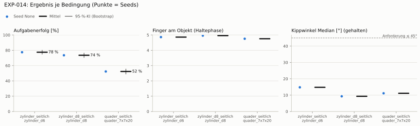

# EXP-014: Regel-Baseline: alle Finger schließen (kein RL)

**Leistung** 71 % [69–73 %] (erfolgreiche Seeds, IQM über die Objekte; je Objekt Ø 6 cm 78 % · Ø 8 cm 74 % · Quader 52 %) — ggü. EXP-013: P(besser) = 0.11 [0.00–0.33] → gesichert schlechter

**Testobjekte** (nie trainiert, erfolgreiche Seeds, Median): Flasche 72 % · Saftpackung 62 %

**Zuverlässigkeit** 1/1 Seeds erfolgreich [2–100 %] — EXP-013: 3/5, exakter Fisher-Test p = 1.00 → nicht unterscheidbar (für eine Aussage ≥ 10 Seeds je Experiment)

**Leitplanken** eingehalten

**Befund** Engpass Quader (52 %); Kippwinkel 15° (EXP-013: 27°); Finger am Objekt 4.9 (EXP-013: 2.9); Unruhe 0.01 (EXP-013: 0.70)

**Urteilsvorschlag** (auswertung-v2): **schlechter**

**Beste Videos** (Seed 0, 3 Episoden): [Ø 6 cm](beste_videos/EXP-014_zylinder_d6_s0.mp4) · [Ø 8 cm](beste_videos/EXP-014_zylinder_d8_s0.mp4) · [Quader](beste_videos/EXP-014_quader_7x7x20_s0.mp4)

Ergebnisse je Bedingung (eval-v1, Leitplanken, Fehlerarten, Fingernutzung)

#### Bedingung `zylinder_seitlich`

Bedingung `zylinder_seitlich` (Objekt `zylinder_d6`, Kippwinkel ≤ 45°), Protokoll eval-v1, 1 Seed(s); Spalte EXP-013 unter derselben Anforderung

| Metrik | Mittel | 95-%-KI | IQM | Fehlschlag-Seeds (< 50 %) | EXP-013 (Mittel / IQM) |
|---|---|---|---|---|---|
| aufgabenerfolg | 77.5 % | 75.0 % – 80.0 % | 77.5 % | 0.0 % | 50.3 % / 56.6 % |
| haltequote | 77.5 % | 75.0 % – 80.0 % | 77.5 % | 0.0 % | 55.6 % / 64.1 % |
| Kippwinkel Median [°] | 14.8 | | | | 27.1 |
| Unterarm Median [°] | 0.308 | | | | 32 |
| Griffkraft Mittel [N] | 46.2 | | | | 93.5 |
| Kraft > 15 N [Anteil] | 92.0 % | | | | 99.9 % |
| Stall-Anteil [Anteil] | 0.0 % | | | | 100.0 % |
| Absinken [mm] | 0.0428 | | | | 0.000794 |
| Unruhe | 0.00573 | | | | 0.705 |

Fehlerarten: startfehler 0.5 %, gefallen 22.0 %, instabil 0.0 %, anforderung_verletzt 0.0 %

**Urteilsvorschlag: kein messbarer Unterschied (vorläufig: < 3 Seeds)** (gegenüber EXP-013)
Unterschied Aufgabenerfolg +26.9 Prozentpunkte (95-%-KI -7.3 … +61.6)

Je Seed: 77.5 %

Fingernutzung (Haltephase): im Mittel 4.86 Finger am Objekt; Kontaktanteil je Seed (Daumen, Zeige, Mittel, Ring, klein): 97/100/100/97/93

#### Bedingung `zylinder_d8_seitlich`

Bedingung `zylinder_d8_seitlich` (Objekt `zylinder_d8`, Kippwinkel ≤ 45°), Protokoll eval-v1, 1 Seed(s); Spalte EXP-013 unter derselben Anforderung

| Metrik | Mittel | 95-%-KI | IQM | Fehlschlag-Seeds (< 50 %) | EXP-013 (Mittel / IQM) |
|---|---|---|---|---|---|
| aufgabenerfolg | 73.5 % | 70.7 % – 76.2 % | 73.5 % | 0.0 % | 49.4 % / 55.6 % |
| haltequote | 73.5 % | 70.8 % – 76.1 % | 73.5 % | 0.0 % | 51.1 % / 57.7 % |
| Kippwinkel Median [°] | 9.29 | | | | 21.6 |
| Unterarm Median [°] | 0.321 | | | | 30.6 |
| Griffkraft Mittel [N] | 41.1 | | | | 90 |
| Kraft > 15 N [Anteil] | 97.1 % | | | | 100.0 % |
| Stall-Anteil [Anteil] | 0.0 % | | | | 100.0 % |
| Absinken [mm] | 0.079 | | | | 0 |
| Unruhe | 0.00572 | | | | 0.845 |

Fehlerarten: startfehler 1.0 %, gefallen 25.5 %, instabil 0.0 %, anforderung_verletzt 0.0 %

**Urteilsvorschlag: kein messbarer Unterschied (vorläufig: < 3 Seeds)** (gegenüber EXP-013)
Unterschied Aufgabenerfolg +23.8 Prozentpunkte (95-%-KI -10.1 … +58.0)

Je Seed: 73.5 %

Fingernutzung (Haltephase): im Mittel 4.96 Finger am Objekt; Kontaktanteil je Seed (Daumen, Zeige, Mittel, Ring, klein): 100/100/100/99/97

#### Bedingung `quader_seitlich`

Bedingung `quader_seitlich` (Objekt `quader_7x7x20`, Kippwinkel ≤ 45°), Protokoll eval-v1, 1 Seed(s); Spalte EXP-013 unter derselben Anforderung

| Metrik | Mittel | 95-%-KI | IQM | Fehlschlag-Seeds (< 50 %) | EXP-013 (Mittel / IQM) |
|---|---|---|---|---|---|
| aufgabenerfolg | 52.3 % | 49.1 % – 55.4 % | 52.3 % | 0.0 % | 33.6 % / 37.0 % |
| haltequote | 52.6 % | 49.3 % – 55.6 % | 52.6 % | 0.0 % | 36.4 % / 41.5 % |
| Kippwinkel Median [°] | 11.1 | | | | 22.6 |
| Unterarm Median [°] | 0.343 | | | | 31.5 |
| Griffkraft Mittel [N] | 39.3 | | | | 80.9 |
| Kraft > 15 N [Anteil] | 84.3 % | | | | 99.9 % |
| Stall-Anteil [Anteil] | 0.0 % | | | | 100.0 % |
| Absinken [mm] | 0.425 | | | | 0.00647 |
| Unruhe | 0.00587 | | | | 0.931 |

Fehlerarten: startfehler 5.9 %, gefallen 41.6 %, instabil 0.0 %, anforderung_verletzt 0.3 %

**Urteilsvorschlag: kein messbarer Unterschied (vorläufig: < 3 Seeds)** (gegenüber EXP-013)
Unterschied Aufgabenerfolg +18.4 Prozentpunkte (95-%-KI -5.3 … +42.2)

Je Seed: 52.3 %

Fingernutzung (Haltephase): im Mittel 4.75 Finger am Objekt; Kontaktanteil je Seed (Daumen, Zeige, Mittel, Ring, klein): 92/95/97/97/94

#### Bedingung `flasche_seitlich`

Bedingung `flasche_seitlich` (Objekt `flasche_d7x25`, Kippwinkel ≤ 45°), Protokoll eval-v1, 1 Seed(s); Spalte EXP-013 unter derselben Anforderung

| Metrik | Mittel | 95-%-KI | IQM | Fehlschlag-Seeds (< 50 %) | EXP-013 (Mittel / IQM) |
|---|---|---|---|---|---|
| aufgabenerfolg | 72.0 % | 69.1 % – 74.9 % | 72.0 % | 0.0 % | 49.1 % / 55.4 % |
| haltequote | 72.3 % | 69.6 % – 75.0 % | 72.3 % | 0.0 % | 51.7 % / 59.1 % |
| Kippwinkel Median [°] | 12.4 | | | | 23.7 |
| Unterarm Median [°] | 0.31 | | | | 30.1 |
| Griffkraft Mittel [N] | 43 | | | | 91.9 |
| Kraft > 15 N [Anteil] | 90.5 % | | | | 99.9 % |
| Stall-Anteil [Anteil] | 0.0 % | | | | 100.0 % |
| Absinken [mm] | 0.692 | | | | 0.0287 |
| Unruhe | 0.00579 | | | | 0.802 |

Fehlerarten: startfehler 0.4 %, gefallen 27.3 %, instabil 0.0 %, anforderung_verletzt 0.3 %

**Urteilsvorschlag: kein messbarer Unterschied (vorläufig: < 3 Seeds)** (gegenüber EXP-013)
Unterschied Aufgabenerfolg +22.5 Prozentpunkte (95-%-KI -11.5 … +56.4)

Je Seed: 72.0 %

Fingernutzung (Haltephase): im Mittel 4.84 Finger am Objekt; Kontaktanteil je Seed (Daumen, Zeige, Mittel, Ring, klein): 99/99/100/96/89

#### Bedingung `saftpackung_seitlich`

Bedingung `saftpackung_seitlich` (Objekt `saftpackung_9x6x19`, Kippwinkel ≤ 45°), Protokoll eval-v1, 1 Seed(s); Spalte EXP-013 unter derselben Anforderung

| Metrik | Mittel | 95-%-KI | IQM | Fehlschlag-Seeds (< 50 %) | EXP-013 (Mittel / IQM) |
|---|---|---|---|---|---|
| aufgabenerfolg | 62.0 % | 58.8 % – 65.1 % | 62.0 % | 0.0 % | 39.6 % / 45.4 % |
| haltequote | 62.2 % | 59.3 % – 65.2 % | 62.2 % | 0.0 % | 41.7 % / 47.5 % |
| Kippwinkel Median [°] | 13.7 | | | | 23.2 |
| Unterarm Median [°] | 0.372 | | | | 33.9 |
| Griffkraft Mittel [N] | 38.3 | | | | 81.7 |
| Kraft > 15 N [Anteil] | 82.0 % | | | | 99.9 % |
| Stall-Anteil [Anteil] | 0.0 % | | | | 100.0 % |
| Absinken [mm] | 0.422 | | | | 0 |
| Unruhe | 0.0058 | | | | 0.83 |

Fehlerarten: startfehler 5.4 %, gefallen 32.5 %, instabil 0.0 %, anforderung_verletzt 0.2 %

**Urteilsvorschlag: kein messbarer Unterschied (vorläufig: < 3 Seeds)** (gegenüber EXP-013)
Unterschied Aufgabenerfolg +22.1 Prozentpunkte (95-%-KI -4.9 … +50.0)

Je Seed: 62.0 %

Fingernutzung (Haltephase): im Mittel 4.88 Finger am Objekt; Kontaktanteil je Seed (Daumen, Zeige, Mittel, Ring, klein): 93/100/100/99/96

Videos aller Seeds

16 Umgebungen, eine Episode (nicht im Git, Hugging Face).

| Objekt | Seed 0 |
|---|---|
| `quader_7x7x20` | [▶](videos/EXP-014_quader_7x7x20_s0.mp4) |
| `zylinder_d6` | [▶](videos/EXP-014_zylinder_d6_s0.mp4) |
| `zylinder_d8` | [▶](videos/EXP-014_zylinder_d8_s0.mp4) |

Regel und Parameterwahl

Regel `alle_schliessen`, gewählt `schliessen=0.2` aus dem Raster (Aufgabenerfolg mit Seed 2000, Mittel über die Benchmark-Objekte): `schliessen=0.2` 68 %, `schliessen=0.4` 65 %, `schliessen=0.8` 34 %

