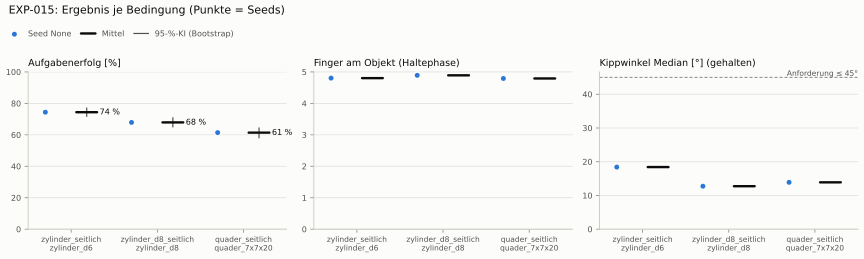

# EXP-015: Regel-Baseline: schließen bis Kontakt, taktiler Reflex (kein RL)

**Leistung** 68 % [66–70 %] (erfolgreiche Seeds, IQM über die Objekte; je Objekt Ø 6 cm 76 % · Ø 8 cm 70 % · Quader 51 %) — ggü. EXP-013: P(besser) = 0.11 [0.00–0.33] → gesichert schlechter

**Testobjekte** (nie trainiert, erfolgreiche Seeds, Median): Flasche 72 % · Saftpackung 62 %

**Zuverlässigkeit** 1/1 Seeds erfolgreich [2–100 %] — EXP-013: 3/5, exakter Fisher-Test p = 1.00 → nicht unterscheidbar (für eine Aussage ≥ 10 Seeds je Experiment)

**Leitplanken** eingehalten

**Befund** Engpass Quader (51 %); Kippwinkel 17° (EXP-013: 27°); Finger am Objekt 4.8 (EXP-013: 2.9); Unruhe 0.01 (EXP-013: 0.70)

**Urteilsvorschlag** (auswertung-v2): **schlechter**

**Beste Videos** (Seed 0, 3 Episoden): [Ø 6 cm](beste_videos/EXP-015_zylinder_d6_s0.mp4) · [Ø 8 cm](beste_videos/EXP-015_zylinder_d8_s0.mp4) · [Quader](beste_videos/EXP-015_quader_7x7x20_s0.mp4)

Ergebnisse je Bedingung (eval-v1, Leitplanken, Fehlerarten, Fingernutzung)

#### Bedingung `zylinder_seitlich`

Bedingung `zylinder_seitlich` (Objekt `zylinder_d6`, Kippwinkel ≤ 45°), Protokoll eval-v1, 1 Seed(s); Spalte EXP-013 unter derselben Anforderung

| Metrik | Mittel | 95-%-KI | IQM | Fehlschlag-Seeds (< 50 %) | EXP-013 (Mittel / IQM) |
|---|---|---|---|---|---|
| aufgabenerfolg | 76.4 % | 73.7 % – 79.0 % | 76.4 % | 0.0 % | 50.3 % / 56.6 % |
| haltequote | 76.4 % | 73.8 % – 79.0 % | 76.4 % | 0.0 % | 55.6 % / 64.1 % |
| Kippwinkel Median [°] | 17.4 | | | | 27.1 |
| Unterarm Median [°] | 0.315 | | | | 32 |
| Griffkraft Mittel [N] | 82 | | | | 93.5 |
| Kraft > 15 N [Anteil] | 96.7 % | | | | 99.9 % |
| Stall-Anteil [Anteil] | 2.3 % | | | | 100.0 % |
| Absinken [mm] | 0.0256 | | | | 0.000794 |
| Unruhe | 0.00809 | | | | 0.705 |

Fehlerarten: startfehler 0.8 %, gefallen 22.8 %, instabil 0.0 %, anforderung_verletzt 0.0 %

**Urteilsvorschlag: kein messbarer Unterschied (vorläufig: < 3 Seeds)** (gegenüber EXP-013)
Unterschied Aufgabenerfolg +25.8 Prozentpunkte (95-%-KI -8.5 … +60.9)

Je Seed: 76.4 %

Fingernutzung (Haltephase): im Mittel 4.81 Finger am Objekt; Kontaktanteil je Seed (Daumen, Zeige, Mittel, Ring, klein): 97/99/100/95/90

#### Bedingung `zylinder_d8_seitlich`

Bedingung `zylinder_d8_seitlich` (Objekt `zylinder_d8`, Kippwinkel ≤ 45°), Protokoll eval-v1, 1 Seed(s); Spalte EXP-013 unter derselben Anforderung

| Metrik | Mittel | 95-%-KI | IQM | Fehlschlag-Seeds (< 50 %) | EXP-013 (Mittel / IQM) |
|---|---|---|---|---|---|
| aufgabenerfolg | 70.4 % | 67.5 % – 73.4 % | 70.4 % | 0.0 % | 49.4 % / 55.6 % |
| haltequote | 70.4 % | 67.7 % – 73.2 % | 70.4 % | 0.0 % | 51.1 % / 57.7 % |
| Kippwinkel Median [°] | 11 | | | | 21.6 |
| Unterarm Median [°] | 0.329 | | | | 30.6 |
| Griffkraft Mittel [N] | 71.8 | | | | 90 |
| Kraft > 15 N [Anteil] | 100.0 % | | | | 100.0 % |
| Stall-Anteil [Anteil] | 0.0 % | | | | 100.0 % |
| Absinken [mm] | 0.0551 | | | | 0 |
| Unruhe | 0.00813 | | | | 0.845 |

Fehlerarten: startfehler 0.8 %, gefallen 28.8 %, instabil 0.0 %, anforderung_verletzt 0.0 %

**Urteilsvorschlag: kein messbarer Unterschied (vorläufig: < 3 Seeds)** (gegenüber EXP-013)
Unterschied Aufgabenerfolg +20.6 Prozentpunkte (95-%-KI -13.2 … +54.7)

Je Seed: 70.4 %

Fingernutzung (Haltephase): im Mittel 4.91 Finger am Objekt; Kontaktanteil je Seed (Daumen, Zeige, Mittel, Ring, klein): 100/100/100/97/94

#### Bedingung `quader_seitlich`

Bedingung `quader_seitlich` (Objekt `quader_7x7x20`, Kippwinkel ≤ 45°), Protokoll eval-v1, 1 Seed(s); Spalte EXP-013 unter derselben Anforderung

| Metrik | Mittel | 95-%-KI | IQM | Fehlschlag-Seeds (< 50 %) | EXP-013 (Mittel / IQM) |
|---|---|---|---|---|---|
| aufgabenerfolg | 51.0 % | 47.9 % – 54.0 % | 51.0 % | 0.0 % | 33.6 % / 37.0 % |
| haltequote | 51.2 % | 48.1 % – 54.2 % | 51.2 % | 0.0 % | 36.4 % / 41.5 % |
| Kippwinkel Median [°] | 13.1 | | | | 22.6 |
| Unterarm Median [°] | 0.358 | | | | 31.5 |
| Griffkraft Mittel [N] | 71.8 | | | | 80.9 |
| Kraft > 15 N [Anteil] | 92.1 % | | | | 99.9 % |
| Stall-Anteil [Anteil] | 1.0 % | | | | 100.0 % |
| Absinken [mm] | 0.298 | | | | 0.00647 |
| Unruhe | 0.00814 | | | | 0.931 |

Fehlerarten: startfehler 7.4 %, gefallen 41.5 %, instabil 0.0 %, anforderung_verletzt 0.2 %

**Urteilsvorschlag: kein messbarer Unterschied (vorläufig: < 3 Seeds)** (gegenüber EXP-013)
Unterschied Aufgabenerfolg +17.1 Prozentpunkte (95-%-KI -6.9 … +40.8)

Je Seed: 51.0 %

Fingernutzung (Haltephase): im Mittel 4.82 Finger am Objekt; Kontaktanteil je Seed (Daumen, Zeige, Mittel, Ring, klein): 96/95/97/99/94

#### Bedingung `flasche_seitlich`

Bedingung `flasche_seitlich` (Objekt `flasche_d7x25`, Kippwinkel ≤ 45°), Protokoll eval-v1, 1 Seed(s); Spalte EXP-013 unter derselben Anforderung

| Metrik | Mittel | 95-%-KI | IQM | Fehlschlag-Seeds (< 50 %) | EXP-013 (Mittel / IQM) |
|---|---|---|---|---|---|
| aufgabenerfolg | 71.9 % | 69.1 % – 74.7 % | 71.9 % | 0.0 % | 49.1 % / 55.4 % |
| haltequote | 72.0 % | 69.3 % – 74.8 % | 72.0 % | 0.0 % | 51.7 % / 59.1 % |
| Kippwinkel Median [°] | 13.8 | | | | 23.7 |
| Unterarm Median [°] | 0.32 | | | | 30.1 |
| Griffkraft Mittel [N] | 76.6 | | | | 91.9 |
| Kraft > 15 N [Anteil] | 99.3 % | | | | 99.9 % |
| Stall-Anteil [Anteil] | 0.7 % | | | | 100.0 % |
| Absinken [mm] | 0.522 | | | | 0.0287 |
| Unruhe | 0.00814 | | | | 0.802 |

Fehlerarten: startfehler 0.6 %, gefallen 27.5 %, instabil 0.0 %, anforderung_verletzt 0.1 %

**Urteilsvorschlag: kein messbarer Unterschied (vorläufig: < 3 Seeds)** (gegenüber EXP-013)
Unterschied Aufgabenerfolg +22.4 Prozentpunkte (95-%-KI -11.5 … +56.3)

Je Seed: 71.9 %

Fingernutzung (Haltephase): im Mittel 4.81 Finger am Objekt; Kontaktanteil je Seed (Daumen, Zeige, Mittel, Ring, klein): 100/100/100/94/88

#### Bedingung `saftpackung_seitlich`

Bedingung `saftpackung_seitlich` (Objekt `saftpackung_9x6x19`, Kippwinkel ≤ 45°), Protokoll eval-v1, 1 Seed(s); Spalte EXP-013 unter derselben Anforderung

| Metrik | Mittel | 95-%-KI | IQM | Fehlschlag-Seeds (< 50 %) | EXP-013 (Mittel / IQM) |
|---|---|---|---|---|---|
| aufgabenerfolg | 61.9 % | 58.9 % – 64.8 % | 61.9 % | 0.0 % | 39.6 % / 45.4 % |
| haltequote | 62.1 % | 59.1 % – 65.2 % | 62.1 % | 0.0 % | 41.7 % / 47.5 % |
| Kippwinkel Median [°] | 15.6 | | | | 23.2 |
| Unterarm Median [°] | 0.394 | | | | 33.9 |
| Griffkraft Mittel [N] | 66.9 | | | | 81.7 |
| Kraft > 15 N [Anteil] | 83.4 % | | | | 99.9 % |
| Stall-Anteil [Anteil] | 0.7 % | | | | 100.0 % |
| Absinken [mm] | 0.286 | | | | 0 |
| Unruhe | 0.0082 | | | | 0.83 |

Fehlerarten: startfehler 4.1 %, gefallen 33.9 %, instabil 0.0 %, anforderung_verletzt 0.2 %

**Urteilsvorschlag: kein messbarer Unterschied (vorläufig: < 3 Seeds)** (gegenüber EXP-013)
Unterschied Aufgabenerfolg +22.1 Prozentpunkte (95-%-KI -5.0 … +49.7)

Je Seed: 61.9 %

Fingernutzung (Haltephase): im Mittel 4.87 Finger am Objekt; Kontaktanteil je Seed (Daumen, Zeige, Mittel, Ring, klein): 92/99/100/99/96

Videos aller Seeds

16 Umgebungen, eine Episode (nicht im Git, Hugging Face).

| Objekt | Seed 0 |
|---|---|
| `quader_7x7x20` | [▶](videos/EXP-015_quader_7x7x20_s0.mp4) |
| `zylinder_d6` | [▶](videos/EXP-015_zylinder_d6_s0.mp4) |
| `zylinder_d8` | [▶](videos/EXP-015_zylinder_d8_s0.mp4) |

Regel und Parameterwahl

Regel `bis_kontakt`, gewählt `schliessen=0.4,nachdruck_deg=2` aus dem Raster (Aufgabenerfolg mit Seed 2000, Mittel über die Benchmark-Objekte): `schliessen=0.4,nachdruck_deg=2` 67 %, `schliessen=0.4,nachdruck_deg=4` 39 %, `schliessen=0.4,nachdruck_deg=5.7` 19 %

