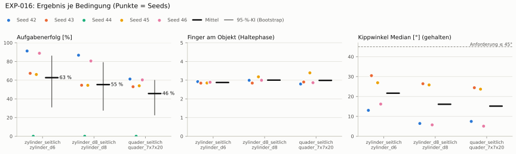
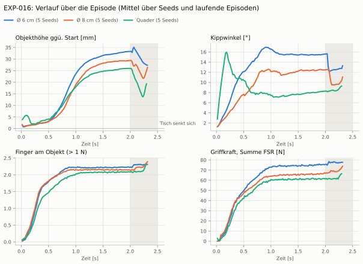
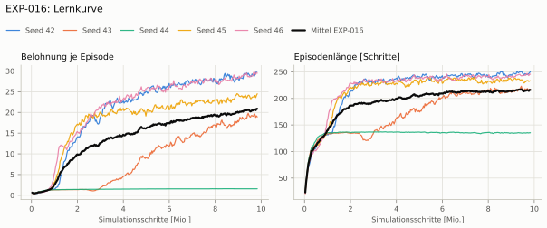
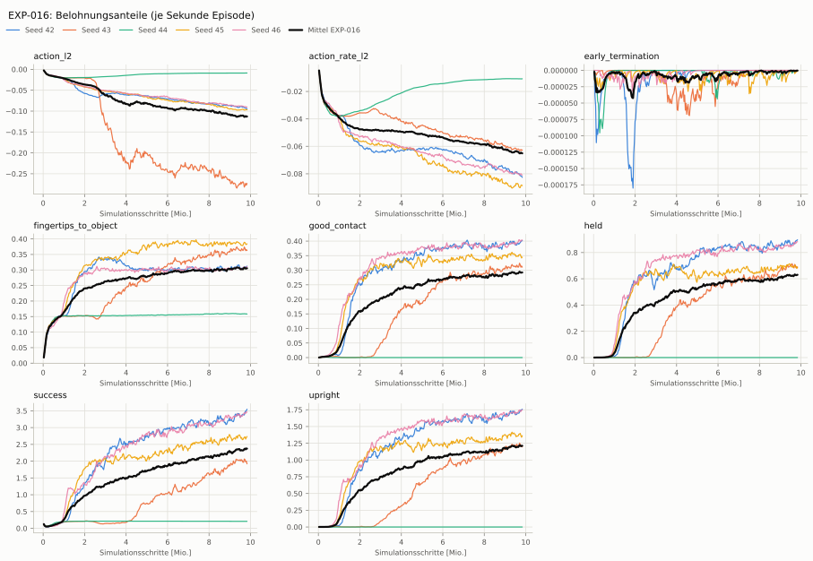
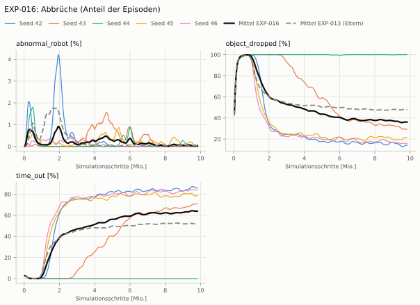
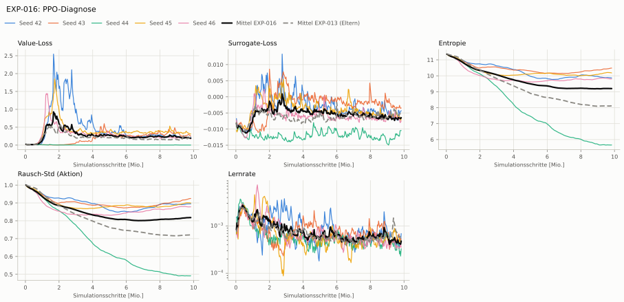

# EXP-016: Randomisierung der Hand wie Dexsuite (Servo-Gains 0,5–2, Gelenkreibung)

> **Nachtrag 2026-10-09 (ADR-021/022):** Bewertet unter eval-v1: beim Reset steckte die Hand in bis zu 81 % der Starts im Objekt (ADR-021) — besonders Quader-Werte und der Abstand zu den Regel-Baselines sind verzerrt.

> **Nachtrag 2026-10-09 (ADR-021/022):** Der Annäherungsterm maß bis EXP-018 alle Handkörper (Unterarmansatz) statt der Fingerspitzen und wäre auch korrigiert für 3–4 cm Fingerweg zu flach: ein Signal fürs Zugreifen fehlte, Seeds scheiterten deshalb am Entdecken des Griffs (ADR-022).

> **Nachtrag 2026-10-09 (ADR-021/022):** Aktionen unbegrenzt (rsl_rl ohne NVIDIAs bounds_loss): Aktionsstrafen und Leitplanke Unruhe messen großteils Rauschen und Überziehen jenseits der Servo-Sättigung, nicht Bewegung (ADR-022).

**Leistung** 65 % [58–76 %] (erfolgreiche Seeds, IQM über die Objekte; je Objekt Ø 6 cm 78 % · Ø 8 cm 68 % · Quader 57 %)

**Testobjekte** (nie trainiert, erfolgreiche Seeds, Median): Flasche 69 % · Saftpackung 65 % · Cracker (YCB) – · Zucker (YCB) – · Senf (YCB) –

**Zuverlässigkeit** 4/5 Seeds erfolgreich [28–99 %]

**Leitplanken** – (keine Eltern)

**Befund** ohne Erfolg: Seed 44 (lernt nicht zu greifen); Engpass Quader (57 %)

**Urteilsvorschlag** (auswertung-v2): **kein Vergleich (Eltern unter eval-v2)**

**Beste Videos** (Seed 42, 3 Episoden): [Ø 6 cm](beste_videos/EXP-016_zylinder_d6_s42.mp4) · [Ø 8 cm](beste_videos/EXP-016_zylinder_d8_s42.mp4) · [Quader](beste_videos/EXP-016_quader_7x7x20_s42.mp4)

Ergebnisse je Bedingung (eval-v1, Leitplanken, Fehlerarten, Fingernutzung)

#### Bedingung `zylinder_seitlich`

Bedingung `zylinder_seitlich` (Objekt `zylinder_d6`, Kippwinkel ≤ 45°), Protokoll eval-v1, 5 Seed(s); Spalte Eltern unter derselben Anforderung

| Metrik | Mittel | 95-%-KI | IQM | Fehlschlag-Seeds (< 50 %) | Eltern (Mittel / IQM) |
|---|---|---|---|---|---|
| aufgabenerfolg | 62.7 % | 31.3 % – 85.9 % | 73.4 % | 20.0 % | – |
| haltequote | 69.3 % | 33.4 % – 91.0 % | 85.1 % | 20.0 % | – |
| Kippwinkel Median [°] | 21.6 | | | | – |
| Unterarm Median [°] | 27.7 | | | | – |
| Griffkraft Mittel [N] | 97.1 | | | | – |
| Kraft > 15 N [Anteil] | 99.9 % | | | | – |
| Stall-Anteil [Anteil] | 100.0 % | | | | – |
| Absinken [mm] | 0.0135 | | | | – |
| Unruhe | 1.24 | | | | – |
| Unruhe wirksam (Aktion auf ±1 begrenzt) | – | | | | – |

Fehlerarten: startfehler 0.7 %, gefallen 30.0 %, instabil 0.0 %, anforderung_verletzt 6.6 %

**Urteilsvorschlag: kein Vergleich (keine Eltern-Bewertung mit gleichem Protokoll)**

Je Seed: 91.2 %, 67.3 %, 0.0 %, 66.1 %, 88.8 %

Fingernutzung (Haltephase): im Mittel 2.88 Finger am Objekt; Kontaktanteil je Seed (Daumen, Zeige, Mittel, Ring, klein): 100/93/99/0/0 · 99/0/0/100/86 · –/–/–/–/– · 92/4/100/73/15 · 100/89/100/0/0

#### Bedingung `zylinder_d8_seitlich`

Bedingung `zylinder_d8_seitlich` (Objekt `zylinder_d8`, Kippwinkel ≤ 45°), Protokoll eval-v1, 5 Seed(s); Spalte Referenz zylinder_seitlich unter derselben Anforderung

| Metrik | Mittel | 95-%-KI | IQM | Fehlschlag-Seeds (< 50 %) | Referenz zylinder_seitlich (Mittel / IQM) |
|---|---|---|---|---|---|
| aufgabenerfolg | 55.3 % | 27.8 % – 78.9 % | 62.3 % | 20.0 % | 62.7 % / 73.4 % |
| haltequote | 60.5 % | 28.3 % – 83.1 % | 72.4 % | 20.0 % | 69.3 % / 85.1 % |
| Kippwinkel Median [°] | 16.1 | | | | 21.6 |
| Unterarm Median [°] | 26 | | | | 27.7 |
| Griffkraft Mittel [N] | 92 | | | | 97.1 |
| Kraft > 15 N [Anteil] | 99.8 % | | | | 99.9 % |
| Stall-Anteil [Anteil] | 100.0 % | | | | 100.0 % |
| Absinken [mm] | 0.0368 | | | | 0.0135 |
| Unruhe | 1.95 | | | | 1.24 |
| Unruhe wirksam (Aktion auf ±1 begrenzt) | – | | | | – |

Fehlerarten: startfehler 0.6 %, gefallen 38.8 %, instabil 0.0 %, anforderung_verletzt 5.3 %

**Urteilsvorschlag: schlechter** (gegenüber Referenz zylinder_seitlich)
Unterschied Aufgabenerfolg -7.3 Prozentpunkte (95-%-KI -11.3 … -2.8)
- Leitplanke: Unruhe: 1.95 > 1.49

Je Seed: 86.7 %, 54.6 %, 0.0 %, 54.5 %, 80.5 %

Fingernutzung (Haltephase): im Mittel 3.00 Finger am Objekt; Kontaktanteil je Seed (Daumen, Zeige, Mittel, Ring, klein): 100/99/100/0/0 · 98/0/0/100/86 · –/–/–/–/– · 97/7/100/80/34 · 100/100/100/0/0

#### Bedingung `quader_seitlich`

Bedingung `quader_seitlich` (Objekt `quader_7x7x20`, Kippwinkel ≤ 45°), Protokoll eval-v1, 5 Seed(s); Spalte Referenz zylinder_seitlich unter derselben Anforderung

| Metrik | Mittel | 95-%-KI | IQM | Fehlschlag-Seeds (< 50 %) | Referenz zylinder_seitlich (Mittel / IQM) |
|---|---|---|---|---|---|
| aufgabenerfolg | 45.7 % | 22.8 % – 59.8 % | 55.6 % | 20.0 % | 62.7 % / 73.4 % |
| haltequote | 46.8 % | 23.0 % – 60.6 % | 57.6 % | 20.0 % | 69.3 % / 85.1 % |
| Kippwinkel Median [°] | 15.2 | | | | 21.6 |
| Unterarm Median [°] | 21.6 | | | | 27.7 |
| Griffkraft Mittel [N] | 85.8 | | | | 97.1 |
| Kraft > 15 N [Anteil] | 99.8 % | | | | 99.9 % |
| Stall-Anteil [Anteil] | 100.0 % | | | | 100.0 % |
| Absinken [mm] | 0.22 | | | | 0.0135 |
| Unruhe | 1.11 | | | | 1.24 |
| Unruhe wirksam (Aktion auf ±1 begrenzt) | – | | | | – |

Fehlerarten: startfehler 7.2 %, gefallen 46.1 %, instabil 0.0 %, anforderung_verletzt 1.1 %

**Urteilsvorschlag: schlechter** (gegenüber Referenz zylinder_seitlich)
Unterschied Aufgabenerfolg -17.1 Prozentpunkte (95-%-KI -26.6 … -7.7)

Je Seed: 61.2 %, 53.0 %, 0.0 %, 54.0 %, 60.3 %

Fingernutzung (Haltephase): im Mittel 2.99 Finger am Objekt; Kontaktanteil je Seed (Daumen, Zeige, Mittel, Ring, klein): 100/83/96/0/0 · 94/0/0/100/96 · –/–/–/–/– · 94/1/99/93/52 · 100/89/98/0/0

#### Bedingung `flasche_seitlich`

Bedingung `flasche_seitlich` (Objekt `flasche_d7x25`, Kippwinkel ≤ 45°), Protokoll eval-v1, 5 Seed(s); Spalte Referenz zylinder_seitlich unter derselben Anforderung

| Metrik | Mittel | 95-%-KI | IQM | Fehlschlag-Seeds (< 50 %) | Referenz zylinder_seitlich (Mittel / IQM) |
|---|---|---|---|---|---|
| aufgabenerfolg | 55.7 % | 27.7 % – 80.2 % | 62.4 % | 20.0 % | 62.7 % / 73.4 % |
| haltequote | 63.6 % | 30.6 % – 84.7 % | 76.6 % | 20.0 % | 69.3 % / 85.1 % |
| Kippwinkel Median [°] | 16.3 | | | | 21.6 |
| Unterarm Median [°] | 26.4 | | | | 27.7 |
| Griffkraft Mittel [N] | 94.7 | | | | 97.1 |
| Kraft > 15 N [Anteil] | 99.7 % | | | | 99.9 % |
| Stall-Anteil [Anteil] | 100.0 % | | | | 100.0 % |
| Absinken [mm] | 0.335 | | | | 0.0135 |
| Unruhe | 2.03 | | | | 1.24 |
| Unruhe wirksam (Aktion auf ±1 begrenzt) | – | | | | – |

Fehlerarten: startfehler 0.7 %, gefallen 35.7 %, instabil 0.0 %, anforderung_verletzt 7.9 %

**Urteilsvorschlag: schlechter** (gegenüber Referenz zylinder_seitlich)
Unterschied Aufgabenerfolg -6.9 Prozentpunkte (95-%-KI -12.0 … -1.8)
- Leitplanke: Unruhe: 2.03 > 1.49

Je Seed: 83.2 %, 52.9 %, 0.0 %, 54.0 %, 88.2 %

Fingernutzung (Haltephase): im Mittel 2.95 Finger am Objekt; Kontaktanteil je Seed (Daumen, Zeige, Mittel, Ring, klein): 100/100/100/0/0 · 98/0/0/99/79 · –/–/–/–/– · 98/7/99/74/26 · 100/99/100/0/0

#### Bedingung `saftpackung_seitlich`

Bedingung `saftpackung_seitlich` (Objekt `saftpackung_9x6x19`, Kippwinkel ≤ 45°), Protokoll eval-v1, 5 Seed(s); Spalte Referenz zylinder_seitlich unter derselben Anforderung

| Metrik | Mittel | 95-%-KI | IQM | Fehlschlag-Seeds (< 50 %) | Referenz zylinder_seitlich (Mittel / IQM) |
|---|---|---|---|---|---|
| aufgabenerfolg | 52.2 % | 26.3 % – 70.0 % | 62.3 % | 20.0 % | 62.7 % / 73.4 % |
| haltequote | 53.6 % | 25.8 % – 71.0 % | 64.8 % | 20.0 % | 69.3 % / 85.1 % |
| Kippwinkel Median [°] | 16.2 | | | | 21.6 |
| Unterarm Median [°] | 23.2 | | | | 27.7 |
| Griffkraft Mittel [N] | 87 | | | | 97.1 |
| Kraft > 15 N [Anteil] | 99.8 % | | | | 99.9 % |
| Stall-Anteil [Anteil] | 100.0 % | | | | 100.0 % |
| Absinken [mm] | 0.195 | | | | 0.0135 |
| Unruhe | 0.771 | | | | 1.24 |
| Unruhe wirksam (Aktion auf ±1 begrenzt) | – | | | | – |

Fehlerarten: startfehler 5.4 %, gefallen 41.1 %, instabil 0.0 %, anforderung_verletzt 1.4 %

**Urteilsvorschlag: schlechter** (gegenüber Referenz zylinder_seitlich)
Unterschied Aufgabenerfolg -10.5 Prozentpunkte (95-%-KI -17.1 … -4.3)

Je Seed: 70.5 %, 57.1 %, 0.0 %, 60.0 %, 73.5 %

Fingernutzung (Haltephase): im Mittel 3.04 Finger am Objekt; Kontaktanteil je Seed (Daumen, Zeige, Mittel, Ring, klein): 100/100/100/0/0 · 99/0/0/100/92 · –/–/–/–/– · 95/1/100/92/39 · 100/100/100/0/0

Trainingsverlauf

Seeds dünn, Mittel kräftig, Eltern gestrichelt (nur Abbrüche/PPO — Trainings-Belohnung ist zwischen Experimenten nicht vergleichbar); geglättet, x = Simulationsschritte. Endwerte = Mittel der letzten 10 Iterationen (Belohnungsanteile je Sekunde Episode).

| Größe | Seed 42 | Seed 43 | Seed 44 | Seed 45 | Seed 46 | Mittel |
|---|---|---|---|---|---|---|
| mean_reward | 29.5 | 19.1 | 1.57 | 23.9 | 29.5 | 20.7 |
| action_l2 | -0.0928 | -0.273 | -0.0088 | -0.0964 | -0.0895 | -0.112 |
| action_rate_l2 | -0.0814 | -0.0628 | -0.0108 | -0.0883 | -0.0808 | -0.0648 |
| early_termination | 0 | 0 | -1.45e-06 | -1.65e-06 | 0 | -6.2e-07 |
| fingertips_to_object | 0.309 | 0.366 | 0.159 | 0.383 | 0.308 | 0.305 |
| good_contact | 0.397 | 0.314 | 2.06e-05 | 0.347 | 0.403 | 0.292 |
| held | 0.886 | 0.691 | 0 | 0.686 | 0.878 | 0.628 |
| success | 3.48 | 1.97 | 0.209 | 2.69 | 3.44 | 2.36 |
| upright | 1.74 | 1.21 | 0 | 1.36 | 1.74 | 1.21 |
| object_dropped | 13.8 % | 29.1 % | 100.0 % | 21.6 % | 16.0 % | 36.1 % |
| mean_noise_std | 0.895 | 0.924 | 0.492 | 0.901 | 0.878 | 0.818 |

Videos aller Seeds

16 Umgebungen, eine Episode (nicht im Git, Hugging Face).

| Objekt | Seed 42 | Seed 43 | Seed 44 | Seed 45 | Seed 46 |
|---|---|---|---|---|---|
| `quader_7x7x20` | [▶](videos/EXP-016_quader_7x7x20_s42.mp4) | [▶](videos/EXP-016_quader_7x7x20_s43.mp4) | [▶](videos/EXP-016_quader_7x7x20_s44.mp4) | [▶](videos/EXP-016_quader_7x7x20_s45.mp4) | [▶](videos/EXP-016_quader_7x7x20_s46.mp4) |
| `zylinder_d6` | [▶](videos/EXP-016_zylinder_d6_s42.mp4) | [▶](videos/EXP-016_zylinder_d6_s43.mp4) | [▶](videos/EXP-016_zylinder_d6_s44.mp4) | [▶](videos/EXP-016_zylinder_d6_s45.mp4) | [▶](videos/EXP-016_zylinder_d6_s46.mp4) |
| `zylinder_d8` | [▶](videos/EXP-016_zylinder_d8_s42.mp4) | [▶](videos/EXP-016_zylinder_d8_s43.mp4) | [▶](videos/EXP-016_zylinder_d8_s44.mp4) | [▶](videos/EXP-016_zylinder_d8_s45.mp4) | [▶](videos/EXP-016_zylinder_d8_s46.mp4) |

Netz, Training und Konfiguration

Actor [256, 128, 64] (elu), 68808 Parameter, 105 Eingänge (Verlauf 5) · Critic [512, 256, 128] · PPO: Lernrate 0.001, Entropie 0.005, 5 Epochen × 4 Mini-Batches, 32 Schritte/Umgebung · 1024 Umgebungen × 300 Iterationen

Geplante Änderung: Randomisierung wie Dexsuite (Task HeavyMultiRand-v0): Servo-Gains 0,5–2 statt 0,8–1,25, Gelenkreibung × 0–5 (neu). Objektgröße bleibt ±10 % (Dexsuite 0,75–1,5 würde Objekte unter 15 cm erzeugen).

Konfiguration gegenüber EXP-013 (19 Unterschiede):

- `env.events.joint_friction.func: ∅ → isaaclab.envs.mdp.events:randomize_joint_parameters`
- `env.events.joint_friction.interval_range_s: ∅ → None`
- `env.events.joint_friction.is_global_time: ∅ → False`
- `env.events.joint_friction.min_step_count_between_reset: ∅ → 0`
- `env.events.joint_friction.mode: ∅ → startup`
- `env.events.joint_friction.params.asset_cfg.body_ids: ∅ → object/apply:builtins.slice(None, None, None)`
- `env.events.joint_friction.params.asset_cfg.body_names: ∅ → None`
- `env.events.joint_friction.params.asset_cfg.fixed_tendon_ids: ∅ → object/apply:builtins.slice(None, None, None)`
- `env.events.joint_friction.params.asset_cfg.fixed_tendon_names: ∅ → None`
- `env.events.joint_friction.params.asset_cfg.joint_ids: ∅ → object/apply:builtins.slice(None, None, None)`
- `env.events.joint_friction.params.asset_cfg.joint_names: ∅ → .*`
- `env.events.joint_friction.params.asset_cfg.name: ∅ → robot`
- `env.events.joint_friction.params.asset_cfg.object_collection_ids: ∅ → object/apply:builtins.slice(None, None, None)`
- `env.events.joint_friction.params.asset_cfg.object_collection_names: ∅ → None`
- `env.events.joint_friction.params.asset_cfg.preserve_order: ∅ → False`
- `env.events.joint_friction.params.friction_distribution_params: ∅ → (0.0, 5.0)`
- `env.events.joint_friction.params.operation: ∅ → scale`
- `env.events.servo_gains.params.damping_distribution_params: (0.8, 1.25) → (0.5, 2.0)`
- `env.events.servo_gains.params.stiffness_distribution_params: (0.8, 1.25) → (0.5, 2.0)`

