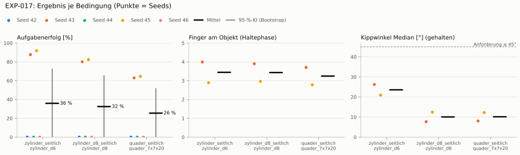
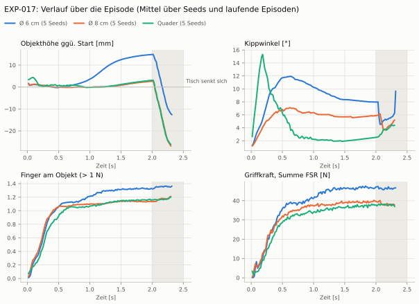
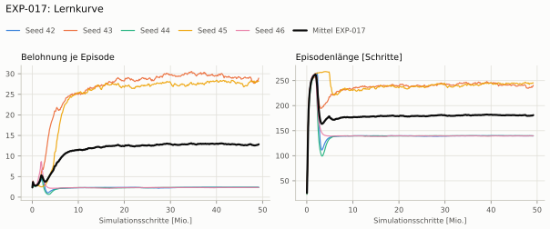
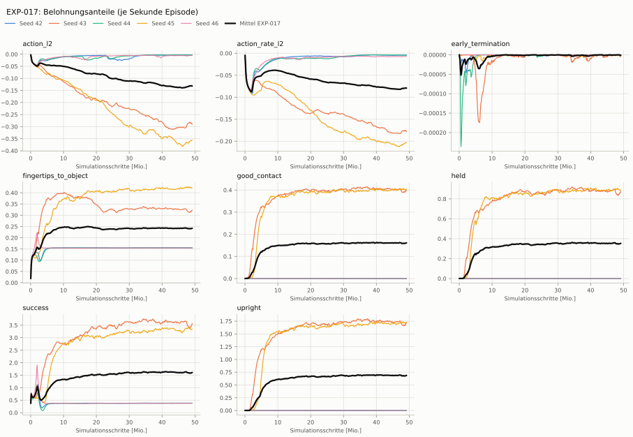
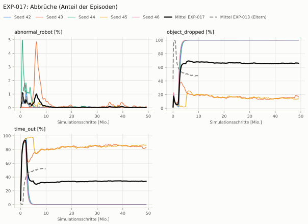
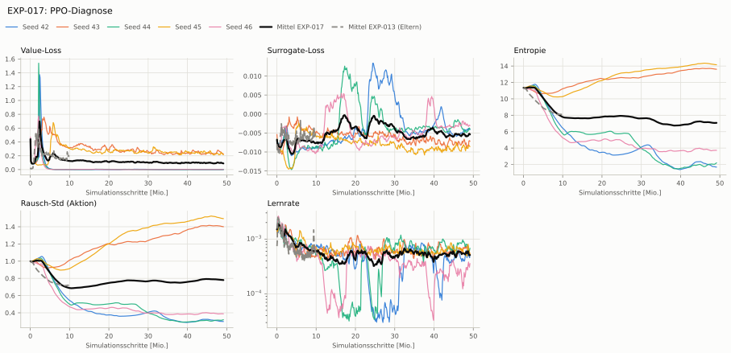

# EXP-017: Curriculum wie Dexsuite (Schwerkraft und Beobachtungsrauschen nach Erfolg), 1500 Iterationen

**Leistung** 86 % [85–89 %] (erfolgreiche Seeds, IQM über die Objekte; je Objekt Ø 6 cm 90 % · Ø 8 cm 89 % · Quader 80 %) — ggü. EXP-013: P(besser) = 0.78 [0.50–1.00] → kein Unterschied

**Testobjekte** (nie trainiert, erfolgreiche Seeds, Median): Flasche 90 % · Saftpackung 85 % · Cracker (YCB) 70 % · Zucker (YCB) 61 % · Senf (YCB) 57 %

**Zuverlässigkeit** 2/5 Seeds erfolgreich [5–85 %] — EXP-013: 3/5, exakter Fisher-Test p = 1.00 → nicht unterscheidbar (für eine Aussage ≥ 10 Seeds je Experiment)

**Leitplanken** Griffkraft Mittel [N]: 120 > 112; Unruhe: 2.66 > 0.914 ✗

**Befund** ohne Erfolg: Seed 42 (lernt nicht zu greifen), Seed 44 (lernt nicht zu greifen), Seed 46 (lernt nicht zu greifen); Engpass Quader (80 %); Unruhe 2.66 (EXP-013: 0.76)

**Urteilsvorschlag** (auswertung-v2): **kein Unterschied, Leitplanke verletzt**

**Beste Videos** (Seed 45, 3 Episoden): [Ø 6 cm](beste_videos/EXP-017_zylinder_d6_s45.mp4) · [Ø 8 cm](beste_videos/EXP-017_zylinder_d8_s45.mp4) · [Quader](beste_videos/EXP-017_quader_7x7x20_s45.mp4)

Ergebnisse je Bedingung (eval-v2, Leitplanken, Fehlerarten, Fingernutzung)

#### Bedingung `zylinder_seitlich`

Bedingung `zylinder_seitlich` (Objekt `zylinder_d6`, Kippwinkel ≤ 45°), Protokoll eval-v2, 5 Seed(s); Spalte EXP-013 unter derselben Anforderung

| Metrik | Mittel | 95-%-KI | IQM | Fehlschlag-Seeds (< 50 %) | EXP-013 (Mittel / IQM) |
|---|---|---|---|---|---|
| aufgabenerfolg | 36.1 % | 0.0 % – 73.4 % | 25.9 % | 60.0 % | 51.0 % / 56.4 % |
| haltequote | 38.1 % | 0.0 % – 76.6 % | 28.2 % | 60.0 % | 58.1 % / 67.2 % |
| Kippwinkel Median [°] | 25 | | | | 28 |
| Unterarm Median [°] | 26.5 | | | | 33 |
| Griffkraft Mittel [N] | 120 | | | | 93.6 |
| Kraft > 15 N [Anteil] | 99.9 % | | | | 100.0 % |
| Stall-Anteil [Anteil] | 100.0 % | | | | 100.0 % |
| Absinken [mm] | 0.00238 | | | | 0 |
| Unruhe | 2.66 | | | | 0.762 |

Fehlerarten: startfehler 0.0 %, gefallen 61.9 %, instabil 0.0 %, anforderung_verletzt 2.0 %

**Urteilsvorschlag: kein messbarer Unterschied** (gegenüber EXP-013)
Unterschied Aufgabenerfolg -16.1 Prozentpunkte (95-%-KI -69.2 … +38.3)
- Leitplanke: Griffkraft Mittel [N]: 120 > 112
- Leitplanke: Unruhe: 2.66 > 0.914

Je Seed: 0.0 %, 86.5 %, 0.0 %, 93.8 %, 0.0 %

Fingernutzung (Haltephase): im Mittel 3.47 Finger am Objekt; Kontaktanteil je Seed (Daumen, Zeige, Mittel, Ring, klein): –/–/–/–/– · 99/76/99/79/51 · –/–/–/–/– · 99/0/92/99/0 · –/–/–/–/–

#### Bedingung `zylinder_d8_seitlich`

Bedingung `zylinder_d8_seitlich` (Objekt `zylinder_d8`, Kippwinkel ≤ 45°), Protokoll eval-v2, 5 Seed(s); Spalte EXP-013 unter derselben Anforderung

| Metrik | Mittel | 95-%-KI | IQM | Fehlschlag-Seeds (< 50 %) | EXP-013 (Mittel / IQM) |
|---|---|---|---|---|---|
| aufgabenerfolg | 35.5 % | 0.0 % – 71.5 % | 26.2 % | 60.0 % | 53.0 % / 60.7 % |
| haltequote | 36.1 % | 0.0 % – 72.7 % | 26.6 % | 60.0 % | 55.6 % / 64.2 % |
| Kippwinkel Median [°] | 10 | | | | 22.5 |
| Unterarm Median [°] | 7.3 | | | | 32 |
| Griffkraft Mittel [N] | 108 | | | | 88.3 |
| Kraft > 15 N [Anteil] | 99.8 % | | | | 100.0 % |
| Stall-Anteil [Anteil] | 100.0 % | | | | 100.0 % |
| Absinken [mm] | 0.0992 | | | | 0 |
| Unruhe | 1.3 | | | | 0.889 |

Fehlerarten: startfehler 0.0 %, gefallen 63.9 %, instabil 0.0 %, anforderung_verletzt 0.6 %

**Urteilsvorschlag: kein messbarer Unterschied** (gegenüber EXP-013)
Unterschied Aufgabenerfolg -18.7 Prozentpunkte (95-%-KI -71.8 … +36.1)
- Leitplanke: Griffkraft Mittel [N]: 108 > 106
- Leitplanke: Unruhe: 1.3 > 1.07

Je Seed: 0.0 %, 87.4 %, 0.0 %, 90.1 %, 0.0 %

Fingernutzung (Haltephase): im Mittel 3.43 Finger am Objekt; Kontaktanteil je Seed (Daumen, Zeige, Mittel, Ring, klein): –/–/–/–/– · 100/96/98/93/3 · –/–/–/–/– · 100/0/100/97/0 · –/–/–/–/–

#### Bedingung `quader_seitlich`

Bedingung `quader_seitlich` (Objekt `quader_7x7x20`, Kippwinkel ≤ 45°), Protokoll eval-v2, 5 Seed(s); Spalte EXP-013 unter derselben Anforderung

| Metrik | Mittel | 95-%-KI | IQM | Fehlschlag-Seeds (< 50 %) | EXP-013 (Mittel / IQM) |
|---|---|---|---|---|---|
| aufgabenerfolg | 32.2 % | 0.0 % – 64.7 % | 24.1 % | 60.0 % | 44.0 % / 48.0 % |
| haltequote | 32.2 % | 0.0 % – 64.7 % | 24.1 % | 60.0 % | 48.3 % / 55.6 % |
| Kippwinkel Median [°] | 9.93 | | | | 23.4 |
| Unterarm Median [°] | 8.17 | | | | 32.5 |
| Griffkraft Mittel [N] | 106 | | | | 82.5 |
| Kraft > 15 N [Anteil] | 99.5 % | | | | 100.0 % |
| Stall-Anteil [Anteil] | 100.0 % | | | | 100.0 % |
| Absinken [mm] | 0.827 | | | | 0.0174 |
| Unruhe | 1.92 | | | | 0.953 |

Fehlerarten: startfehler 0.0 %, gefallen 67.8 %, instabil 0.0 %, anforderung_verletzt 0.0 %

**Urteilsvorschlag: kein messbarer Unterschied** (gegenüber EXP-013)
Unterschied Aufgabenerfolg -12.8 Prozentpunkte (95-%-KI -59.6 … +35.7)
- Leitplanke: Griffkraft Mittel [N]: 106 > 99
- Leitplanke: Unruhe: 1.92 > 1.14

Je Seed: 0.0 %, 80.2 %, 0.0 %, 80.6 %, 0.0 %

Fingernutzung (Haltephase): im Mittel 3.33 Finger am Objekt; Kontaktanteil je Seed (Daumen, Zeige, Mittel, Ring, klein): –/–/–/–/– · 100/96/97/87/2 · –/–/–/–/– · 99/0/99/87/0 · –/–/–/–/–

#### Bedingung `flasche_seitlich`

Bedingung `flasche_seitlich` (Objekt `flasche_d7x25`, Kippwinkel ≤ 45°), Protokoll eval-v2, 5 Seed(s); Spalte EXP-013 unter derselben Anforderung

| Metrik | Mittel | 95-%-KI | IQM | Fehlschlag-Seeds (< 50 %) | EXP-013 (Mittel / IQM) |
|---|---|---|---|---|---|
| aufgabenerfolg | 36.0 % | 0.0 % – 72.3 % | 26.6 % | 60.0 % | 52.7 % / 59.3 % |
| haltequote | 37.6 % | 0.0 % – 75.7 % | 27.8 % | 60.0 % | 56.3 % / 65.1 % |
| Kippwinkel Median [°] | 16.4 | | | | 24.6 |
| Unterarm Median [°] | 9.23 | | | | 31.4 |
| Griffkraft Mittel [N] | 113 | | | | 90.8 |
| Kraft > 15 N [Anteil] | 99.7 % | | | | 99.9 % |
| Stall-Anteil [Anteil] | 100.0 % | | | | 100.0 % |
| Absinken [mm] | 0.0127 | | | | 0.0161 |
| Unruhe | 1.57 | | | | 0.834 |

Fehlerarten: startfehler 0.0 %, gefallen 62.4 %, instabil 0.0 %, anforderung_verletzt 1.7 %

**Urteilsvorschlag: kein messbarer Unterschied** (gegenüber EXP-013)
Unterschied Aufgabenerfolg -18.0 Prozentpunkte (95-%-KI -72.7 … +38.2)
- Leitplanke: Griffkraft Mittel [N]: 113 > 109
- Leitplanke: Unruhe: 1.57 > 1

Je Seed: 0.0 %, 91.2 %, 0.0 %, 88.6 %, 0.0 %

Fingernutzung (Haltephase): im Mittel 3.37 Finger am Objekt; Kontaktanteil je Seed (Daumen, Zeige, Mittel, Ring, klein): –/–/–/–/– · 99/91/98/85/3 · –/–/–/–/– · 100/0/98/99/0 · –/–/–/–/–

#### Bedingung `saftpackung_seitlich`

Bedingung `saftpackung_seitlich` (Objekt `saftpackung_9x6x19`, Kippwinkel ≤ 45°), Protokoll eval-v2, 5 Seed(s); Spalte EXP-013 unter derselben Anforderung

| Metrik | Mittel | 95-%-KI | IQM | Fehlschlag-Seeds (< 50 %) | EXP-013 (Mittel / IQM) |
|---|---|---|---|---|---|
| aufgabenerfolg | 34.2 % | 0.0 % – 68.8 % | 25.4 % | 60.0 % | 51.0 % / 57.3 % |
| haltequote | 34.7 % | 0.0 % – 69.7 % | 25.8 % | 60.0 % | 53.9 % / 62.2 % |
| Kippwinkel Median [°] | 15.3 | | | | 24.1 |
| Unterarm Median [°] | 12.8 | | | | 34.8 |
| Griffkraft Mittel [N] | 97.4 | | | | 82.4 |
| Kraft > 15 N [Anteil] | 99.5 % | | | | 99.9 % |
| Stall-Anteil [Anteil] | 100.0 % | | | | 100.0 % |
| Absinken [mm] | 1.32 | | | | 0.0045 |
| Unruhe | 2.45 | | | | 0.856 |

Fehlerarten: startfehler 0.0 %, gefallen 65.3 %, instabil 0.0 %, anforderung_verletzt 0.5 %

**Urteilsvorschlag: kein messbarer Unterschied** (gegenüber EXP-013)
Unterschied Aufgabenerfolg -17.9 Prozentpunkte (95-%-KI -69.2 … +35.6)
- Leitplanke: Unruhe: 2.45 > 1.03

Je Seed: 0.0 %, 86.3 %, 0.0 %, 84.6 %, 0.0 %

Fingernutzung (Haltephase): im Mittel 3.26 Finger am Objekt; Kontaktanteil je Seed (Daumen, Zeige, Mittel, Ring, klein): –/–/–/–/– · 100/100/99/63/10 · –/–/–/–/– · 98/0/100/83/0 · –/–/–/–/–

Trainingsverlauf

Seeds dünn, Mittel kräftig, Eltern gestrichelt (nur Abbrüche/PPO — Trainings-Belohnung ist zwischen Experimenten nicht vergleichbar); geglättet, x = Simulationsschritte. Endwerte = Mittel der letzten 10 Iterationen (Belohnungsanteile je Sekunde Episode).

| Größe | Seed 42 | Seed 43 | Seed 44 | Seed 45 | Seed 46 | Mittel |
|---|---|---|---|---|---|---|
| mean_reward | 2.37 | 29.5 | 2.37 | 28.3 | 2.34 | 13 |
| action_l2 | -0.00351 | -0.295 | -0.00334 | -0.354 | -0.00499 | -0.132 |
| action_rate_l2 | -0.00402 | -0.179 | -0.00462 | -0.203 | -0.00703 | -0.0796 |
| early_termination | 0 | -7.23e-06 | 0 | 0 | 0 | -1.45e-06 |
| fingertips_to_object | 0.155 | 0.329 | 0.155 | 0.424 | 0.155 | 0.244 |
| good_contact | 0 | 0.407 | 1.45e-06 | 0.406 | 0 | 0.163 |
| held | 0 | 0.894 | 0 | 0.892 | 0 | 0.357 |
| success | 0.381 | 3.66 | 0.382 | 3.35 | 0.378 | 1.63 |
| upright | 0 | 1.76 | 0 | 1.74 | 0 | 0.7 |
| object_dropped | 100.0 % | 15.6 % | 100.0 % | 13.7 % | 100.0 % | 65.9 % |
| mean_noise_std | 0.298 | 1.4 | 0.325 | 1.49 | 0.388 | 0.78 |

Videos aller Seeds

16 Umgebungen, eine Episode (nicht im Git, Hugging Face).

| Objekt | Seed 42 | Seed 43 | Seed 44 | Seed 45 | Seed 46 |
|---|---|---|---|---|---|
| `quader_7x7x20` | [▶](videos/EXP-017_quader_7x7x20_s42.mp4) | [▶](videos/EXP-017_quader_7x7x20_s43.mp4) | [▶](videos/EXP-017_quader_7x7x20_s44.mp4) | [▶](videos/EXP-017_quader_7x7x20_s45.mp4) | [▶](videos/EXP-017_quader_7x7x20_s46.mp4) |
| `zylinder_d6` | [▶](videos/EXP-017_zylinder_d6_s42.mp4) | [▶](videos/EXP-017_zylinder_d6_s43.mp4) | [▶](videos/EXP-017_zylinder_d6_s44.mp4) | [▶](videos/EXP-017_zylinder_d6_s45.mp4) | [▶](videos/EXP-017_zylinder_d6_s46.mp4) |
| `zylinder_d8` | [▶](videos/EXP-017_zylinder_d8_s42.mp4) | [▶](videos/EXP-017_zylinder_d8_s43.mp4) | [▶](videos/EXP-017_zylinder_d8_s44.mp4) | [▶](videos/EXP-017_zylinder_d8_s45.mp4) | [▶](videos/EXP-017_zylinder_d8_s46.mp4) |

Netz, Training und Konfiguration

Actor [256, 128, 64] (elu), 68808 Parameter, 105 Eingänge (Verlauf 5) · Critic [512, 256, 128] · PPO: Lernrate 0.001, Entropie 0.005, 5 Epochen × 4 Mini-Batches, 32 Schritte/Umgebung · 1024 Umgebungen × 1500 Iterationen

Geplante Änderung: Curriculum wie Dexsuite (Task HeavyMultiADR-v0, adr_curriculum.py): Schwierigkeit 0–10 je Umgebung nach Erfolg (gehalten, Kipp ≤ 45°), Schwerkraft 0 → 9,81 m/s², Rauschen der Gelenkwinkel 0 → ±0,1 rad; FSR ohne Rauschen. Dazu 1500 statt 300 Iterationen, weil das Curriculum Zeit braucht (EXP-011: 1500 It. allein ohne Wirkung). Bewertung ohne Curriculum (volle Schwerkraft, kein Rauschen).

Konfiguration gegenüber EXP-013 (38 Unterschiede):

- `agent.max_iterations: 300 → 1500`
- `env.curriculum: None → ∅`
- `env.curriculum.adr.func: ∅ → pib_grasp.mdp:GraspDifficultyScheduler`
- `env.curriculum.adr.params.init_difficulty: ∅ → 0`
- `env.curriculum.adr.params.max_difficulty: ∅ → 10`
- `env.curriculum.adr.params.max_kipp_deg: ∅ → 45.0`
- `env.curriculum.adr.params.min_difficulty: ∅ → 0`
- `env.curriculum.gravity_adr.func: ∅ → isaaclab.envs.mdp.curriculums:modify_term_cfg`
- `env.curriculum.gravity_adr.params.address: ∅ → events.variable_gravity.params.gravity_distribution_params`
- `env.curriculum.gravity_adr.params.modify_fn: ∅ → isaaclab_tasks.manager_based.manipulation.dexsuite.mdp.curriculums:initial_final_interpolate_fn`
- `env.curriculum.gravity_adr.params.modify_params.difficulty_term_str: ∅ → adr`
- `env.curriculum.gravity_adr.params.modify_params.final_value: ∅ → ([0.0, 0.0, -9.81], [0.0, 0.0, -9.81])`
- `env.curriculum.gravity_adr.params.modify_params.initial_value: ∅ → ([0.0, 0.0, 0.0], [0.0, 0.0, 0.0])`
- `env.curriculum.joint_pos_noise_max_adr.func: ∅ → isaaclab.envs.mdp.curriculums:modify_term_cfg`
- `env.curriculum.joint_pos_noise_max_adr.params.address: ∅ → observations.policy.joint_pos.noise.n_max`
- `env.curriculum.joint_pos_noise_max_adr.params.modify_fn: ∅ → isaaclab_tasks.manager_based.manipulation.dexsuite.mdp.curriculums:initial_final_interpolate_fn`
- `env.curriculum.joint_pos_noise_max_adr.params.modify_params.difficulty_term_str: ∅ → adr`
- `env.curriculum.joint_pos_noise_max_adr.params.modify_params.final_value: ∅ → 0.1`
- `env.curriculum.joint_pos_noise_max_adr.params.modify_params.initial_value: ∅ → 0.0`
- `env.curriculum.joint_pos_noise_min_adr.func: ∅ → isaaclab.envs.mdp.curriculums:modify_term_cfg`
- `env.curriculum.joint_pos_noise_min_adr.params.address: ∅ → observations.policy.joint_pos.noise.n_min`
- `env.curriculum.joint_pos_noise_min_adr.params.modify_fn: ∅ → isaaclab_tasks.manager_based.manipulation.dexsuite.mdp.curriculums:initial_final_interpolate_fn`
- `env.curriculum.joint_pos_noise_min_adr.params.modify_params.difficulty_term_str: ∅ → adr`
- `env.curriculum.joint_pos_noise_min_adr.params.modify_params.final_value: ∅ → -0.1`
- `env.curriculum.joint_pos_noise_min_adr.params.modify_params.initial_value: ∅ → 0.0`
- `env.events.variable_gravity.func: ∅ → isaaclab.envs.mdp.events:randomize_physics_scene_gravity`
- `env.events.variable_gravity.interval_range_s: ∅ → None`
- `env.events.variable_gravity.is_global_time: ∅ → False`
- `env.events.variable_gravity.min_step_count_between_reset: ∅ → 0`
- `env.events.variable_gravity.mode: ∅ → reset`
- `env.events.variable_gravity.params.gravity_distribution_params: ∅ → ([0.0, 0.0, 0.0], [0.0, 0.0, 0.0])`
- `env.events.variable_gravity.params.operation: ∅ → abs`
- `env.observations.policy.enable_corruption: False → True`
- `env.observations.policy.joint_pos.noise: None → ∅`
- `env.observations.policy.joint_pos.noise.func: ∅ → isaaclab.utils.noise.noise_model:uniform_noise`
- `env.observations.policy.joint_pos.noise.n_max: ∅ → 0.0`
- `env.observations.policy.joint_pos.noise.n_min: ∅ → 0.0`
- `env.observations.policy.joint_pos.noise.operation: ∅ → add`

