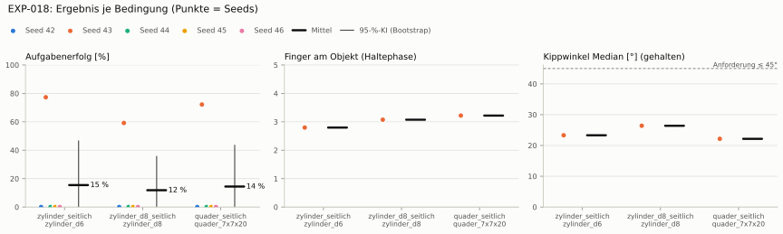
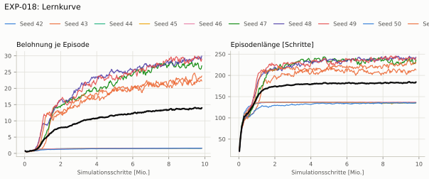
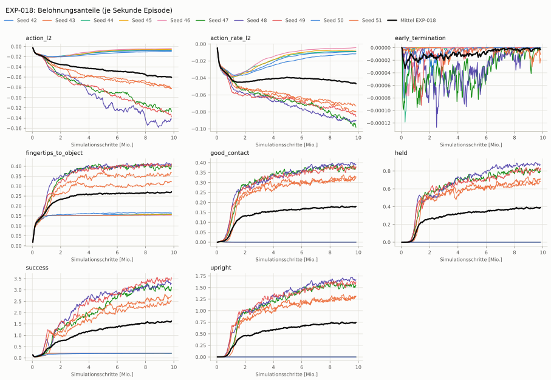
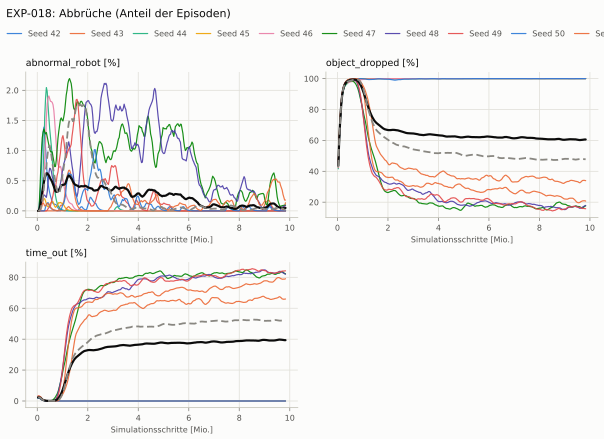
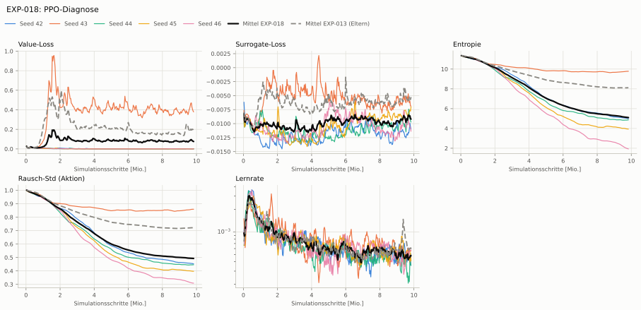

# EXP-018: Neue Basis: EXP-013 mit Reset ohne Überlappung (ADR-021)

> **Nachtrag 2026-10-09 (ADR-021/022):** 1/5 Seeds lernen greifen: ohne die zufälligen Kontakte der Reset-Stöße fehlt jede Hilfe beim Entdecken — die Lernkurven entscheiden sich in den ersten 10–25 Iterationen. Der Annäherungsterm maß bis EXP-018 alle Handkörper (Unterarmansatz) statt der Fingerspitzen und wäre auch korrigiert für 3–4 cm Fingerweg zu flach: ein Signal fürs Zugreifen fehlte, Seeds scheiterten deshalb am Entdecken des Griffs (ADR-022).

> **Nachtrag 2026-10-09 (ADR-021/022):** Aktionen unbegrenzt (rsl_rl ohne NVIDIAs bounds_loss): Aktionsstrafen und Leitplanke Unruhe messen großteils Rauschen und Überziehen jenseits der Servo-Sättigung, nicht Bewegung (ADR-022).

> **Nachtrag 2026-10-09 (ADR-021/022):** Seeds 47–51 im Nachtlauf 2026-10-09 nachtrainiert (Basis für EXP-019–021 mit 10 Seeds).

**Leistung** 86 % [81–89 %] (erfolgreiche Seeds, IQM über die Objekte; je Objekt Ø 6 cm 92 % · Ø 8 cm 89 % · Quader 81 %) — ggü. EXP-013: P(besser) = 0.62 [0.38–0.84] → kein Unterschied

**Testobjekte** (nie trainiert, erfolgreiche Seeds, Median): Flasche 90 % · Saftpackung 91 % · Cracker (YCB) 82 % · Zucker (YCB) 97 % · Senf (YCB) 94 %

**Zuverlässigkeit** 5/10 Seeds erfolgreich [19–81 %] — EXP-013: 3/5, exakter Fisher-Test p = 1.00 → nicht unterscheidbar (für eine Aussage ≥ 10 Seeds je Experiment)

**Leitplanken** eingehalten

**Befund** ohne Erfolg: Seed 42 (lernt nicht zu greifen), Seed 44 (lernt nicht zu greifen), Seed 45 (lernt nicht zu greifen), Seed 46 (lernt nicht zu greifen), Seed 50 (lernt nicht zu greifen); Engpass Quader (81 %); Kippwinkel 18° (EXP-013: 28°)

**Urteilsvorschlag** (auswertung-v2): **kein Unterschied**

**Beste Videos** (Seed 48, 3 Episoden): [Ø 6 cm](beste_videos/EXP-018_zylinder_d6_s48.mp4) · [Ø 8 cm](beste_videos/EXP-018_zylinder_d8_s48.mp4) · [Quader](beste_videos/EXP-018_quader_7x7x20_s48.mp4)

Ergebnisse je Bedingung (eval-v2, Leitplanken, Fehlerarten, Fingernutzung)

#### Bedingung `zylinder_seitlich`

Bedingung `zylinder_seitlich` (Objekt `zylinder_d6`, Kippwinkel ≤ 45°), Protokoll eval-v2, 10 Seed(s); Spalte EXP-013 unter derselben Anforderung

| Metrik | Mittel | 95-%-KI | IQM | Fehlschlag-Seeds (< 50 %) | EXP-013 (Mittel / IQM) |
|---|---|---|---|---|---|
| aufgabenerfolg | 45.1 % | 17.4 % – 72.7 % | 42.9 % | 50.0 % | 51.0 % / 56.4 % |
| haltequote | 47.5 % | 18.5 % – 76.8 % | 45.9 % | 50.0 % | 58.1 % / 67.2 % |
| Kippwinkel Median [°] | 18.4 | | | | 28 |
| Unterarm Median [°] | 21.7 | | | | 33 |
| Griffkraft Mittel [N] | 91.5 | | | | 93.6 |
| Kraft > 15 N [Anteil] | 99.9 % | | | | 100.0 % |
| Stall-Anteil [Anteil] | 99.9 % | | | | 100.0 % |
| Absinken [mm] | 0.000324 | | | | 0 |
| Unruhe | 0.912 | | | | 0.762 |
| Unruhe wirksam (Aktion auf ±1 begrenzt) | 0.374 | | | | – |

Fehlerarten: startfehler 0.0 %, gefallen 52.5 %, instabil 0.0 %, anforderung_verletzt 2.5 %

**Urteilsvorschlag: kein messbarer Unterschied** (gegenüber EXP-013)
Unterschied Aufgabenerfolg -6.1 Prozentpunkte (95-%-KI -50.5 … +40.0)

Je Seed: 0.0 %, 77.3 %, 0.0 %, 0.0 %, 0.0 %, 94.1 %, 96.1 %, 90.9 %, 0.0 %, 92.1 %

Fingernutzung (Haltephase): im Mittel 2.88 Finger am Objekt; Kontaktanteil je Seed (Daumen, Zeige, Mittel, Ring, klein): –/–/–/–/– · 98/18/0/99/64 · –/–/–/–/– · –/–/–/–/– · –/–/–/–/– · 96/99/100/0/3 · 100/88/100/0/4 · 98/99/100/0/0 · –/–/–/–/– · 85/96/2/89/0

#### Bedingung `zylinder_d8_seitlich`

Bedingung `zylinder_d8_seitlich` (Objekt `zylinder_d8`, Kippwinkel ≤ 45°), Protokoll eval-v2, 10 Seed(s); Spalte EXP-013 unter derselben Anforderung

| Metrik | Mittel | 95-%-KI | IQM | Fehlschlag-Seeds (< 50 %) | EXP-013 (Mittel / IQM) |
|---|---|---|---|---|---|
| aufgabenerfolg | 41.7 % | 15.4 % – 68.1 % | 37.8 % | 50.0 % | 53.0 % / 60.7 % |
| haltequote | 42.9 % | 15.9 % – 70.3 % | 39.7 % | 50.0 % | 55.6 % / 64.2 % |
| Kippwinkel Median [°] | 14.4 | | | | 22.5 |
| Unterarm Median [°] | 20.1 | | | | 32 |
| Griffkraft Mittel [N] | 86.3 | | | | 88.3 |
| Kraft > 15 N [Anteil] | 99.9 % | | | | 100.0 % |
| Stall-Anteil [Anteil] | 99.9 % | | | | 100.0 % |
| Absinken [mm] | 0 | | | | 0 |
| Unruhe | 0.683 | | | | 0.889 |
| Unruhe wirksam (Aktion auf ±1 begrenzt) | 0.259 | | | | – |

Fehlerarten: startfehler 0.0 %, gefallen 57.2 %, instabil 0.0 %, anforderung_verletzt 1.2 %

**Urteilsvorschlag: kein messbarer Unterschied** (gegenüber EXP-013)
Unterschied Aufgabenerfolg -11.6 Prozentpunkte (95-%-KI -55.1 … +34.0)

Je Seed: 0.0 %, 59.2 %, 0.0 %, 0.0 %, 0.0 %, 88.6 %, 93.4 %, 90.3 %, 0.0 %, 85.4 %

Fingernutzung (Haltephase): im Mittel 2.97 Finger am Objekt; Kontaktanteil je Seed (Daumen, Zeige, Mittel, Ring, klein): –/–/–/–/– · 99/21/0/100/87 · –/–/–/–/– · –/–/–/–/– · –/–/–/–/– · 100/99/100/0/0 · 100/99/100/0/1 · 100/100/100/0/0 · –/–/–/–/– · 98/98/0/82/0

#### Bedingung `quader_seitlich`

Bedingung `quader_seitlich` (Objekt `quader_7x7x20`, Kippwinkel ≤ 45°), Protokoll eval-v2, 10 Seed(s); Spalte EXP-013 unter derselben Anforderung

| Metrik | Mittel | 95-%-KI | IQM | Fehlschlag-Seeds (< 50 %) | EXP-013 (Mittel / IQM) |
|---|---|---|---|---|---|
| aufgabenerfolg | 39.4 % | 15.4 % – 63.6 % | 37.3 % | 50.0 % | 44.0 % / 48.0 % |
| haltequote | 39.6 % | 15.6 % – 64.4 % | 37.7 % | 50.0 % | 48.3 % / 55.6 % |
| Kippwinkel Median [°] | 14.9 | | | | 23.4 |
| Unterarm Median [°] | 20.8 | | | | 32.5 |
| Griffkraft Mittel [N] | 85.3 | | | | 82.5 |
| Kraft > 15 N [Anteil] | 99.8 % | | | | 100.0 % |
| Stall-Anteil [Anteil] | 99.9 % | | | | 100.0 % |
| Absinken [mm] | 0 | | | | 0.0174 |
| Unruhe | 1.08 | | | | 0.953 |
| Unruhe wirksam (Aktion auf ±1 begrenzt) | 0.439 | | | | – |

Fehlerarten: startfehler 0.0 %, gefallen 60.4 %, instabil 0.0 %, anforderung_verletzt 0.2 %

**Urteilsvorschlag: kein messbarer Unterschied** (gegenüber EXP-013)
Unterschied Aufgabenerfolg -4.7 Prozentpunkte (95-%-KI -43.9 … +36.0)

Je Seed: 0.0 %, 72.2 %, 0.0 %, 0.0 %, 0.0 %, 80.7 %, 84.2 %, 83.3 %, 0.0 %, 74.1 %

Fingernutzung (Haltephase): im Mittel 2.95 Finger am Objekt; Kontaktanteil je Seed (Daumen, Zeige, Mittel, Ring, klein): –/–/–/–/– · 99/28/0/100/96 · –/–/–/–/– · –/–/–/–/– · –/–/–/–/– · 97/94/99/0/0 · 100/90/100/0/3 · 99/96/99/0/0 · –/–/–/–/– · 97/89/0/89/0

#### Bedingung `flasche_seitlich`

Bedingung `flasche_seitlich` (Objekt `flasche_d7x25`, Kippwinkel ≤ 45°), Protokoll eval-v2, 10 Seed(s); Spalte EXP-013 unter derselben Anforderung

| Metrik | Mittel | 95-%-KI | IQM | Fehlschlag-Seeds (< 50 %) | EXP-013 (Mittel / IQM) |
|---|---|---|---|---|---|
| aufgabenerfolg | 42.1 % | 16.0 % – 68.7 % | 37.4 % | 50.0 % | 52.7 % / 59.3 % |
| haltequote | 44.7 % | 17.2 % – 73.1 % | 41.7 % | 50.0 % | 56.3 % / 65.1 % |
| Kippwinkel Median [°] | 14.5 | | | | 24.6 |
| Unterarm Median [°] | 20.8 | | | | 31.4 |
| Griffkraft Mittel [N] | 87.7 | | | | 90.8 |
| Kraft > 15 N [Anteil] | 99.8 % | | | | 99.9 % |
| Stall-Anteil [Anteil] | 99.9 % | | | | 100.0 % |
| Absinken [mm] | 0.0163 | | | | 0.0161 |
| Unruhe | 0.975 | | | | 0.834 |
| Unruhe wirksam (Aktion auf ±1 begrenzt) | 0.361 | | | | – |

Fehlerarten: startfehler 0.0 %, gefallen 55.3 %, instabil 0.0 %, anforderung_verletzt 2.6 %

**Urteilsvorschlag: kein messbarer Unterschied** (gegenüber EXP-013)
Unterschied Aufgabenerfolg -10.9 Prozentpunkte (95-%-KI -54.6 … +34.8)

Je Seed: 0.0 %, 62.3 %, 0.0 %, 0.0 %, 0.0 %, 89.6 %, 97.0 %, 92.4 %, 0.0 %, 79.7 %

Fingernutzung (Haltephase): im Mittel 2.96 Finger am Objekt; Kontaktanteil je Seed (Daumen, Zeige, Mittel, Ring, klein): –/–/–/–/– · 99/30/1/98/73 · –/–/–/–/– · –/–/–/–/– · –/–/–/–/– · 100/99/100/0/0 · 100/99/100/0/1 · 100/100/100/0/0 · –/–/–/–/– · 94/97/0/93/0

#### Bedingung `saftpackung_seitlich`

Bedingung `saftpackung_seitlich` (Objekt `saftpackung_9x6x19`, Kippwinkel ≤ 45°), Protokoll eval-v2, 10 Seed(s); Spalte EXP-013 unter derselben Anforderung

| Metrik | Mittel | 95-%-KI | IQM | Fehlschlag-Seeds (< 50 %) | EXP-013 (Mittel / IQM) |
|---|---|---|---|---|---|
| aufgabenerfolg | 44.3 % | 17.1 % – 71.4 % | 42.4 % | 50.0 % | 51.0 % / 57.3 % |
| haltequote | 44.5 % | 17.1 % – 72.3 % | 42.7 % | 50.0 % | 53.9 % / 62.2 % |
| Kippwinkel Median [°] | 15 | | | | 24.1 |
| Unterarm Median [°] | 21.7 | | | | 34.8 |
| Griffkraft Mittel [N] | 84.5 | | | | 82.4 |
| Kraft > 15 N [Anteil] | 99.7 % | | | | 99.9 % |
| Stall-Anteil [Anteil] | 99.9 % | | | | 100.0 % |
| Absinken [mm] | 0.000216 | | | | 0.0045 |
| Unruhe | 1.35 | | | | 0.856 |
| Unruhe wirksam (Aktion auf ±1 begrenzt) | 0.593 | | | | – |

Fehlerarten: startfehler 0.0 %, gefallen 55.5 %, instabil 0.0 %, anforderung_verletzt 0.2 %

**Urteilsvorschlag: kein messbarer Unterschied** (gegenüber EXP-013)
Unterschied Aufgabenerfolg -6.9 Prozentpunkte (95-%-KI -50.8 … +38.4)
- Leitplanke: Unruhe: 1.35 > 1.03

Je Seed: 0.0 %, 77.9 %, 0.0 %, 0.0 %, 0.0 %, 90.6 %, 92.9 %, 92.4 %, 0.0 %, 89.0 %

Fingernutzung (Haltephase): im Mittel 3.01 Finger am Objekt; Kontaktanteil je Seed (Daumen, Zeige, Mittel, Ring, klein): –/–/–/–/– · 98/38/0/100/86 · –/–/–/–/– · –/–/–/–/– · –/–/–/–/– · 94/100/100/0/3 · 99/100/100/0/4 · 97/100/100/0/0 · –/–/–/–/– · 99/99/0/89/0

#### Bedingung `ycb_cracker_seitlich`

Bedingung `ycb_cracker_seitlich` (Objekt `ycb_003_cracker`, Kippwinkel ≤ 45°), Protokoll eval-v2, 10 Seed(s); Spalte EXP-013 unter derselben Anforderung

| Metrik | Mittel | 95-%-KI | IQM | Fehlschlag-Seeds (< 50 %) | EXP-013 (Mittel / IQM) |
|---|---|---|---|---|---|
| aufgabenerfolg | 42.5 % | 16.2 % – 68.9 % | 39.7 % | 50.0 % | 48.4 % / 55.1 % |
| haltequote | 42.5 % | 16.2 % – 69.0 % | 39.7 % | 50.0 % | 48.8 % / 55.1 % |
| Kippwinkel Median [°] | 11.6 | | | | 21.5 |
| Unterarm Median [°] | 19.8 | | | | 32.2 |
| Griffkraft Mittel [N] | 91.9 | | | | 84.5 |
| Kraft > 15 N [Anteil] | 100.0 % | | | | 100.0 % |
| Stall-Anteil [Anteil] | 100.0 % | | | | 100.0 % |
| Absinken [mm] | 0.147 | | | | 0.087 |
| Unruhe | 0.986 | | | | 0.822 |
| Unruhe wirksam (Aktion auf ±1 begrenzt) | 0.339 | | | | – |

Fehlerarten: startfehler 0.0 %, gefallen 57.5 %, instabil 0.0 %, anforderung_verletzt 0.0 %

**Urteilsvorschlag: kein messbarer Unterschied** (gegenüber EXP-013)
Unterschied Aufgabenerfolg -6.2 Prozentpunkte (95-%-KI -47.6 … +38.6)
- Leitplanke: Unruhe: 0.986 > 0.986

Je Seed: 0.0 %, 76.1 %, 0.0 %, 0.0 %, 0.0 %, 82.2 %, 85.9 %, 81.2 %, 0.0 %, 99.2 %

Fingernutzung (Haltephase): im Mittel 2.98 Finger am Objekt; Kontaktanteil je Seed (Daumen, Zeige, Mittel, Ring, klein): –/–/–/–/– · 100/11/0/100/99 · –/–/–/–/– · –/–/–/–/– · –/–/–/–/– · 100/100/100/0/0 · 100/100/100/0/0 · 100/100/100/0/0 · –/–/–/–/– · 100/97/0/84/0

#### Bedingung `ycb_zucker_seitlich`

Bedingung `ycb_zucker_seitlich` (Objekt `ycb_004_zucker`, Kippwinkel ≤ 45°), Protokoll eval-v2, 10 Seed(s); Spalte EXP-013 unter derselben Anforderung

| Metrik | Mittel | 95-%-KI | IQM | Fehlschlag-Seeds (< 50 %) | EXP-013 (Mittel / IQM) |
|---|---|---|---|---|---|
| aufgabenerfolg | 46.8 % | 18.5 % – 75.4 % | 44.9 % | 50.0 % | 53.9 % / 60.5 % |
| haltequote | 47.6 % | 18.6 % – 76.8 % | 46.4 % | 50.0 % | 56.3 % / 63.5 % |
| Kippwinkel Median [°] | 16.2 | | | | 21.2 |
| Unterarm Median [°] | 14.7 | | | | 35.6 |
| Griffkraft Mittel [N] | 85.4 | | | | 85.6 |
| Kraft > 15 N [Anteil] | 100.0 % | | | | 100.0 % |
| Stall-Anteil [Anteil] | 99.9 % | | | | 100.0 % |
| Absinken [mm] | 0.114 | | | | 0.142 |
| Unruhe | 1.11 | | | | 0.528 |
| Unruhe wirksam (Aktion auf ±1 begrenzt) | 0.498 | | | | – |

Fehlerarten: startfehler 0.0 %, gefallen 52.4 %, instabil 0.0 %, anforderung_verletzt 0.8 %

**Urteilsvorschlag: kein messbarer Unterschied** (gegenüber EXP-013)
Unterschied Aufgabenerfolg -7.2 Prozentpunkte (95-%-KI -53.5 … +40.5)
- Leitplanke: Unruhe: 1.11 > 0.634

Je Seed: 0.0 %, 87.4 %, 0.0 %, 0.0 %, 0.0 %, 88.6 %, 97.0 %, 97.4 %, 0.0 %, 97.9 %

Fingernutzung (Haltephase): im Mittel 2.91 Finger am Objekt; Kontaktanteil je Seed (Daumen, Zeige, Mittel, Ring, klein): –/–/–/–/– · 100/23/1/97/55 · –/–/–/–/– · –/–/–/–/– · –/–/–/–/– · 100/100/98/0/0 · 100/100/100/0/2 · 99/100/100/0/0 · –/–/–/–/– · 100/99/0/80/0

#### Bedingung `ycb_senf_seitlich`

Bedingung `ycb_senf_seitlich` (Objekt `ycb_006_senf`, Kippwinkel ≤ 45°), Protokoll eval-v2, 10 Seed(s); Spalte EXP-013 unter derselben Anforderung

| Metrik | Mittel | 95-%-KI | IQM | Fehlschlag-Seeds (< 50 %) | EXP-013 (Mittel / IQM) |
|---|---|---|---|---|---|
| aufgabenerfolg | 43.7 % | 16.5 % – 71.2 % | 39.1 % | 50.0 % | 48.6 % / 52.4 % |
| haltequote | 45.9 % | 17.8 % – 74.6 % | 43.5 % | 50.0 % | 52.3 % / 56.6 % |
| Kippwinkel Median [°] | 15.5 | | | | 23.2 |
| Unterarm Median [°] | 21.4 | | | | 33.4 |
| Griffkraft Mittel [N] | 89 | | | | 90.7 |
| Kraft > 15 N [Anteil] | 100.0 % | | | | 100.0 % |
| Stall-Anteil [Anteil] | 99.9 % | | | | 100.0 % |
| Absinken [mm] | 0.509 | | | | 0.539 |
| Unruhe | 1.15 | | | | 0.432 |
| Unruhe wirksam (Aktion auf ±1 begrenzt) | 0.388 | | | | – |

Fehlerarten: startfehler 0.0 %, gefallen 54.1 %, instabil 0.0 %, anforderung_verletzt 2.3 %

**Urteilsvorschlag: kein messbarer Unterschied** (gegenüber EXP-013)
Unterschied Aufgabenerfolg -5.2 Prozentpunkte (95-%-KI -48.9 … +40.2)
- Leitplanke: Unruhe: 1.15 > 0.519

Je Seed: 0.0 %, 65.5 %, 0.0 %, 0.0 %, 0.0 %, 83.2 %, 95.1 %, 93.9 %, 0.0 %, 98.9 %

Fingernutzung (Haltephase): im Mittel 2.90 Finger am Objekt; Kontaktanteil je Seed (Daumen, Zeige, Mittel, Ring, klein): –/–/–/–/– · 100/20/0/97/51 · –/–/–/–/– · –/–/–/–/– · –/–/–/–/– · 100/97/100/0/0 · 100/97/99/0/3 · 100/98/100/0/0 · –/–/–/–/– · 100/97/0/91/0

Trainingsverlauf

Seeds dünn, Mittel kräftig, Eltern gestrichelt (nur Abbrüche/PPO — Trainings-Belohnung ist zwischen Experimenten nicht vergleichbar); geglättet, x = Simulationsschritte. Endwerte = Mittel der letzten 10 Iterationen (Belohnungsanteile je Sekunde Episode).

| Größe | Seed 42 | Seed 43 | Seed 44 | Seed 45 | Seed 46 | Seed 47 | Seed 48 | Seed 49 | Seed 50 | Seed 51 | Mittel |
|---|---|---|---|---|---|---|---|---|---|---|---|
| mean_reward | 1.59 | 22.3 | 1.58 | 1.59 | 1.62 | 26.7 | 29.5 | 29 | 1.6 | 23.1 | 13.9 |
| action_l2 | -0.00827 | -0.0805 | -0.00696 | -0.00572 | -0.00398 | -0.125 | -0.144 | -0.135 | -0.00953 | -0.0814 | -0.06 |
| action_rate_l2 | -0.00918 | -0.0723 | -0.00862 | -0.00719 | -0.00436 | -0.0963 | -0.0905 | -0.084 | -0.0116 | -0.0791 | -0.0463 |
| early_termination | 0 | -5.51e-06 | 0 | 0 | 0 | -1.93e-06 | -8.9e-07 | 0 | 0 | -1.1e-05 | -1.94e-06 |
| fingertips_to_object | 0.161 | 0.364 | 0.158 | 0.157 | 0.152 | 0.398 | 0.409 | 0.406 | 0.169 | 0.321 | 0.269 |
| good_contact | 0.000166 | 0.319 | 0.000117 | 2.02e-06 | 0 | 0.375 | 0.392 | 0.377 | 6.67e-05 | 0.327 | 0.179 |
| held | 0 | 0.675 | 0 | 0 | 0 | 0.804 | 0.871 | 0.824 | 2.57e-06 | 0.704 | 0.388 |
| success | 0.207 | 2.49 | 0.208 | 0.21 | 0.216 | 3.07 | 3.31 | 3.48 | 0.207 | 2.67 | 1.61 |
| upright | 0 | 1.29 | 0 | 0 | 0 | 1.55 | 1.67 | 1.61 | 5.13e-06 | 1.29 | 0.741 |
| object_dropped | 100.0 % | 33.7 % | 100.0 % | 100.0 % | 100.0 % | 17.0 % | 17.1 % | 16.0 % | 100.0 % | 20.7 % | 60.4 % |
| mean_noise_std | 0.454 | 0.858 | 0.445 | 0.398 | 0.31 | 1.03 | 0.962 | 0.972 | 0.5 | 0.888 | 0.682 |

Netz, Training und Konfiguration

Actor [256, 128, 64] (elu), 68808 Parameter, 105 Eingänge (Verlauf 5) · Critic [512, 256, 128] · PPO: Lernrate 0.001, Entropie 0.005, 5 Epochen × 4 Mini-Batches, 32 Schritte/Umgebung · 1024 Umgebungen × 300 Iterationen

Geplante Änderung: Reset ohne Überlappung (ADR-021): Startbeugung Daumen-MCP 0–4° statt 0–15°, Handgelenk −1–0° statt −3–0°, Abstand zur Handfläche nach der Gierdrehung (reset_object_gap_aware). Sonst wie EXP-013 (HeavyMulti-v0, 300 It. × 1024, 5 Seeds); YCB-Bedingungen nur in der Bewertung.

Konfiguration gegenüber EXP-013 (5 Unterschiede):

- `env.events.place_objects.params.lift: ∅ → 0.0`
- `env.events.place_objects.params.root_height: ∅ → None`
- `env.events.reset_hand.params.ranges_deg.thumb_left_proximal: (0.0, 15.0) → (0.0, 4.0)`
- `env.events.reset_hand.params.ranges_deg.wrist_left: (-3.0, 0.0) → (-1.0, 0.0)`
- `env.events.reset_object.func: isaaclab.envs.mdp.events:reset_root_state_uniform → pib_grasp.mdp:reset_object_gap_aware`

