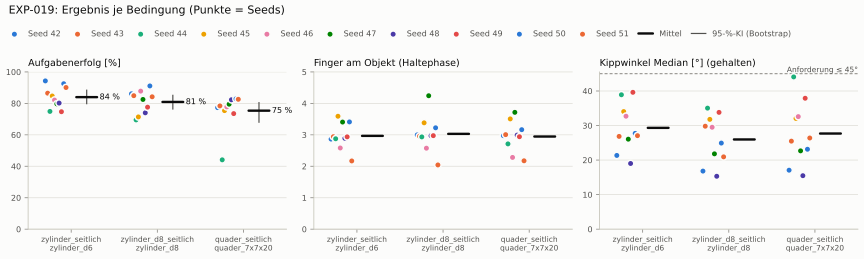
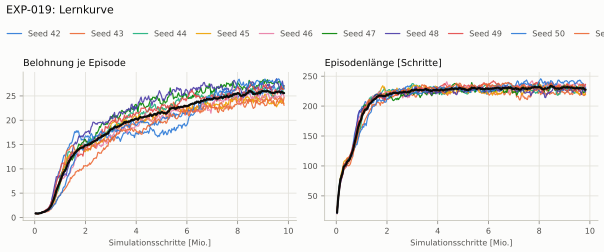
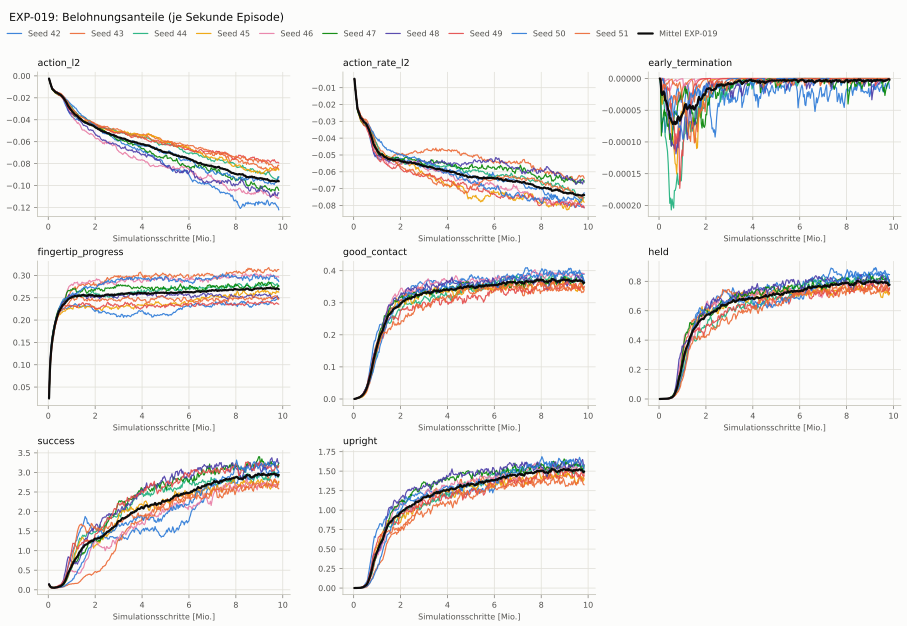
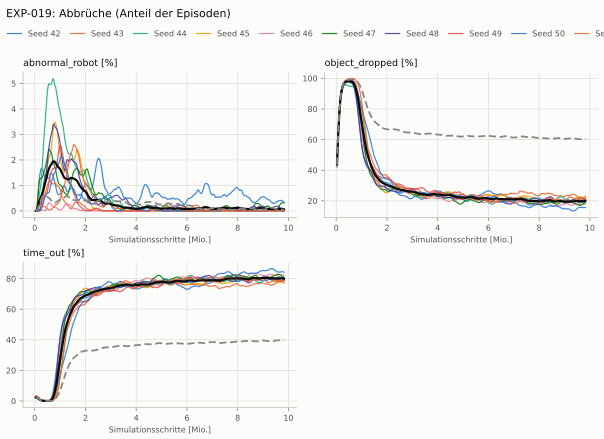
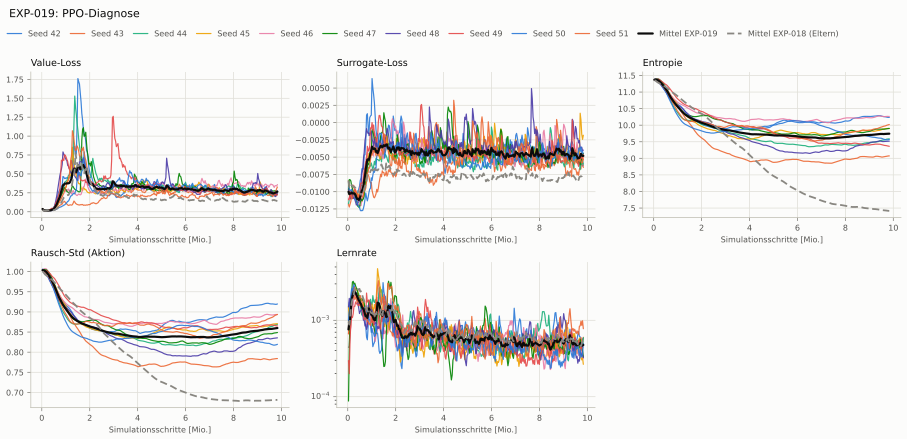

# EXP-019: Annäherung je Fingerspitze als Fortschritt (wie NVIDIA AllegroKuka/DexPBT)

**Leistung** 81 % [78–83 %] (erfolgreiche Seeds, IQM über die Objekte; je Objekt Ø 6 cm 83 % · Ø 8 cm 83 % · Quader 78 %) — ggü. EXP-018: P(besser) = 0.32 [0.14–0.52] → kein Unterschied

**Testobjekte** (nie trainiert, erfolgreiche Seeds, Median): Flasche 80 % · Saftpackung 82 % · Cracker (YCB) 82 % · Zucker (YCB) 83 % · Senf (YCB) 82 %

**Zuverlässigkeit** 10/10 Seeds erfolgreich [69–100 %] — EXP-018: 5/10, exakter Fisher-Test p = 0.03 → gesichert besser

**Leitplanken** Kippwinkel Median [°]: 29.3 > 23.4; Unterarm Median [°]: 41.2 > 31.7; Unruhe: 1.19 > 1.09; Unruhe wirksam (Aktion auf ±1 begrenzt): 0.562 > 0.449 ✗

**Befund** Engpass Quader (78 %); Kippwinkel 29° (EXP-018: 18°); Unruhe 1.19 (EXP-018: 0.91)

**Urteilsvorschlag** (auswertung-v2): **kein Unterschied, Leitplanke verletzt**

Ergebnisse je Bedingung (eval-v2, Leitplanken, Fehlerarten, Fingernutzung)

#### Bedingung `zylinder_seitlich`

Bedingung `zylinder_seitlich` (Objekt `zylinder_d6`, Kippwinkel ≤ 45°), Protokoll eval-v2, 10 Seed(s); Spalte EXP-018 unter derselben Anforderung

| Metrik | Mittel | 95-%-KI | IQM | Fehlschlag-Seeds (< 50 %) | EXP-018 (Mittel / IQM) |
|---|---|---|---|---|---|
| aufgabenerfolg | 84.0 % | 79.8 % – 88.4 % | 83.7 % | 0.0 % | 45.1 % / 42.9 % |
| haltequote | 92.2 % | 89.1 % – 94.6 % | 93.4 % | 0.0 % | 47.5 % / 45.9 % |
| Kippwinkel Median [°] | 29.3 | | | | 18.4 |
| Unterarm Median [°] | 41.2 | | | | 21.7 |
| Griffkraft Mittel [N] | 87.9 | | | | 91.5 |
| Kraft > 15 N [Anteil] | 99.9 % | | | | 99.9 % |
| Stall-Anteil [Anteil] | 99.7 % | | | | 99.9 % |
| Absinken [mm] | 0.0578 | | | | 0.000324 |
| Unruhe | 1.19 | | | | 0.912 |
| Unruhe wirksam (Aktion auf ±1 begrenzt) | 0.562 | | | | 0.374 |

Fehlerarten: startfehler 0.0 %, gefallen 7.8 %, instabil 0.0 %, anforderung_verletzt 8.2 %

**Urteilsvorschlag: Leitplanke verletzt** (gegenüber EXP-018)
Unterschied Aufgabenerfolg +38.8 Prozentpunkte (95-%-KI +9.7 … +67.8)
- Leitplanke: Kippwinkel Median [°]: 29.3 > 23.4
- Leitplanke: Unterarm Median [°]: 41.2 > 31.7
- Leitplanke: Unruhe: 1.19 > 1.09
- Leitplanke: Unruhe wirksam (Aktion auf ±1 begrenzt): 0.562 > 0.449

Je Seed: 94.3 %, 86.5 %, 74.9 %, 84.7 %, 82.1 %, 79.7 %, 80.2 %, 74.7 %, 92.5 %, 90.1 %

Fingernutzung (Haltephase): im Mittel 2.97 Finger am Objekt; Kontaktanteil je Seed (Daumen, Zeige, Mittel, Ring, klein): 100/87/100/0/0 · 97/0/0/100/97 · 100/91/1/0/96 · 98/0/100/94/68 · 99/25/0/59/75 · 97/71/49/91/32 · 98/1/99/0/92 · 94/97/97/0/5 · 99/65/2/78/98 · 88/96/14/20/0

#### Bedingung `zylinder_d8_seitlich`

Bedingung `zylinder_d8_seitlich` (Objekt `zylinder_d8`, Kippwinkel ≤ 45°), Protokoll eval-v2, 10 Seed(s); Spalte EXP-018 unter derselben Anforderung

| Metrik | Mittel | 95-%-KI | IQM | Fehlschlag-Seeds (< 50 %) | EXP-018 (Mittel / IQM) |
|---|---|---|---|---|---|
| aufgabenerfolg | 80.9 % | 76.4 % – 85.1 % | 81.8 % | 0.0 % | 41.7 % / 37.8 % |
| haltequote | 85.0 % | 82.0 % – 87.9 % | 85.8 % | 0.0 % | 42.9 % / 39.7 % |
| Kippwinkel Median [°] | 26 | | | | 14.4 |
| Unterarm Median [°] | 39.3 | | | | 20.1 |
| Griffkraft Mittel [N] | 85.1 | | | | 86.3 |
| Kraft > 15 N [Anteil] | 99.9 % | | | | 99.9 % |
| Stall-Anteil [Anteil] | 99.8 % | | | | 99.9 % |
| Absinken [mm] | 0.0132 | | | | 0 |
| Unruhe | 1.07 | | | | 0.683 |
| Unruhe wirksam (Aktion auf ±1 begrenzt) | 0.484 | | | | 0.259 |

Fehlerarten: startfehler 0.0 %, gefallen 15.0 %, instabil 0.0 %, anforderung_verletzt 4.1 %

**Urteilsvorschlag: Leitplanke verletzt** (gegenüber EXP-018)
Unterschied Aufgabenerfolg +39.1 Prozentpunkte (95-%-KI +12.5 … +66.1)
- Leitplanke: Kippwinkel Median [°]: 26 > 19.4
- Leitplanke: Unterarm Median [°]: 39.3 > 30.1
- Leitplanke: Unruhe: 1.07 > 0.82
- Leitplanke: Unruhe wirksam (Aktion auf ±1 begrenzt): 0.484 > 0.311

Je Seed: 86.1 %, 84.9 %, 69.5 %, 71.4 %, 87.8 %, 82.5 %, 74.0 %, 77.6 %, 91.1 %, 84.2 %

Fingernutzung (Haltephase): im Mittel 3.03 Finger am Objekt; Kontaktanteil je Seed (Daumen, Zeige, Mittel, Ring, klein): 100/100/100/0/0 · 98/0/0/100/98 · 100/98/0/0/95 · 100/0/100/97/42 · 99/41/0/22/94 · 99/94/89/97/46 · 100/0/100/0/97 · 99/98/99/0/0 · 99/86/0/38/99 · 100/98/2/4/0

#### Bedingung `quader_seitlich`

Bedingung `quader_seitlich` (Objekt `quader_7x7x20`, Kippwinkel ≤ 45°), Protokoll eval-v2, 10 Seed(s); Spalte EXP-018 unter derselben Anforderung

| Metrik | Mittel | 95-%-KI | IQM | Fehlschlag-Seeds (< 50 %) | EXP-018 (Mittel / IQM) |
|---|---|---|---|---|---|
| aufgabenerfolg | 75.4 % | 68.0 % – 80.5 % | 78.4 % | 10.0 % | 39.4 % / 37.3 % |
| haltequote | 80.4 % | 78.9 % – 82.0 % | 80.7 % | 0.0 % | 39.6 % / 37.7 % |
| Kippwinkel Median [°] | 27.7 | | | | 14.9 |
| Unterarm Median [°] | 39.2 | | | | 20.8 |
| Griffkraft Mittel [N] | 76.8 | | | | 85.3 |
| Kraft > 15 N [Anteil] | 99.9 % | | | | 99.8 % |
| Stall-Anteil [Anteil] | 99.7 % | | | | 99.9 % |
| Absinken [mm] | 0.00317 | | | | 0 |
| Unruhe | 1.68 | | | | 1.08 |
| Unruhe wirksam (Aktion auf ±1 begrenzt) | 0.729 | | | | 0.439 |

Fehlerarten: startfehler 0.0 %, gefallen 19.5 %, instabil 0.0 %, anforderung_verletzt 5.1 %

**Urteilsvorschlag: Leitplanke verletzt** (gegenüber EXP-018)
Unterschied Aufgabenerfolg +35.9 Prozentpunkte (95-%-KI +13.5 … +59.2)
- Leitplanke: Kippwinkel Median [°]: 27.7 > 19.9
- Leitplanke: Unterarm Median [°]: 39.2 > 30.8
- Leitplanke: Unruhe: 1.68 > 1.3
- Leitplanke: Unruhe wirksam (Aktion auf ±1 begrenzt): 0.729 > 0.526

Je Seed: 77.3 %, 78.4 %, 44.0 %, 75.4 %, 77.8 %, 79.5 %, 82.3 %, 73.5 %, 82.9 %, 82.6 %

Fingernutzung (Haltephase): im Mittel 2.95 Finger am Objekt; Kontaktanteil je Seed (Daumen, Zeige, Mittel, Ring, klein): 100/98/100/0/0 · 98/8/0/100/95 · 100/80/6/0/85 · 100/0/100/100/51 · 100/21/0/11/96 · 99/69/21/99/84 · 100/0/100/0/99 · 96/96/100/0/3 · 100/72/2/55/87 · 99/99/3/16/0

#### Bedingung `flasche_seitlich`

Bedingung `flasche_seitlich` (Objekt `flasche_d7x25`, Kippwinkel ≤ 45°), Protokoll eval-v2, 10 Seed(s); Spalte EXP-018 unter derselben Anforderung

| Metrik | Mittel | 95-%-KI | IQM | Fehlschlag-Seeds (< 50 %) | EXP-018 (Mittel / IQM) |
|---|---|---|---|---|---|
| aufgabenerfolg | 81.5 % | 77.6 % – 86.1 % | 80.2 % | 0.0 % | 42.1 % / 37.4 % |
| haltequote | 89.0 % | 87.2 % – 91.1 % | 88.5 % | 0.0 % | 44.7 % / 41.7 % |
| Kippwinkel Median [°] | 26.2 | | | | 14.5 |
| Unterarm Median [°] | 41.4 | | | | 20.8 |
| Griffkraft Mittel [N] | 85.2 | | | | 87.7 |
| Kraft > 15 N [Anteil] | 99.9 % | | | | 99.8 % |
| Stall-Anteil [Anteil] | 99.8 % | | | | 99.9 % |
| Absinken [mm] | 0.0295 | | | | 0.0163 |
| Unruhe | 1.2 | | | | 0.975 |
| Unruhe wirksam (Aktion auf ±1 begrenzt) | 0.547 | | | | 0.361 |

Fehlerarten: startfehler 0.0 %, gefallen 11.0 %, instabil 0.0 %, anforderung_verletzt 7.5 %

**Urteilsvorschlag: Leitplanke verletzt** (gegenüber EXP-018)
Unterschied Aufgabenerfolg +39.4 Prozentpunkte (95-%-KI +11.2 … +67.2)
- Leitplanke: Kippwinkel Median [°]: 26.2 > 19.5
- Leitplanke: Unterarm Median [°]: 41.4 > 30.8
- Leitplanke: Unruhe: 1.2 > 1.17
- Leitplanke: Unruhe wirksam (Aktion auf ±1 begrenzt): 0.547 > 0.433

Je Seed: 90.8 %, 84.4 %, 72.6 %, 75.6 %, 85.7 %, 75.5 %, 82.0 %, 76.0 %, 94.7 %, 78.1 %

Fingernutzung (Haltephase): im Mittel 2.99 Finger am Objekt; Kontaktanteil je Seed (Daumen, Zeige, Mittel, Ring, klein): 100/99/100/0/0 · 97/0/0/100/97 · 100/97/2/0/95 · 100/0/99/92/52 · 99/54/0/36/88 · 96/84/60/90/45 · 100/0/100/0/93 · 99/97/98/0/1 · 99/76/1/48/96 · 99/98/2/4/0

#### Bedingung `saftpackung_seitlich`

Bedingung `saftpackung_seitlich` (Objekt `saftpackung_9x6x19`, Kippwinkel ≤ 45°), Protokoll eval-v2, 10 Seed(s); Spalte EXP-018 unter derselben Anforderung

| Metrik | Mittel | 95-%-KI | IQM | Fehlschlag-Seeds (< 50 %) | EXP-018 (Mittel / IQM) |
|---|---|---|---|---|---|
| aufgabenerfolg | 79.3 % | 74.5 % – 83.9 % | 80.3 % | 0.0 % | 44.3 % / 42.4 % |
| haltequote | 85.3 % | 82.3 % – 87.7 % | 86.3 % | 0.0 % | 44.5 % / 42.7 % |
| Kippwinkel Median [°] | 28.4 | | | | 15 |
| Unterarm Median [°] | 42.2 | | | | 21.7 |
| Griffkraft Mittel [N] | 78.8 | | | | 84.5 |
| Kraft > 15 N [Anteil] | 99.9 % | | | | 99.7 % |
| Stall-Anteil [Anteil] | 99.7 % | | | | 99.9 % |
| Absinken [mm] | 0.0102 | | | | 0.000216 |
| Unruhe | 1.64 | | | | 1.35 |
| Unruhe wirksam (Aktion auf ±1 begrenzt) | 0.707 | | | | 0.593 |

Fehlerarten: startfehler 0.0 %, gefallen 14.7 %, instabil 0.0 %, anforderung_verletzt 6.0 %

**Urteilsvorschlag: Leitplanke verletzt** (gegenüber EXP-018)
Unterschied Aufgabenerfolg +34.9 Prozentpunkte (95-%-KI +8.0 … +62.2)
- Leitplanke: Kippwinkel Median [°]: 28.4 > 20
- Leitplanke: Unterarm Median [°]: 42.2 > 31.7
- Leitplanke: Unruhe: 1.64 > 1.62

Je Seed: 84.4 %, 84.7 %, 64.1 %, 85.2 %, 72.7 %, 78.8 %, 72.6 %, 74.9 %, 86.5 %, 88.8 %

Fingernutzung (Haltephase): im Mittel 3.02 Finger am Objekt; Kontaktanteil je Seed (Daumen, Zeige, Mittel, Ring, klein): 100/100/100/0/0 · 99/3/0/100/95 · 100/98/1/0/89 · 99/0/100/97/74 · 100/34/1/40/75 · 98/67/23/92/75 · 100/0/100/0/95 · 92/98/99/0/7 · 100/81/6/51/95 · 99/100/10/27/0

#### Bedingung `ycb_cracker_seitlich`

Bedingung `ycb_cracker_seitlich` (Objekt `ycb_003_cracker`, Kippwinkel ≤ 45°), Protokoll eval-v2, 10 Seed(s); Spalte EXP-018 unter derselben Anforderung

| Metrik | Mittel | 95-%-KI | IQM | Fehlschlag-Seeds (< 50 %) | EXP-018 (Mittel / IQM) |
|---|---|---|---|---|---|
| aufgabenerfolg | 81.4 % | 79.1 % – 83.8 % | 81.7 % | 0.0 % | 42.5 % / 39.7 % |
| haltequote | 81.5 % | 79.2 % – 83.7 % | 81.8 % | 0.0 % | 42.5 % / 39.7 % |
| Kippwinkel Median [°] | 20.8 | | | | 11.6 |
| Unterarm Median [°] | 38.4 | | | | 19.8 |
| Griffkraft Mittel [N] | 84.1 | | | | 91.9 |
| Kraft > 15 N [Anteil] | 100.0 % | | | | 100.0 % |
| Stall-Anteil [Anteil] | 99.8 % | | | | 100.0 % |
| Absinken [mm] | 1.07 | | | | 0.147 |
| Unruhe | 1.46 | | | | 0.986 |
| Unruhe wirksam (Aktion auf ±1 begrenzt) | 0.61 | | | | 0.339 |

Fehlerarten: startfehler 0.0 %, gefallen 18.5 %, instabil 0.0 %, anforderung_verletzt 0.0 %

**Urteilsvorschlag: Leitplanke verletzt** (gegenüber EXP-018)
Unterschied Aufgabenerfolg +38.8 Prozentpunkte (95-%-KI +12.3 … +65.7)
- Leitplanke: Kippwinkel Median [°]: 20.8 > 16.6
- Leitplanke: Unterarm Median [°]: 38.4 > 29.8
- Leitplanke: Unruhe: 1.46 > 1.18
- Leitplanke: Unruhe wirksam (Aktion auf ±1 begrenzt): 0.61 > 0.406

Je Seed: 83.1 %, 81.7 %, 82.7 %, 75.5 %, 86.2 %, 85.9 %, 77.6 %, 77.3 %, 84.0 %, 80.4 %

Fingernutzung (Haltephase): im Mittel 3.03 Finger am Objekt; Kontaktanteil je Seed (Daumen, Zeige, Mittel, Ring, klein): 100/100/100/0/0 · 100/2/0/100/100 · 100/98/0/0/95 · 100/0/99/99/78 · 100/4/0/14/95 · 100/82/82/100/99 · 100/8/100/0/92 · 98/97/100/0/0 · 100/50/16/15/100 · 100/100/2/9/0

#### Bedingung `ycb_zucker_seitlich`

Bedingung `ycb_zucker_seitlich` (Objekt `ycb_004_zucker`, Kippwinkel ≤ 45°), Protokoll eval-v2, 10 Seed(s); Spalte EXP-018 unter derselben Anforderung

| Metrik | Mittel | 95-%-KI | IQM | Fehlschlag-Seeds (< 50 %) | EXP-018 (Mittel / IQM) |
|---|---|---|---|---|---|
| aufgabenerfolg | 82.5 % | 74.5 % – 89.5 % | 83.7 % | 0.0 % | 46.8 % / 44.9 % |
| haltequote | 84.0 % | 75.5 % – 90.3 % | 84.9 % | 0.0 % | 47.6 % / 46.4 % |
| Kippwinkel Median [°] | 23.9 | | | | 16.2 |
| Unterarm Median [°] | 41.1 | | | | 14.7 |
| Griffkraft Mittel [N] | 85.9 | | | | 85.4 |
| Kraft > 15 N [Anteil] | 100.0 % | | | | 100.0 % |
| Stall-Anteil [Anteil] | 99.6 % | | | | 99.9 % |
| Absinken [mm] | 0.755 | | | | 0.114 |
| Unruhe | 1.24 | | | | 1.11 |
| Unruhe wirksam (Aktion auf ±1 begrenzt) | 0.499 | | | | 0.498 |

Fehlerarten: startfehler 0.0 %, gefallen 16.0 %, instabil 0.0 %, anforderung_verletzt 1.4 %

**Urteilsvorschlag: Leitplanke verletzt** (gegenüber EXP-018)
Unterschied Aufgabenerfolg +35.5 Prozentpunkte (95-%-KI +4.5 … +66.9)
- Leitplanke: Kippwinkel Median [°]: 23.9 > 21.2
- Leitplanke: Unterarm Median [°]: 41.1 > 24.7

Je Seed: 98.6 %, 96.8 %, 91.8 %, 79.6 %, 72.1 %, 88.2 %, 55.0 %, 82.9 %, 83.2 %, 77.1 %

Fingernutzung (Haltephase): im Mittel 2.93 Finger am Objekt; Kontaktanteil je Seed (Daumen, Zeige, Mittel, Ring, klein): 100/100/100/0/0 · 100/0/0/100/96 · 100/83/0/0/87 · 99/0/100/2/99 · 100/51/2/77/47 · 99/34/18/98/84 · 98/0/96/0/84 · 100/99/100/0/0 · 100/14/3/98/99 · 100/98/60/8/0

#### Bedingung `ycb_senf_seitlich`

Bedingung `ycb_senf_seitlich` (Objekt `ycb_006_senf`, Kippwinkel ≤ 45°), Protokoll eval-v2, 10 Seed(s); Spalte EXP-018 unter derselben Anforderung

| Metrik | Mittel | 95-%-KI | IQM | Fehlschlag-Seeds (< 50 %) | EXP-018 (Mittel / IQM) |
|---|---|---|---|---|---|
| aufgabenerfolg | 79.4 % | 70.2 % – 87.6 % | 81.7 % | 0.0 % | 43.7 % / 39.1 % |
| haltequote | 81.7 % | 73.0 % – 89.1 % | 83.6 % | 0.0 % | 45.9 % / 43.5 % |
| Kippwinkel Median [°] | 24.5 | | | | 15.5 |
| Unterarm Median [°] | 40.1 | | | | 21.4 |
| Griffkraft Mittel [N] | 84.5 | | | | 89 |
| Kraft > 15 N [Anteil] | 100.0 % | | | | 100.0 % |
| Stall-Anteil [Anteil] | 99.7 % | | | | 99.9 % |
| Absinken [mm] | 0.68 | | | | 0.509 |
| Unruhe | 1.17 | | | | 1.15 |
| Unruhe wirksam (Aktion auf ±1 begrenzt) | 0.509 | | | | 0.388 |

Fehlerarten: startfehler 0.0 %, gefallen 18.3 %, instabil 0.0 %, anforderung_verletzt 2.3 %

**Urteilsvorschlag: Leitplanke verletzt** (gegenüber EXP-018)
Unterschied Aufgabenerfolg +35.5 Prozentpunkte (95-%-KI +6.3 … +63.1)
- Leitplanke: Kippwinkel Median [°]: 24.5 > 20.5
- Leitplanke: Unterarm Median [°]: 40.1 > 31.4
- Leitplanke: Unruhe wirksam (Aktion auf ±1 begrenzt): 0.509 > 0.466

Je Seed: 94.9 %, 96.2 %, 84.2 %, 66.9 %, 63.1 %, 92.5 %, 51.3 %, 79.0 %, 85.7 %, 79.9 %

Fingernutzung (Haltephase): im Mittel 2.89 Finger am Objekt; Kontaktanteil je Seed (Daumen, Zeige, Mittel, Ring, klein): 100/97/100/0/0 · 100/2/0/100/90 · 100/87/0/0/84 · 100/0/100/15/96 · 100/44/7/42/73 · 99/41/43/96/82 · 100/3/95/0/50 · 100/88/100/0/0 · 100/32/2/82/100 · 100/83/35/25/0

Trainingsverlauf

Seeds dünn, Mittel kräftig, Eltern gestrichelt (nur Abbrüche/PPO — Trainings-Belohnung ist zwischen Experimenten nicht vergleichbar); geglättet, x = Simulationsschritte. Endwerte = Mittel der letzten 10 Iterationen (Belohnungsanteile je Sekunde Episode).

| Größe | Seed 42 | Seed 43 | Seed 44 | Seed 45 | Seed 46 | Seed 47 | Seed 48 | Seed 49 | Seed 50 | Seed 51 | Mittel |
|---|---|---|---|---|---|---|---|---|---|---|---|
| mean_reward | 26.4 | 23.9 | 26.3 | 23.6 | 24.9 | 27.1 | 27 | 26.3 | 27.4 | 24.1 | 25.7 |
| action_l2 | -0.119 | -0.0845 | -0.0935 | -0.0858 | -0.11 | -0.103 | -0.107 | -0.0784 | -0.0949 | -0.0828 | -0.0959 |
| action_rate_l2 | -0.0805 | -0.0628 | -0.0762 | -0.0779 | -0.08 | -0.0654 | -0.0654 | -0.0802 | -0.0751 | -0.0748 | -0.0738 |
| early_termination | -1.43e-05 | 0 | 0 | 0 | 0 | -1.16e-05 | 0 | 0 | 0 | 0 | -2.59e-06 |
| fingertip_progress | 0.248 | 0.311 | 0.278 | 0.263 | 0.297 | 0.273 | 0.25 | 0.237 | 0.291 | 0.251 | 0.27 |
| good_contact | 0.388 | 0.336 | 0.378 | 0.348 | 0.388 | 0.36 | 0.372 | 0.347 | 0.382 | 0.352 | 0.365 |
| held | 0.842 | 0.739 | 0.809 | 0.726 | 0.788 | 0.798 | 0.804 | 0.748 | 0.826 | 0.744 | 0.782 |
| success | 2.98 | 2.68 | 2.96 | 2.77 | 2.67 | 3.18 | 3.24 | 3.12 | 3.12 | 2.7 | 2.94 |
| upright | 1.56 | 1.42 | 1.54 | 1.41 | 1.53 | 1.55 | 1.59 | 1.45 | 1.59 | 1.37 | 1.5 |
| object_dropped | 20.9 % | 22.3 % | 19.2 % | 22.3 % | 17.7 % | 18.3 % | 19.7 % | 21.6 % | 15.9 % | 21.0 % | 19.9 % |
| mean_noise_std | 0.919 | 0.784 | 0.868 | 0.871 | 0.893 | 0.848 | 0.835 | 0.866 | 0.818 | 0.892 | 0.859 |

Netz, Training und Konfiguration

Actor [256, 128, 64] (elu), 68808 Parameter, 105 Eingänge (Verlauf 5) · Critic [512, 256, 128] · PPO: Lernrate 0.001, Entropie 0.005, 5 Epochen × 4 Mini-Batches, 32 Schritte/Umgebung · 1024 Umgebungen × 300 Iterationen

Geplante Änderung: Annäherung ersetzt: fingertips_to_object (Dexsuite-Kopie mit Standardargument-Fehler, maß alle Handkörper) → mdp.FingertipProgress: je Fingerspitze Σ max(kleinster bisheriger Abstand zur Objektmitte − aktueller, 0), je Schritt auf 5 cm gekappt, nur vor dem Absenken, Gewicht 500 (reward_diag: greifende Policy 0,52/s vor dem Absenken, Gegengriff 0,36/s). Task HeavyMultiProgress-v0, sonst wie EXP-018. 10 Seeds (Zuverlässigkeit ist die Hauptfrage).

Konfiguration gegenüber EXP-018 (8 Unterschiede):

- `env.rewards.fingertip_progress.func: ∅ → pib_grasp.mdp:FingertipProgress`
- `env.rewards.fingertip_progress.params.drop_start_s: ∅ → 2.0`
- `env.rewards.fingertip_progress.params.max_delta: ∅ → 0.05`
- `env.rewards.fingertip_progress.weight: ∅ → 500.0`
- `env.rewards.fingertips_to_object: ∅ → None`
- `env.rewards.fingertips_to_object.func: pib_grasp.mdp:fingertips_to_object → ∅`
- `env.rewards.fingertips_to_object.params.std: 0.4 → ∅`
- `env.rewards.fingertips_to_object.weight: 1.0 → ∅`

