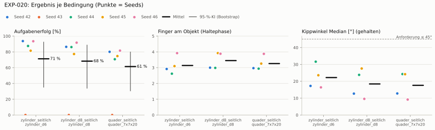
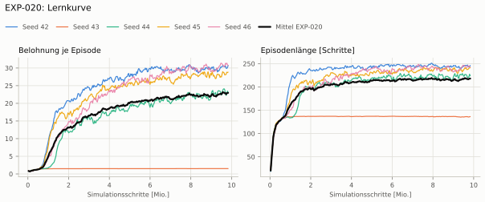
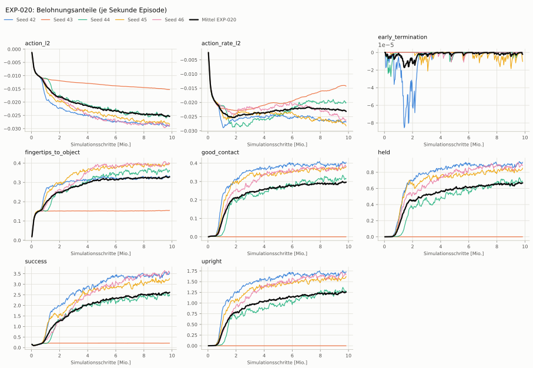
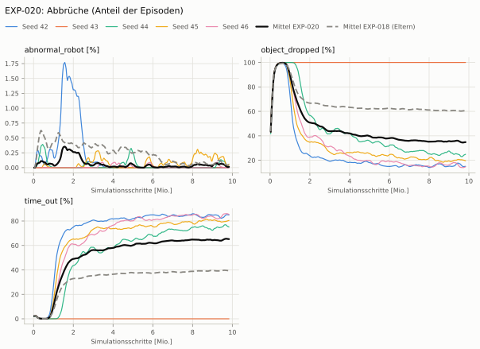
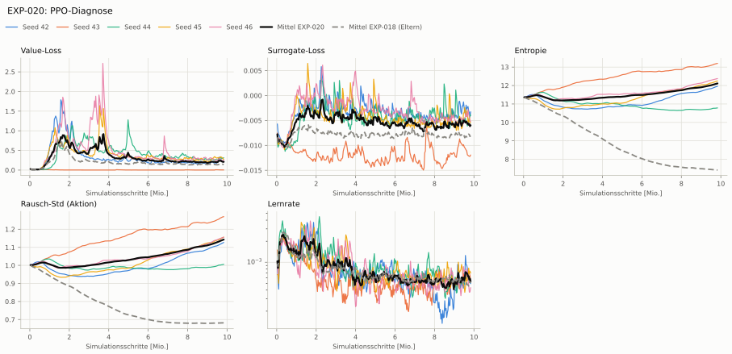

# EXP-020: Aktionen auf ±1 begrenzt (clip_actions, Ersatz für NVIDIAs bounds_loss)

**Leistung** 84 % [80–88 %] (erfolgreiche Seeds, IQM über die Objekte; je Objekt Ø 6 cm 90 % · Ø 8 cm 86 % · Quader 77 %) — ggü. EXP-018: P(besser) = 0.40 [0.20–0.63] → kein Unterschied

**Testobjekte** (nie trainiert, erfolgreiche Seeds, Median): Flasche 80 % · Saftpackung 85 % · Cracker (YCB) 84 % · Zucker (YCB) 96 % · Senf (YCB) 85 %

**Zuverlässigkeit** 4/5 Seeds erfolgreich [28–99 %] — EXP-018: 5/10, exakter Fisher-Test p = 0.58 → nicht unterscheidbar (für eine Aussage ≥ 10 Seeds je Experiment)

**Leitplanken** Unruhe: 1.13 > 1.09; Unruhe wirksam (Aktion auf ±1 begrenzt): 1.13 > 0.449 ✗

**Befund** ohne Erfolg: Seed 43 (lernt nicht zu greifen); Engpass Quader (77 %)

**Urteilsvorschlag** (auswertung-v2): **kein Unterschied, Leitplanke verletzt**

Ergebnisse je Bedingung (eval-v2, Leitplanken, Fehlerarten, Fingernutzung)

#### Bedingung `zylinder_seitlich`

Bedingung `zylinder_seitlich` (Objekt `zylinder_d6`, Kippwinkel ≤ 45°), Protokoll eval-v2, 5 Seed(s); Spalte EXP-018 unter derselben Anforderung

| Metrik | Mittel | 95-%-KI | IQM | Fehlschlag-Seeds (< 50 %) | EXP-018 (Mittel / IQM) |
|---|---|---|---|---|---|
| aufgabenerfolg | 71.2 % | 35.2 % – 92.4 % | 87.5 % | 20.0 % | 45.1 % / 42.9 % |
| haltequote | 73.9 % | 36.8 % – 94.2 % | 91.5 % | 20.0 % | 47.5 % / 45.9 % |
| Kippwinkel Median [°] | 22.2 | | | | 18.4 |
| Unterarm Median [°] | 27.5 | | | | 21.7 |
| Griffkraft Mittel [N] | 100 | | | | 91.5 |
| Kraft > 15 N [Anteil] | 99.2 % | | | | 99.9 % |
| Stall-Anteil [Anteil] | 99.2 % | | | | 99.9 % |
| Absinken [mm] | 0.135 | | | | 0.000324 |
| Unruhe | 1.13 | | | | 0.912 |
| Unruhe wirksam (Aktion auf ±1 begrenzt) | 1.13 | | | | 0.374 |

Fehlerarten: startfehler 0.0 %, gefallen 26.0 %, instabil 0.1 %, anforderung_verletzt 2.7 %

**Urteilsvorschlag: kein messbarer Unterschied** (gegenüber EXP-018)
Unterschied Aufgabenerfolg +26.5 Prozentpunkte (95-%-KI -18.8 … +64.8)
- Leitplanke: Unruhe: 1.13 > 1.09
- Leitplanke: Unruhe wirksam (Aktion auf ±1 begrenzt): 1.13 > 0.449

Je Seed: 93.7 %, 0.0 %, 87.5 %, 81.5 %, 93.5 %

Fingernutzung (Haltephase): im Mittel 3.14 Finger am Objekt; Kontaktanteil je Seed (Daumen, Zeige, Mittel, Ring, klein): 100/92/100/0/0 · –/–/–/–/– · 73/92/0/70/27 · 97/25/100/40/49 · 98/97/100/0/97

#### Bedingung `zylinder_d8_seitlich`

Bedingung `zylinder_d8_seitlich` (Objekt `zylinder_d8`, Kippwinkel ≤ 45°), Protokoll eval-v2, 5 Seed(s); Spalte EXP-018 unter derselben Anforderung

| Metrik | Mittel | 95-%-KI | IQM | Fehlschlag-Seeds (< 50 %) | EXP-018 (Mittel / IQM) |
|---|---|---|---|---|---|
| aufgabenerfolg | 68.3 % | 34.0 % – 88.7 % | 83.5 % | 20.0 % | 41.7 % / 37.8 % |
| haltequote | 69.3 % | 34.3 % – 89.4 % | 84.6 % | 20.0 % | 42.9 % / 39.7 % |
| Kippwinkel Median [°] | 18.4 | | | | 14.4 |
| Unterarm Median [°] | 22.4 | | | | 20.1 |
| Griffkraft Mittel [N] | 101 | | | | 86.3 |
| Kraft > 15 N [Anteil] | 100.0 % | | | | 99.9 % |
| Stall-Anteil [Anteil] | 99.4 % | | | | 99.9 % |
| Absinken [mm] | 0.0129 | | | | 0 |
| Unruhe | 1.35 | | | | 0.683 |
| Unruhe wirksam (Aktion auf ±1 begrenzt) | 1.35 | | | | 0.259 |

Fehlerarten: startfehler 0.0 %, gefallen 30.7 %, instabil 0.0 %, anforderung_verletzt 1.0 %

**Urteilsvorschlag: kein messbarer Unterschied** (gegenüber EXP-018)
Unterschied Aufgabenerfolg +27.0 Prozentpunkte (95-%-KI -16.1 … +63.3)
- Leitplanke: Unruhe: 1.35 > 0.82
- Leitplanke: Unruhe wirksam (Aktion auf ±1 begrenzt): 1.35 > 0.311

Je Seed: 86.4 %, 0.0 %, 86.1 %, 77.3 %, 91.7 %

Fingernutzung (Haltephase): im Mittel 3.45 Finger am Objekt; Kontaktanteil je Seed (Daumen, Zeige, Mittel, Ring, klein): 100/100/100/0/0 · –/–/–/–/– · 100/99/0/99/0 · 96/38/100/75/83 · 100/98/100/0/90

#### Bedingung `quader_seitlich`

Bedingung `quader_seitlich` (Objekt `quader_7x7x20`, Kippwinkel ≤ 45°), Protokoll eval-v2, 5 Seed(s); Spalte EXP-018 unter derselben Anforderung

| Metrik | Mittel | 95-%-KI | IQM | Fehlschlag-Seeds (< 50 %) | EXP-018 (Mittel / IQM) |
|---|---|---|---|---|---|
| aufgabenerfolg | 61.4 % | 30.6 % – 79.9 % | 75.1 % | 20.0 % | 39.4 % / 37.3 % |
| haltequote | 61.8 % | 30.7 % – 80.1 % | 75.9 % | 20.0 % | 39.6 % / 37.7 % |
| Kippwinkel Median [°] | 17.6 | | | | 14.9 |
| Unterarm Median [°] | 20.5 | | | | 20.8 |
| Griffkraft Mittel [N] | 92.1 | | | | 85.3 |
| Kraft > 15 N [Anteil] | 100.0 % | | | | 99.8 % |
| Stall-Anteil [Anteil] | 99.2 % | | | | 99.9 % |
| Absinken [mm] | 0.0101 | | | | 0 |
| Unruhe | 1.45 | | | | 1.08 |
| Unruhe wirksam (Aktion auf ±1 begrenzt) | 1.45 | | | | 0.439 |

Fehlerarten: startfehler 0.0 %, gefallen 38.0 %, instabil 0.2 %, anforderung_verletzt 0.4 %

**Urteilsvorschlag: kein messbarer Unterschied** (gegenüber EXP-018)
Unterschied Aufgabenerfolg +22.2 Prozentpunkte (95-%-KI -16.8 … +55.1)
- Leitplanke: Unruhe: 1.45 > 1.3
- Leitplanke: Unruhe wirksam (Aktion auf ±1 begrenzt): 1.45 > 0.526

Je Seed: 80.1 %, 0.0 %, 70.7 %, 74.7 %, 81.6 %

Fingernutzung (Haltephase): im Mittel 3.26 Finger am Objekt; Kontaktanteil je Seed (Daumen, Zeige, Mittel, Ring, klein): 100/98/99/0/0 · –/–/–/–/– · 99/97/0/97/2 · 97/14/100/31/84 · 98/96/99/0/94

#### Bedingung `flasche_seitlich`

Bedingung `flasche_seitlich` (Objekt `flasche_d7x25`, Kippwinkel ≤ 45°), Protokoll eval-v2, 5 Seed(s); Spalte EXP-018 unter derselben Anforderung

| Metrik | Mittel | 95-%-KI | IQM | Fehlschlag-Seeds (< 50 %) | EXP-018 (Mittel / IQM) |
|---|---|---|---|---|---|
| aufgabenerfolg | 61.4 % | 29.7 % – 86.5 % | 71.9 % | 20.0 % | 42.1 % / 37.4 % |
| haltequote | 69.8 % | 35.7 % – 91.8 % | 85.9 % | 20.0 % | 44.7 % / 41.7 % |
| Kippwinkel Median [°] | 19.8 | | | | 14.5 |
| Unterarm Median [°] | 23.2 | | | | 20.8 |
| Griffkraft Mittel [N] | 105 | | | | 87.7 |
| Kraft > 15 N [Anteil] | 99.8 % | | | | 99.8 % |
| Stall-Anteil [Anteil] | 99.4 % | | | | 99.9 % |
| Absinken [mm] | 0.0269 | | | | 0.0163 |
| Unruhe | 1.23 | | | | 0.975 |
| Unruhe wirksam (Aktion auf ±1 begrenzt) | 1.23 | | | | 0.361 |

Fehlerarten: startfehler 0.0 %, gefallen 30.0 %, instabil 0.2 %, anforderung_verletzt 8.4 %

**Urteilsvorschlag: kein messbarer Unterschied** (gegenüber EXP-018)
Unterschied Aufgabenerfolg +19.7 Prozentpunkte (95-%-KI -21.0 … +57.1)
- Leitplanke: Kippwinkel Median [°]: 19.8 > 19.5
- Leitplanke: Unruhe: 1.23 > 1.17
- Leitplanke: Unruhe wirksam (Aktion auf ±1 begrenzt): 1.23 > 0.433

Je Seed: 91.0 %, 0.0 %, 55.7 %, 70.4 %, 90.0 %

Fingernutzung (Haltephase): im Mittel 3.32 Finger am Objekt; Kontaktanteil je Seed (Daumen, Zeige, Mittel, Ring, klein): 100/100/100/0/0 · –/–/–/–/– · 98/99/0/84/1 · 96/41/99/50/67 · 100/96/100/0/99

#### Bedingung `saftpackung_seitlich`

Bedingung `saftpackung_seitlich` (Objekt `saftpackung_9x6x19`, Kippwinkel ≤ 45°), Protokoll eval-v2, 5 Seed(s); Spalte EXP-018 unter derselben Anforderung

| Metrik | Mittel | 95-%-KI | IQM | Fehlschlag-Seeds (< 50 %) | EXP-018 (Mittel / IQM) |
|---|---|---|---|---|---|
| aufgabenerfolg | 66.6 % | 32.9 % – 88.3 % | 80.7 % | 20.0 % | 44.3 % / 42.4 % |
| haltequote | 67.6 % | 33.5 % – 88.4 % | 82.2 % | 20.0 % | 44.5 % / 42.7 % |
| Kippwinkel Median [°] | 19 | | | | 15 |
| Unterarm Median [°] | 21.2 | | | | 21.7 |
| Griffkraft Mittel [N] | 92.2 | | | | 84.5 |
| Kraft > 15 N [Anteil] | 100.0 % | | | | 99.7 % |
| Stall-Anteil [Anteil] | 99.2 % | | | | 99.9 % |
| Absinken [mm] | 0.000448 | | | | 0.000216 |
| Unruhe | 1.28 | | | | 1.35 |
| Unruhe wirksam (Aktion auf ±1 begrenzt) | 1.28 | | | | 0.593 |

Fehlerarten: startfehler 0.0 %, gefallen 32.4 %, instabil 0.1 %, anforderung_verletzt 0.9 %

**Urteilsvorschlag: kein messbarer Unterschied** (gegenüber EXP-018)
Unterschied Aufgabenerfolg +22.7 Prozentpunkte (95-%-KI -20.2 … +60.5)
- Leitplanke: Unruhe wirksam (Aktion auf ±1 begrenzt): 1.28 > 0.712

Je Seed: 90.6 %, 0.0 %, 79.9 %, 72.6 %, 90.0 %

Fingernutzung (Haltephase): im Mittel 3.32 Finger am Objekt; Kontaktanteil je Seed (Daumen, Zeige, Mittel, Ring, klein): 100/100/100/0/0 · –/–/–/–/– · 99/100/0/89/7 · 97/24/100/38/76 · 100/100/100/0/99

#### Bedingung `ycb_cracker_seitlich`

Bedingung `ycb_cracker_seitlich` (Objekt `ycb_003_cracker`, Kippwinkel ≤ 45°), Protokoll eval-v2, 5 Seed(s); Spalte EXP-018 unter derselben Anforderung

| Metrik | Mittel | 95-%-KI | IQM | Fehlschlag-Seeds (< 50 %) | EXP-018 (Mittel / IQM) |
|---|---|---|---|---|---|
| aufgabenerfolg | 68.3 % | 33.9 % – 88.4 % | 83.0 % | 20.0 % | 42.5 % / 39.7 % |
| haltequote | 68.5 % | 33.6 % – 88.4 % | 83.3 % | 20.0 % | 42.5 % / 39.7 % |
| Kippwinkel Median [°] | 16 | | | | 11.6 |
| Unterarm Median [°] | 18.7 | | | | 19.8 |
| Griffkraft Mittel [N] | 97.8 | | | | 91.9 |
| Kraft > 15 N [Anteil] | 100.0 % | | | | 100.0 % |
| Stall-Anteil [Anteil] | 99.4 % | | | | 100.0 % |
| Absinken [mm] | 1.07 | | | | 0.147 |
| Unruhe | 0.826 | | | | 0.986 |
| Unruhe wirksam (Aktion auf ±1 begrenzt) | 0.826 | | | | 0.339 |

Fehlerarten: startfehler 0.0 %, gefallen 31.4 %, instabil 0.1 %, anforderung_verletzt 0.2 %

**Urteilsvorschlag: kein messbarer Unterschied** (gegenüber EXP-018)
Unterschied Aufgabenerfolg +26.1 Prozentpunkte (95-%-KI -17.3 … +61.9)
- Leitplanke: Unruhe wirksam (Aktion auf ±1 begrenzt): 0.826 > 0.406

Je Seed: 80.5 %, 0.0 %, 92.2 %, 81.8 %, 87.0 %

Fingernutzung (Haltephase): im Mittel 3.39 Finger am Objekt; Kontaktanteil je Seed (Daumen, Zeige, Mittel, Ring, klein): 100/100/100/0/0 · –/–/–/–/– · 100/99/0/100/1 · 96/29/100/42/91 · 100/100/100/0/98

#### Bedingung `ycb_zucker_seitlich`

Bedingung `ycb_zucker_seitlich` (Objekt `ycb_004_zucker`, Kippwinkel ≤ 45°), Protokoll eval-v2, 5 Seed(s); Spalte EXP-018 unter derselben Anforderung

| Metrik | Mittel | 95-%-KI | IQM | Fehlschlag-Seeds (< 50 %) | EXP-018 (Mittel / IQM) |
|---|---|---|---|---|---|
| aufgabenerfolg | 75.5 % | 37.2 % – 97.3 % | 93.3 % | 20.0 % | 46.8 % / 44.9 % |
| haltequote | 76.2 % | 37.4 % – 97.4 % | 94.1 % | 20.0 % | 47.6 % / 46.4 % |
| Kippwinkel Median [°] | 19.9 | | | | 16.2 |
| Unterarm Median [°] | 21.8 | | | | 14.7 |
| Griffkraft Mittel [N] | 93.8 | | | | 85.4 |
| Kraft > 15 N [Anteil] | 100.0 % | | | | 100.0 % |
| Stall-Anteil [Anteil] | 99.3 % | | | | 99.9 % |
| Absinken [mm] | 2.67 | | | | 0.114 |
| Unruhe | 0.78 | | | | 1.11 |
| Unruhe wirksam (Aktion auf ±1 begrenzt) | 0.78 | | | | 0.498 |

Fehlerarten: startfehler 0.0 %, gefallen 23.6 %, instabil 0.2 %, anforderung_verletzt 0.7 %

**Urteilsvorschlag: kein messbarer Unterschied** (gegenüber EXP-018)
Unterschied Aufgabenerfolg +29.0 Prozentpunkte (95-%-KI -18.8 … +68.3)
- Leitplanke: Unruhe wirksam (Aktion auf ±1 begrenzt): 0.78 > 0.598

Je Seed: 96.7 %, 0.0 %, 98.6 %, 87.0 %, 95.4 %

Fingernutzung (Haltephase): im Mittel 3.17 Finger am Objekt; Kontaktanteil je Seed (Daumen, Zeige, Mittel, Ring, klein): 100/100/98/0/0 · –/–/–/–/– · 100/100/0/85/10 · 97/52/100/27/60 · 100/100/96/0/43

#### Bedingung `ycb_senf_seitlich`

Bedingung `ycb_senf_seitlich` (Objekt `ycb_006_senf`, Kippwinkel ≤ 45°), Protokoll eval-v2, 5 Seed(s); Spalte EXP-018 unter derselben Anforderung

| Metrik | Mittel | 95-%-KI | IQM | Fehlschlag-Seeds (< 50 %) | EXP-018 (Mittel / IQM) |
|---|---|---|---|---|---|
| aufgabenerfolg | 69.3 % | 33.9 % – 93.2 % | 82.0 % | 20.0 % | 43.7 % / 39.1 % |
| haltequote | 72.0 % | 34.3 % – 94.4 % | 86.7 % | 20.0 % | 45.9 % / 43.5 % |
| Kippwinkel Median [°] | 20.3 | | | | 15.5 |
| Unterarm Median [°] | 19.3 | | | | 21.4 |
| Griffkraft Mittel [N] | 107 | | | | 89 |
| Kraft > 15 N [Anteil] | 100.0 % | | | | 100.0 % |
| Stall-Anteil [Anteil] | 99.4 % | | | | 99.9 % |
| Absinken [mm] | 5.55 | | | | 0.509 |
| Unruhe | 0.451 | | | | 1.15 |
| Unruhe wirksam (Aktion auf ±1 begrenzt) | 0.451 | | | | 0.388 |

Fehlerarten: startfehler 0.0 %, gefallen 28.0 %, instabil 0.1 %, anforderung_verletzt 2.7 %

**Urteilsvorschlag: kein messbarer Unterschied** (gegenüber EXP-018)
Unterschied Aufgabenerfolg +25.9 Prozentpunkte (95-%-KI -18.5 … +64.0)
- Leitplanke: Absinken [mm]: 5.55 > 5.51

Je Seed: 89.4 %, 0.0 %, 99.8 %, 77.1 %, 80.1 %

Fingernutzung (Haltephase): im Mittel 3.35 Finger am Objekt; Kontaktanteil je Seed (Daumen, Zeige, Mittel, Ring, klein): 100/99/100/0/0 · –/–/–/–/– · 100/100/0/92/6 · 100/84/100/65/26 · 100/98/96/0/73

Trainingsverlauf

Seeds dünn, Mittel kräftig, Eltern gestrichelt (nur Abbrüche/PPO — Trainings-Belohnung ist zwischen Experimenten nicht vergleichbar); geglättet, x = Simulationsschritte. Endwerte = Mittel der letzten 10 Iterationen (Belohnungsanteile je Sekunde Episode).

| Größe | Seed 42 | Seed 43 | Seed 44 | Seed 45 | Seed 46 | Mittel |
|---|---|---|---|---|---|---|
| mean_reward | 30.5 | 1.52 | 23.5 | 28.9 | 30.7 | 23 |
| action_l2 | -0.029 | -0.0153 | -0.0254 | -0.0282 | -0.0287 | -0.0253 |
| action_rate_l2 | -0.0269 | -0.0141 | -0.0199 | -0.028 | -0.026 | -0.023 |
| early_termination | 0 | 0 | 0 | -4.24e-06 | 0 | -8.49e-07 |
| fingertips_to_object | 0.333 | 0.155 | 0.361 | 0.396 | 0.395 | 0.328 |
| good_contact | 0.404 | 0 | 0.322 | 0.379 | 0.379 | 0.297 |
| held | 0.922 | 0 | 0.703 | 0.839 | 0.878 | 0.669 |
| success | 3.52 | 0.211 | 2.52 | 3.24 | 3.54 | 2.61 |
| upright | 1.73 | 0 | 1.31 | 1.6 | 1.65 | 1.26 |
| object_dropped | 15.0 % | 100.0 % | 23.9 % | 19.9 % | 14.1 % | 34.6 % |
| mean_noise_std | 1.12 | 1.27 | 1 | 1.15 | 1.15 | 1.14 |

Netz, Training und Konfiguration

Actor [256, 128, 64] (elu), 68808 Parameter, 105 Eingänge (Verlauf 5) · Critic [512, 256, 128] · PPO: Lernrate 0.001, Entropie 0.005, 5 Epochen × 4 Mini-Batches, 32 Schritte/Umgebung · 1024 Umgebungen × 300 Iterationen

Geplante Änderung: Aktionen auf [−1, 1] begrenzt: rsl_rl clip_actions = 1.0 (Agent PibGraspPPORunnerCfg_Clip, Task HeavyMultiClip-v0), damit auch Aktionsstrafen und Beobachtung der letzten Aktion; Bewertung mit --action_clip 1.0. Sonst wie EXP-018.

Konfiguration gegenüber EXP-018 (1 Unterschiede):

- `agent.clip_actions: None → 1.0`

