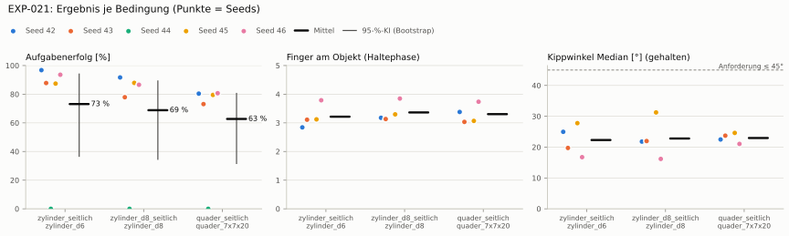
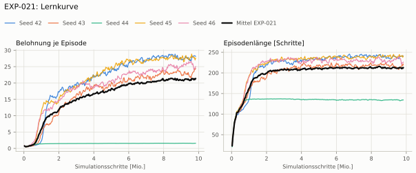
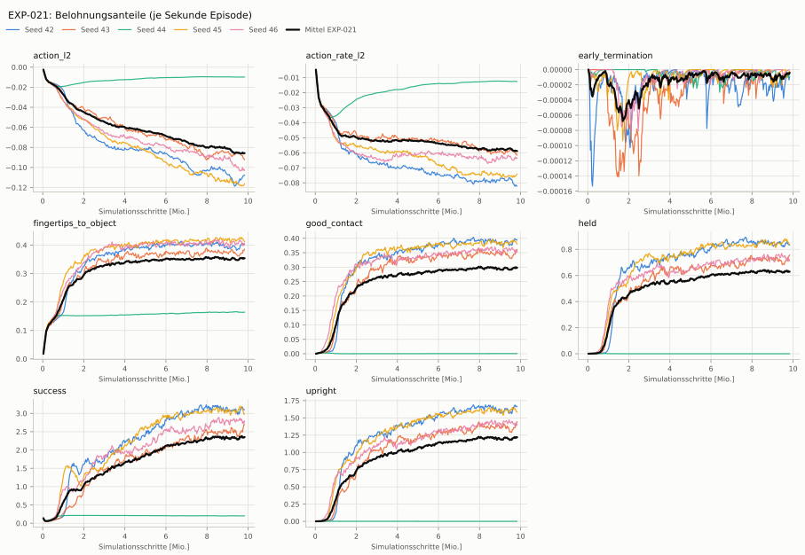
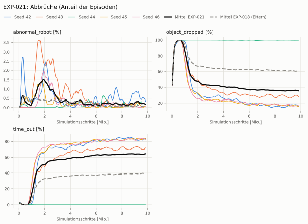
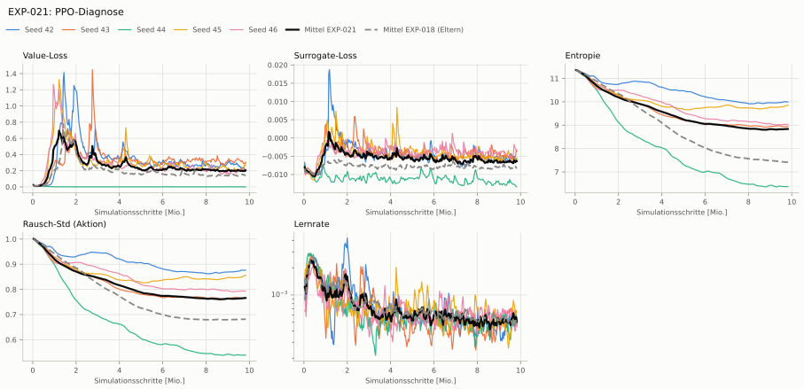

# EXP-021: Critic kennt Objektgröße, Masse und Reibung (privilegiert, wie HORA)

**Leistung** 85 % [82–88 %] (erfolgreiche Seeds, IQM über die Objekte; je Objekt Ø 6 cm 91 % · Ø 8 cm 87 % · Quader 80 %) — ggü. EXP-018: P(besser) = 0.44 [0.22–0.67] → kein Unterschied

**Testobjekte** (nie trainiert, erfolgreiche Seeds, Median): Flasche 87 % · Saftpackung 84 % · Cracker (YCB) 80 % · Zucker (YCB) 86 % · Senf (YCB) 75 %

**Zuverlässigkeit** 4/5 Seeds erfolgreich [28–99 %] — EXP-018: 5/10, exakter Fisher-Test p = 0.58 → nicht unterscheidbar (für eine Aussage ≥ 10 Seeds je Experiment)

**Leitplanken** Unterarm Median [°]: 41.2 > 31.7 ✗

**Befund** ohne Erfolg: Seed 44 (lernt nicht zu greifen); Engpass Quader (80 %)

**Urteilsvorschlag** (auswertung-v2): **kein Unterschied, Leitplanke verletzt**

Ergebnisse je Bedingung (eval-v2, Leitplanken, Fehlerarten, Fingernutzung)

#### Bedingung `zylinder_seitlich`

Bedingung `zylinder_seitlich` (Objekt `zylinder_d6`, Kippwinkel ≤ 45°), Protokoll eval-v2, 5 Seed(s); Spalte EXP-018 unter derselben Anforderung

| Metrik | Mittel | 95-%-KI | IQM | Fehlschlag-Seeds (< 50 %) | EXP-018 (Mittel / IQM) |
|---|---|---|---|---|---|
| aufgabenerfolg | 73.1 % | 36.6 % – 94.1 % | 89.4 % | 20.0 % | 45.1 % / 42.9 % |
| haltequote | 76.1 % | 37.5 % – 97.7 % | 94.1 % | 20.0 % | 47.5 % / 45.9 % |
| Kippwinkel Median [°] | 22.3 | | | | 18.4 |
| Unterarm Median [°] | 41.2 | | | | 21.7 |
| Griffkraft Mittel [N] | 97.2 | | | | 91.5 |
| Kraft > 15 N [Anteil] | 100.0 % | | | | 99.9 % |
| Stall-Anteil [Anteil] | 99.9 % | | | | 99.9 % |
| Absinken [mm] | 0 | | | | 0.000324 |
| Unruhe | 0.703 | | | | 0.912 |
| Unruhe wirksam (Aktion auf ±1 begrenzt) | 0.343 | | | | 0.374 |

Fehlerarten: startfehler 0.0 %, gefallen 23.9 %, instabil 0.0 %, anforderung_verletzt 3.0 %

**Urteilsvorschlag: kein messbarer Unterschied** (gegenüber EXP-018)
Unterschied Aufgabenerfolg +28.0 Prozentpunkte (95-%-KI -17.5 … +66.1)
- Leitplanke: Unterarm Median [°]: 41.2 > 31.7

Je Seed: 96.8 %, 87.8 %, 0.0 %, 87.4 %, 93.6 %

Fingernutzung (Haltephase): im Mittel 3.22 Finger am Objekt; Kontaktanteil je Seed (Daumen, Zeige, Mittel, Ring, klein): 100/37/100/0/48 · 95/23/0/100/93 · –/–/–/–/– · 99/28/100/85/0 · 96/87/96/97/3

#### Bedingung `zylinder_d8_seitlich`

Bedingung `zylinder_d8_seitlich` (Objekt `zylinder_d8`, Kippwinkel ≤ 45°), Protokoll eval-v2, 5 Seed(s); Spalte EXP-018 unter derselben Anforderung

| Metrik | Mittel | 95-%-KI | IQM | Fehlschlag-Seeds (< 50 %) | EXP-018 (Mittel / IQM) |
|---|---|---|---|---|---|
| aufgabenerfolg | 68.8 % | 34.6 % – 89.2 % | 84.4 % | 20.0 % | 41.7 % / 37.8 % |
| haltequote | 69.6 % | 34.0 % – 90.5 % | 85.4 % | 20.0 % | 42.9 % / 39.7 % |
| Kippwinkel Median [°] | 22.8 | | | | 14.4 |
| Unterarm Median [°] | 39.3 | | | | 20.1 |
| Griffkraft Mittel [N] | 96.1 | | | | 86.3 |
| Kraft > 15 N [Anteil] | 100.0 % | | | | 99.9 % |
| Stall-Anteil [Anteil] | 100.0 % | | | | 99.9 % |
| Absinken [mm] | 0 | | | | 0 |
| Unruhe | 0.689 | | | | 0.683 |
| Unruhe wirksam (Aktion auf ±1 begrenzt) | 0.333 | | | | 0.259 |

Fehlerarten: startfehler 0.0 %, gefallen 30.4 %, instabil 0.0 %, anforderung_verletzt 0.7 %

**Urteilsvorschlag: kein messbarer Unterschied** (gegenüber EXP-018)
Unterschied Aufgabenerfolg +27.0 Prozentpunkte (95-%-KI -14.6 … +63.0)
- Leitplanke: Kippwinkel Median [°]: 22.8 > 19.4
- Leitplanke: Unterarm Median [°]: 39.3 > 30.1
- Leitplanke: Unruhe wirksam (Aktion auf ±1 begrenzt): 0.333 > 0.311

Je Seed: 91.7 %, 77.9 %, 0.0 %, 87.9 %, 86.6 %

Fingernutzung (Haltephase): im Mittel 3.36 Finger am Objekt; Kontaktanteil je Seed (Daumen, Zeige, Mittel, Ring, klein): 100/54/100/0/64 · 100/19/0/100/95 · –/–/–/–/– · 100/36/100/94/0 · 100/89/100/97/0

#### Bedingung `quader_seitlich`

Bedingung `quader_seitlich` (Objekt `quader_7x7x20`, Kippwinkel ≤ 45°), Protokoll eval-v2, 5 Seed(s); Spalte EXP-018 unter derselben Anforderung

| Metrik | Mittel | 95-%-KI | IQM | Fehlschlag-Seeds (< 50 %) | EXP-018 (Mittel / IQM) |
|---|---|---|---|---|---|
| aufgabenerfolg | 62.7 % | 31.6 % – 80.5 % | 77.8 % | 20.0 % | 39.4 % / 37.3 % |
| haltequote | 62.9 % | 31.1 % – 80.8 % | 78.0 % | 20.0 % | 39.6 % / 37.7 % |
| Kippwinkel Median [°] | 23 | | | | 14.9 |
| Unterarm Median [°] | 38.3 | | | | 20.8 |
| Griffkraft Mittel [N] | 85.4 | | | | 85.3 |
| Kraft > 15 N [Anteil] | 100.0 % | | | | 99.8 % |
| Stall-Anteil [Anteil] | 99.9 % | | | | 99.9 % |
| Absinken [mm] | 0 | | | | 0 |
| Unruhe | 0.895 | | | | 1.08 |
| Unruhe wirksam (Aktion auf ±1 begrenzt) | 0.43 | | | | 0.439 |

Fehlerarten: startfehler 0.0 %, gefallen 37.1 %, instabil 0.0 %, anforderung_verletzt 0.2 %

**Urteilsvorschlag: kein messbarer Unterschied** (gegenüber EXP-018)
Unterschied Aufgabenerfolg +23.2 Prozentpunkte (95-%-KI -15.7 … +56.1)
- Leitplanke: Kippwinkel Median [°]: 23 > 19.9
- Leitplanke: Unterarm Median [°]: 38.3 > 30.8

Je Seed: 80.4 %, 73.1 %, 0.0 %, 79.5 %, 80.7 %

Fingernutzung (Haltephase): im Mittel 3.30 Finger am Objekt; Kontaktanteil je Seed (Daumen, Zeige, Mittel, Ring, klein): 100/55/100/0/83 · 100/11/0/100/93 · –/–/–/–/– · 100/10/100/97/0 · 99/80/100/95/0

#### Bedingung `flasche_seitlich`

Bedingung `flasche_seitlich` (Objekt `flasche_d7x25`, Kippwinkel ≤ 45°), Protokoll eval-v2, 5 Seed(s); Spalte EXP-018 unter derselben Anforderung

| Metrik | Mittel | 95-%-KI | IQM | Fehlschlag-Seeds (< 50 %) | EXP-018 (Mittel / IQM) |
|---|---|---|---|---|---|
| aufgabenerfolg | 68.6 % | 34.3 % – 90.8 % | 82.7 % | 20.0 % | 42.1 % / 37.4 % |
| haltequote | 72.2 % | 35.2 % – 93.9 % | 88.5 % | 20.0 % | 44.7 % / 41.7 % |
| Kippwinkel Median [°] | 22.5 | | | | 14.5 |
| Unterarm Median [°] | 41.2 | | | | 20.8 |
| Griffkraft Mittel [N] | 96.9 | | | | 87.7 |
| Kraft > 15 N [Anteil] | 99.9 % | | | | 99.8 % |
| Stall-Anteil [Anteil] | 99.9 % | | | | 99.9 % |
| Absinken [mm] | 0.0124 | | | | 0.0163 |
| Unruhe | 0.803 | | | | 0.975 |
| Unruhe wirksam (Aktion auf ±1 begrenzt) | 0.399 | | | | 0.361 |

Fehlerarten: startfehler 0.0 %, gefallen 27.8 %, instabil 0.0 %, anforderung_verletzt 3.6 %

**Urteilsvorschlag: kein messbarer Unterschied** (gegenüber EXP-018)
Unterschied Aufgabenerfolg +26.4 Prozentpunkte (95-%-KI -16.1 … +63.4)
- Leitplanke: Kippwinkel Median [°]: 22.5 > 19.5
- Leitplanke: Unterarm Median [°]: 41.2 > 30.8

Je Seed: 95.5 %, 74.0 %, 0.0 %, 84.3 %, 89.2 %

Fingernutzung (Haltephase): im Mittel 3.34 Finger am Objekt; Kontaktanteil je Seed (Daumen, Zeige, Mittel, Ring, klein): 100/62/100/0/68 · 97/27/0/99/85 · –/–/–/–/– · 100/27/100/90/0 · 99/84/100/98/0

#### Bedingung `saftpackung_seitlich`

Bedingung `saftpackung_seitlich` (Objekt `saftpackung_9x6x19`, Kippwinkel ≤ 45°), Protokoll eval-v2, 5 Seed(s); Spalte EXP-018 unter derselben Anforderung

| Metrik | Mittel | 95-%-KI | IQM | Fehlschlag-Seeds (< 50 %) | EXP-018 (Mittel / IQM) |
|---|---|---|---|---|---|
| aufgabenerfolg | 66.0 % | 33.3 % – 85.8 % | 81.2 % | 20.0 % | 44.3 % / 42.4 % |
| haltequote | 66.4 % | 32.3 % – 86.0 % | 81.8 % | 20.0 % | 44.5 % / 42.7 % |
| Kippwinkel Median [°] | 22.5 | | | | 15 |
| Unterarm Median [°] | 39.4 | | | | 21.7 |
| Griffkraft Mittel [N] | 88.9 | | | | 84.5 |
| Kraft > 15 N [Anteil] | 99.9 % | | | | 99.7 % |
| Stall-Anteil [Anteil] | 99.9 % | | | | 99.9 % |
| Absinken [mm] | 0.00153 | | | | 0.000216 |
| Unruhe | 0.86 | | | | 1.35 |
| Unruhe wirksam (Aktion auf ±1 begrenzt) | 0.428 | | | | 0.593 |

Fehlerarten: startfehler 0.0 %, gefallen 33.6 %, instabil 0.0 %, anforderung_verletzt 0.4 %

**Urteilsvorschlag: kein messbarer Unterschied** (gegenüber EXP-018)
Unterschied Aufgabenerfolg +21.6 Prozentpunkte (95-%-KI -19.6 … +58.2)
- Leitplanke: Kippwinkel Median [°]: 22.5 > 20
- Leitplanke: Unterarm Median [°]: 39.4 > 31.7

Je Seed: 86.8 %, 74.2 %, 0.0 %, 82.5 %, 86.4 %

Fingernutzung (Haltephase): im Mittel 3.34 Finger am Objekt; Kontaktanteil je Seed (Daumen, Zeige, Mittel, Ring, klein): 100/66/100/0/81 · 99/14/0/99/90 · –/–/–/–/– · 100/8/100/94/0 · 99/92/100/96/0

#### Bedingung `ycb_cracker_seitlich`

Bedingung `ycb_cracker_seitlich` (Objekt `ycb_003_cracker`, Kippwinkel ≤ 45°), Protokoll eval-v2, 5 Seed(s); Spalte EXP-018 unter derselben Anforderung

| Metrik | Mittel | 95-%-KI | IQM | Fehlschlag-Seeds (< 50 %) | EXP-018 (Mittel / IQM) |
|---|---|---|---|---|---|
| aufgabenerfolg | 63.0 % | 31.6 % – 81.4 % | 77.9 % | 20.0 % | 42.5 % / 39.7 % |
| haltequote | 63.2 % | 31.0 % – 81.3 % | 78.2 % | 20.0 % | 42.5 % / 39.7 % |
| Kippwinkel Median [°] | 21.5 | | | | 11.6 |
| Unterarm Median [°] | 37.1 | | | | 19.8 |
| Griffkraft Mittel [N] | 93.5 | | | | 91.9 |
| Kraft > 15 N [Anteil] | 100.0 % | | | | 100.0 % |
| Stall-Anteil [Anteil] | 100.0 % | | | | 100.0 % |
| Absinken [mm] | 0.0174 | | | | 0.147 |
| Unruhe | 0.531 | | | | 0.986 |
| Unruhe wirksam (Aktion auf ±1 begrenzt) | 0.214 | | | | 0.339 |

Fehlerarten: startfehler 0.0 %, gefallen 36.8 %, instabil 0.0 %, anforderung_verletzt 0.2 %

**Urteilsvorschlag: kein messbarer Unterschied** (gegenüber EXP-018)
Unterschied Aufgabenerfolg +20.4 Prozentpunkte (95-%-KI -18.9 … +55.3)
- Leitplanke: Kippwinkel Median [°]: 21.5 > 16.6
- Leitplanke: Unterarm Median [°]: 37.1 > 29.8

Je Seed: 79.4 %, 72.3 %, 0.0 %, 81.9 %, 81.6 %

Fingernutzung (Haltephase): im Mittel 3.29 Finger am Objekt; Kontaktanteil je Seed (Daumen, Zeige, Mittel, Ring, klein): 100/47/100/0/58 · 99/7/0/100/99 · –/–/–/–/– · 100/23/100/100/0 · 100/86/100/100/0

#### Bedingung `ycb_zucker_seitlich`

Bedingung `ycb_zucker_seitlich` (Objekt `ycb_004_zucker`, Kippwinkel ≤ 45°), Protokoll eval-v2, 5 Seed(s); Spalte EXP-018 unter derselben Anforderung

| Metrik | Mittel | 95-%-KI | IQM | Fehlschlag-Seeds (< 50 %) | EXP-018 (Mittel / IQM) |
|---|---|---|---|---|---|
| aufgabenerfolg | 66.8 % | 34.1 % – 90.7 % | 79.8 % | 20.0 % | 46.8 % / 44.9 % |
| haltequote | 69.2 % | 34.0 % – 91.6 % | 82.9 % | 20.0 % | 47.6 % / 46.4 % |
| Kippwinkel Median [°] | 22.6 | | | | 16.2 |
| Unterarm Median [°] | 39.3 | | | | 14.7 |
| Griffkraft Mittel [N] | 99.6 | | | | 85.4 |
| Kraft > 15 N [Anteil] | 100.0 % | | | | 100.0 % |
| Stall-Anteil [Anteil] | 99.9 % | | | | 99.9 % |
| Absinken [mm] | 0.654 | | | | 0.114 |
| Unruhe | 0.475 | | | | 1.11 |
| Unruhe wirksam (Aktion auf ±1 begrenzt) | 0.213 | | | | 0.498 |

Fehlerarten: startfehler 0.0 %, gefallen 30.8 %, instabil 0.0 %, anforderung_verletzt 2.3 %

**Urteilsvorschlag: kein messbarer Unterschied** (gegenüber EXP-018)
Unterschied Aufgabenerfolg +19.9 Prozentpunkte (95-%-KI -22.7 … +59.6)
- Leitplanke: Kippwinkel Median [°]: 22.6 > 21.2
- Leitplanke: Unterarm Median [°]: 39.3 > 24.7

Je Seed: 96.4 %, 65.1 %, 0.0 %, 87.6 %, 85.0 %

Fingernutzung (Haltephase): im Mittel 3.35 Finger am Objekt; Kontaktanteil je Seed (Daumen, Zeige, Mittel, Ring, klein): 100/65/100/0/74 · 100/32/0/100/78 · –/–/–/–/– · 100/13/100/98/0 · 100/98/96/89/0

#### Bedingung `ycb_senf_seitlich`

Bedingung `ycb_senf_seitlich` (Objekt `ycb_006_senf`, Kippwinkel ≤ 45°), Protokoll eval-v2, 5 Seed(s); Spalte EXP-018 unter derselben Anforderung

| Metrik | Mittel | 95-%-KI | IQM | Fehlschlag-Seeds (< 50 %) | EXP-018 (Mittel / IQM) |
|---|---|---|---|---|---|
| aufgabenerfolg | 60.5 % | 30.0 % – 83.6 % | 70.1 % | 20.0 % | 43.7 % / 39.1 % |
| haltequote | 61.4 % | 29.5 % – 84.3 % | 71.6 % | 20.0 % | 45.9 % / 43.5 % |
| Kippwinkel Median [°] | 24.2 | | | | 15.5 |
| Unterarm Median [°] | 38.4 | | | | 21.4 |
| Griffkraft Mittel [N] | 96.9 | | | | 89 |
| Kraft > 15 N [Anteil] | 100.0 % | | | | 100.0 % |
| Stall-Anteil [Anteil] | 99.9 % | | | | 99.9 % |
| Absinken [mm] | 0.845 | | | | 0.509 |
| Unruhe | 0.522 | | | | 1.15 |
| Unruhe wirksam (Aktion auf ±1 begrenzt) | 0.235 | | | | 0.388 |

Fehlerarten: startfehler 0.0 %, gefallen 38.6 %, instabil 0.0 %, anforderung_verletzt 1.0 %

**Urteilsvorschlag: kein messbarer Unterschied** (gegenüber EXP-018)
Unterschied Aufgabenerfolg +16.6 Prozentpunkte (95-%-KI -23.8 … +53.7)
- Leitplanke: Kippwinkel Median [°]: 24.2 > 20.5
- Leitplanke: Unterarm Median [°]: 38.4 > 31.4

Je Seed: 82.0 %, 59.9 %, 0.0 %, 91.6 %, 68.9 %

Fingernutzung (Haltephase): im Mittel 3.20 Finger am Objekt; Kontaktanteil je Seed (Daumen, Zeige, Mittel, Ring, klein): 100/57/100/0/68 · 100/11/0/100/79 · –/–/–/–/– · 100/10/100/97/0 · 100/86/87/86/0

Trainingsverlauf

Seeds dünn, Mittel kräftig, Eltern gestrichelt (nur Abbrüche/PPO — Trainings-Belohnung ist zwischen Experimenten nicht vergleichbar); geglättet, x = Simulationsschritte. Endwerte = Mittel der letzten 10 Iterationen (Belohnungsanteile je Sekunde Episode).

| Größe | Seed 42 | Seed 43 | Seed 44 | Seed 45 | Seed 46 | Mittel |
|---|---|---|---|---|---|---|
| mean_reward | 28.2 | 23.8 | 1.55 | 27.9 | 25.1 | 21.3 |
| action_l2 | -0.109 | -0.09 | -0.00984 | -0.118 | -0.103 | -0.0859 |
| action_rate_l2 | -0.0818 | -0.0605 | -0.0126 | -0.0751 | -0.0644 | -0.0589 |
| early_termination | -1.06e-05 | -4.24e-06 | -6.32e-06 | -3.86e-06 | 0 | -5.01e-06 |
| fingertips_to_object | 0.404 | 0.378 | 0.164 | 0.419 | 0.409 | 0.355 |
| good_contact | 0.394 | 0.352 | 0.000549 | 0.386 | 0.358 | 0.298 |
| held | 0.842 | 0.736 | 0 | 0.856 | 0.726 | 0.632 |
| success | 3.13 | 2.6 | 0.202 | 3.08 | 2.8 | 2.36 |
| upright | 1.66 | 1.39 | 0 | 1.61 | 1.41 | 1.22 |
| object_dropped | 16.7 % | 29.0 % | 99.8 % | 16.1 % | 16.9 % | 35.7 % |
| mean_noise_std | 0.877 | 0.765 | 0.539 | 0.854 | 0.794 | 0.766 |

Netz, Training und Konfiguration

Actor [256, 128, 64] (elu), 68808 Parameter, 105 Eingänge (Verlauf 5) · Critic [512, 256, 128] · PPO: Lernrate 0.001, Entropie 0.005, 5 Epochen × 4 Mini-Batches, 32 Schritte/Umgebung · 1024 Umgebungen × 300 Iterationen

Geplante Änderung: Critic-Beobachtung um mdp.object_properties ergänzt: halbe Tiefe, halbe Breite, Höhe (Bounding Box inkl. Zufallsgröße), Masse, Haft-/Gleitreibung (Task HeavyMultiPriv-v0). Actor unverändert. Sonst wie EXP-018.

Konfiguration gegenüber EXP-018 (7 Unterschiede):

- `env.observations.critic.object_props.clip: ∅ → None`
- `env.observations.critic.object_props.flatten_history_dim: ∅ → True`
- `env.observations.critic.object_props.func: ∅ → pib_grasp.mdp:object_properties`
- `env.observations.critic.object_props.history_length: ∅ → 0`
- `env.observations.critic.object_props.modifiers: ∅ → None`
- `env.observations.critic.object_props.noise: ∅ → None`
- `env.observations.critic.object_props.scale: ∅ → None`

