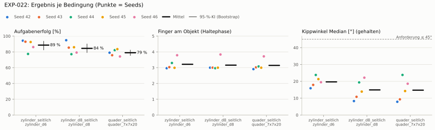
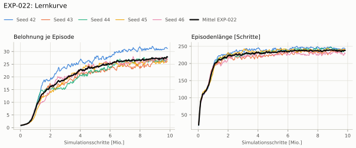
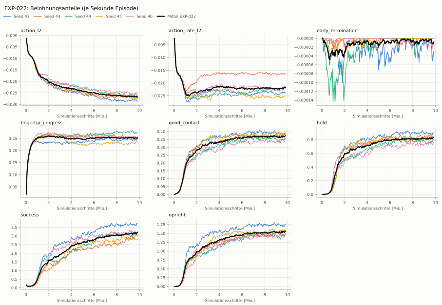
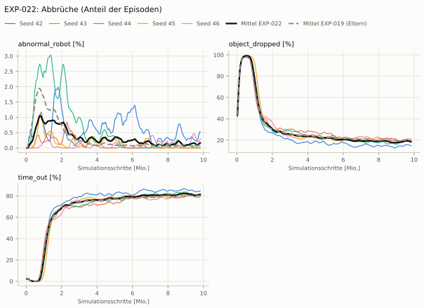
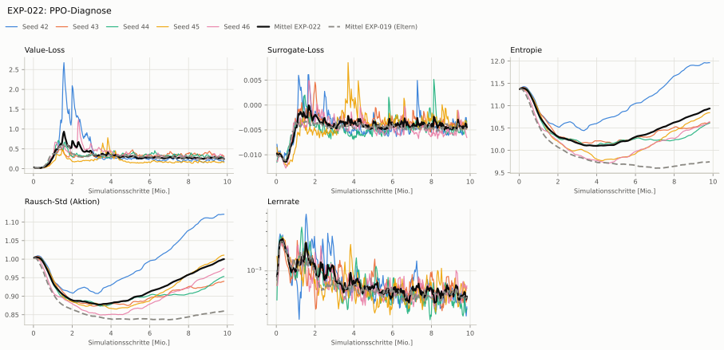

# EXP-022: EXP-019 mit Aktionen auf ±1 begrenzt

**Leistung** 83 % [80–87 %] (erfolgreiche Seeds, IQM über die Objekte; je Objekt Ø 6 cm 92 % · Ø 8 cm 85 % · Quader 79 %) — ggü. EXP-019: P(besser) = 0.62 [0.43–0.79] → kein Unterschied

**Testobjekte** (nie trainiert, erfolgreiche Seeds, Median): Flasche 88 % · Saftpackung 81 % · Cracker (YCB) 84 % · Zucker (YCB) 93 % · Senf (YCB) 83 %

**Zuverlässigkeit** 5/5 Seeds erfolgreich [48–100 %] — EXP-019: 10/10, exakter Fisher-Test p = 1.00 → nicht unterscheidbar (für eine Aussage ≥ 10 Seeds je Experiment)

**Leitplanken** eingehalten

**Befund** Engpass Quader (79 %); Kippwinkel 20° (EXP-019: 29°); Unruhe 0.36 (EXP-019: 1.19)

**Urteilsvorschlag** (auswertung-v2): **kein Unterschied**

**Beste Videos** (Seed 42, 3 Episoden): [Ø 6 cm](beste_videos/EXP-022_zylinder_d6_s42.mp4) · [Ø 8 cm](beste_videos/EXP-022_zylinder_d8_s42.mp4) · [Quader](beste_videos/EXP-022_quader_7x7x20_s42.mp4)

Ergebnisse je Bedingung (eval-v2, Leitplanken, Fehlerarten, Fingernutzung)

#### Bedingung `zylinder_seitlich`

Bedingung `zylinder_seitlich` (Objekt `zylinder_d6`, Kippwinkel ≤ 45°), Protokoll eval-v2, 5 Seed(s); Spalte EXP-019 unter derselben Anforderung

| Metrik | Mittel | 95-%-KI | IQM | Fehlschlag-Seeds (< 50 %) | EXP-019 (Mittel / IQM) |
|---|---|---|---|---|---|
| aufgabenerfolg | 88.6 % | 82.7 % – 93.4 % | 90.7 % | 0.0 % | 84.0 % / 83.7 % |
| haltequote | 90.0 % | 84.8 % – 94.1 % | 92.1 % | 0.0 % | 92.2 % / 93.4 % |
| Kippwinkel Median [°] | 19.7 | | | | 29.3 |
| Unterarm Median [°] | 25.1 | | | | 41.2 |
| Griffkraft Mittel [N] | 104 | | | | 87.9 |
| Kraft > 15 N [Anteil] | 100.0 % | | | | 99.9 % |
| Stall-Anteil [Anteil] | 97.4 % | | | | 99.7 % |
| Absinken [mm] | 0.00968 | | | | 0.0578 |
| Unruhe | 0.356 | | | | 1.19 |
| Unruhe wirksam (Aktion auf ±1 begrenzt) | 0.356 | | | | 0.562 |
| Objektweg Tischebene Ende [mm] | 112 | | | | – |

Fehlerarten: startfehler 0.0 %, gefallen 10.0 %, instabil 0.0 %, anforderung_verletzt 1.4 %

**Urteilsvorschlag: kein messbarer Unterschied** (gegenüber EXP-019)
Unterschied Aufgabenerfolg +4.6 Prozentpunkte (95-%-KI -2.8 … +11.1)

Je Seed: 94.2 %, 92.9 %, 77.4 %, 92.5 %, 86.1 %

Fingernutzung (Haltephase): im Mittel 3.22 Finger am Objekt; Kontaktanteil je Seed (Daumen, Zeige, Mittel, Ring, klein): 100/97/100/0/0 · 98/57/0/99/49 · 92/96/0/92/49 · 100/0/100/90/9 · 94/97/4/90/94

#### Bedingung `zylinder_d8_seitlich`

Bedingung `zylinder_d8_seitlich` (Objekt `zylinder_d8`, Kippwinkel ≤ 45°), Protokoll eval-v2, 5 Seed(s); Spalte EXP-019 unter derselben Anforderung

| Metrik | Mittel | 95-%-KI | IQM | Fehlschlag-Seeds (< 50 %) | EXP-019 (Mittel / IQM) |
|---|---|---|---|---|---|
| aufgabenerfolg | 84.5 % | 79.2 % – 90.0 % | 83.7 % | 0.0 % | 80.9 % / 81.8 % |
| haltequote | 85.7 % | 81.4 % – 90.7 % | 85.1 % | 0.0 % | 85.0 % / 85.8 % |
| Kippwinkel Median [°] | 14.9 | | | | 26 |
| Unterarm Median [°] | 18.8 | | | | 39.3 |
| Griffkraft Mittel [N] | 93.6 | | | | 85.1 |
| Kraft > 15 N [Anteil] | 100.0 % | | | | 99.9 % |
| Stall-Anteil [Anteil] | 97.7 % | | | | 99.8 % |
| Absinken [mm] | 0.00899 | | | | 0.0132 |
| Unruhe | 0.227 | | | | 1.07 |
| Unruhe wirksam (Aktion auf ±1 begrenzt) | 0.227 | | | | 0.484 |
| Objektweg Tischebene Ende [mm] | – | | | | – |

Fehlerarten: startfehler 0.0 %, gefallen 14.3 %, instabil 0.0 %, anforderung_verletzt 1.3 %

**Urteilsvorschlag: kein messbarer Unterschied** (gegenüber EXP-019)
Unterschied Aufgabenerfolg +3.6 Prozentpunkte (95-%-KI -3.4 … +11.2)

Je Seed: 94.8 %, 85.4 %, 77.1 %, 85.9 %, 79.2 %

Fingernutzung (Haltephase): im Mittel 3.16 Finger am Objekt; Kontaktanteil je Seed (Daumen, Zeige, Mittel, Ring, klein): 100/100/100/0/0 · 100/96/1/98/4 · 100/99/0/96/2 · 100/0/100/100/0 · 99/98/0/94/93

#### Bedingung `quader_seitlich`

Bedingung `quader_seitlich` (Objekt `quader_7x7x20`, Kippwinkel ≤ 45°), Protokoll eval-v2, 5 Seed(s); Spalte EXP-019 unter derselben Anforderung

| Metrik | Mittel | 95-%-KI | IQM | Fehlschlag-Seeds (< 50 %) | EXP-019 (Mittel / IQM) |
|---|---|---|---|---|---|
| aufgabenerfolg | 78.9 % | 75.5 % – 82.2 % | 79.0 % | 0.0 % | 75.4 % / 78.4 % |
| haltequote | 79.3 % | 75.8 % – 82.5 % | 79.4 % | 0.0 % | 80.4 % / 80.7 % |
| Kippwinkel Median [°] | 14.8 | | | | 27.7 |
| Unterarm Median [°] | 17.2 | | | | 39.2 |
| Griffkraft Mittel [N] | 87.7 | | | | 76.8 |
| Kraft > 15 N [Anteil] | 99.9 % | | | | 99.9 % |
| Stall-Anteil [Anteil] | 97.6 % | | | | 99.7 % |
| Absinken [mm] | 0 | | | | 0.00317 |
| Unruhe | 0.675 | | | | 1.68 |
| Unruhe wirksam (Aktion auf ±1 begrenzt) | 0.675 | | | | 0.729 |
| Objektweg Tischebene Ende [mm] | – | | | | – |

Fehlerarten: startfehler 0.0 %, gefallen 20.7 %, instabil 0.0 %, anforderung_verletzt 0.3 %

**Urteilsvorschlag: kein messbarer Unterschied** (gegenüber EXP-019)
Unterschied Aufgabenerfolg +3.4 Prozentpunkte (95-%-KI -2.9 … +11.3)

Je Seed: 79.0 %, 75.8 %, 82.2 %, 83.5 %, 74.2 %

Fingernutzung (Haltephase): im Mittel 3.14 Finger am Objekt; Kontaktanteil je Seed (Daumen, Zeige, Mittel, Ring, klein): 100/94/97/0/0 · 100/94/0/100/8 · 99/97/0/98/14 · 100/0/100/100/0 · 88/98/4/86/96

#### Bedingung `flasche_seitlich`

Bedingung `flasche_seitlich` (Objekt `flasche_d7x25`, Kippwinkel ≤ 45°), Protokoll eval-v2, 5 Seed(s); Spalte EXP-019 unter derselben Anforderung

| Metrik | Mittel | 95-%-KI | IQM | Fehlschlag-Seeds (< 50 %) | EXP-019 (Mittel / IQM) |
|---|---|---|---|---|---|
| aufgabenerfolg | 86.4 % | 81.9 % – 90.5 % | 86.8 % | 0.0 % | 81.5 % / 80.2 % |
| haltequote | 89.0 % | 86.4 % – 91.8 % | 88.5 % | 0.0 % | 89.0 % / 88.5 % |
| Kippwinkel Median [°] | 16.6 | | | | 26.2 |
| Unterarm Median [°] | 21.3 | | | | 41.4 |
| Griffkraft Mittel [N] | 98.2 | | | | 85.2 |
| Kraft > 15 N [Anteil] | 100.0 % | | | | 99.9 % |
| Stall-Anteil [Anteil] | 97.6 % | | | | 99.8 % |
| Absinken [mm] | 0.0016 | | | | 0.0295 |
| Unruhe | 0.277 | | | | 1.2 |
| Unruhe wirksam (Aktion auf ±1 begrenzt) | 0.277 | | | | 0.547 |
| Objektweg Tischebene Ende [mm] | – | | | | – |

Fehlerarten: startfehler 0.0 %, gefallen 11.0 %, instabil 0.0 %, anforderung_verletzt 2.6 %

**Urteilsvorschlag: kein messbarer Unterschied** (gegenüber EXP-019)
Unterschied Aufgabenerfolg +4.8 Prozentpunkte (95-%-KI -1.7 … +10.8)

Je Seed: 93.2 %, 89.2 %, 83.2 %, 87.7 %, 78.8 %

Fingernutzung (Haltephase): im Mittel 3.16 Finger am Objekt; Kontaktanteil je Seed (Daumen, Zeige, Mittel, Ring, klein): 100/100/100/0/0 · 99/87/0/99/17 · 99/99/0/97/4 · 100/0/100/99/1 · 98/98/0/91/91

#### Bedingung `saftpackung_seitlich`

Bedingung `saftpackung_seitlich` (Objekt `saftpackung_9x6x19`, Kippwinkel ≤ 45°), Protokoll eval-v2, 5 Seed(s); Spalte EXP-019 unter derselben Anforderung

| Metrik | Mittel | 95-%-KI | IQM | Fehlschlag-Seeds (< 50 %) | EXP-019 (Mittel / IQM) |
|---|---|---|---|---|---|
| aufgabenerfolg | 84.8 % | 78.4 % – 91.3 % | 84.2 % | 0.0 % | 79.3 % / 80.3 % |
| haltequote | 85.0 % | 78.8 % – 91.3 % | 84.3 % | 0.0 % | 85.3 % / 86.3 % |
| Kippwinkel Median [°] | 16.2 | | | | 28.4 |
| Unterarm Median [°] | 18.6 | | | | 42.2 |
| Griffkraft Mittel [N] | 89.3 | | | | 78.8 |
| Kraft > 15 N [Anteil] | 100.0 % | | | | 99.9 % |
| Stall-Anteil [Anteil] | 97.4 % | | | | 99.7 % |
| Absinken [mm] | 0.0138 | | | | 0.0102 |
| Unruhe | 0.644 | | | | 1.64 |
| Unruhe wirksam (Aktion auf ±1 begrenzt) | 0.644 | | | | 0.707 |
| Objektweg Tischebene Ende [mm] | – | | | | – |

Fehlerarten: startfehler 0.0 %, gefallen 15.0 %, instabil 0.0 %, anforderung_verletzt 0.2 %

**Urteilsvorschlag: kein messbarer Unterschied** (gegenüber EXP-019)
Unterschied Aufgabenerfolg +5.4 Prozentpunkte (95-%-KI -2.4 … +13.8)

Je Seed: 91.7 %, 81.3 %, 80.7 %, 94.9 %, 75.2 %

Fingernutzung (Haltephase): im Mittel 3.20 Finger am Objekt; Kontaktanteil je Seed (Daumen, Zeige, Mittel, Ring, klein): 100/100/100/0/0 · 100/93/0/100/9 · 98/100/0/97/43 · 100/0/100/100/0 · 85/100/7/84/83

#### Bedingung `ycb_cracker_seitlich`

Bedingung `ycb_cracker_seitlich` (Objekt `ycb_003_cracker`, Kippwinkel ≤ 45°), Protokoll eval-v2, 5 Seed(s); Spalte EXP-019 unter derselben Anforderung

| Metrik | Mittel | 95-%-KI | IQM | Fehlschlag-Seeds (< 50 %) | EXP-019 (Mittel / IQM) |
|---|---|---|---|---|---|
| aufgabenerfolg | 84.3 % | 80.8 % – 88.4 % | 83.4 % | 0.0 % | 81.4 % / 81.7 % |
| haltequote | 84.4 % | 80.8 % – 88.3 % | 83.4 % | 0.0 % | 81.5 % / 81.8 % |
| Kippwinkel Median [°] | 12.4 | | | | 20.8 |
| Unterarm Median [°] | 15.6 | | | | 38.4 |
| Griffkraft Mittel [N] | 92.4 | | | | 84.1 |
| Kraft > 15 N [Anteil] | 100.0 % | | | | 100.0 % |
| Stall-Anteil [Anteil] | 97.6 % | | | | 99.8 % |
| Absinken [mm] | 1.33 | | | | 1.07 |
| Unruhe | 0.49 | | | | 1.46 |
| Unruhe wirksam (Aktion auf ±1 begrenzt) | 0.49 | | | | 0.61 |
| Objektweg Tischebene Ende [mm] | – | | | | – |

Fehlerarten: startfehler 0.0 %, gefallen 15.6 %, instabil 0.0 %, anforderung_verletzt 0.1 %

**Urteilsvorschlag: kein messbarer Unterschied** (gegenüber EXP-019)
Unterschied Aufgabenerfolg +2.9 Prozentpunkte (95-%-KI -1.3 … +7.5)

Je Seed: 91.8 %, 85.4 %, 84.2 %, 80.2 %, 80.0 %

Fingernutzung (Haltephase): im Mittel 3.18 Finger am Objekt; Kontaktanteil je Seed (Daumen, Zeige, Mittel, Ring, klein): 100/100/100/0/0 · 100/99/0/100/2 · 98/100/0/99/6 · 100/0/100/100/0 · 95/100/0/92/96

#### Bedingung `ycb_zucker_seitlich`

Bedingung `ycb_zucker_seitlich` (Objekt `ycb_004_zucker`, Kippwinkel ≤ 45°), Protokoll eval-v2, 5 Seed(s); Spalte EXP-019 unter derselben Anforderung

| Metrik | Mittel | 95-%-KI | IQM | Fehlschlag-Seeds (< 50 %) | EXP-019 (Mittel / IQM) |
|---|---|---|---|---|---|
| aufgabenerfolg | 88.6 % | 81.7 % – 94.8 % | 90.1 % | 0.0 % | 82.5 % / 83.7 % |
| haltequote | 90.5 % | 85.3 % – 95.6 % | 91.0 % | 0.0 % | 84.0 % / 84.9 % |
| Kippwinkel Median [°] | 20.8 | | | | 23.9 |
| Unterarm Median [°] | 24.1 | | | | 41.1 |
| Griffkraft Mittel [N] | 102 | | | | 85.9 |
| Kraft > 15 N [Anteil] | 99.9 % | | | | 100.0 % |
| Stall-Anteil [Anteil] | 96.8 % | | | | 99.6 % |
| Absinken [mm] | 2.15 | | | | 0.755 |
| Unruhe | 0.406 | | | | 1.24 |
| Unruhe wirksam (Aktion auf ±1 begrenzt) | 0.406 | | | | 0.499 |
| Objektweg Tischebene Ende [mm] | – | | | | – |

Fehlerarten: startfehler 0.0 %, gefallen 9.5 %, instabil 0.0 %, anforderung_verletzt 1.9 %

**Urteilsvorschlag: kein messbarer Unterschied** (gegenüber EXP-019)
Unterschied Aufgabenerfolg +6.1 Prozentpunkte (95-%-KI -3.7 … +16.4)

Je Seed: 96.8 %, 94.0 %, 82.6 %, 92.8 %, 77.0 %

Fingernutzung (Haltephase): im Mittel 3.23 Finger am Objekt; Kontaktanteil je Seed (Daumen, Zeige, Mittel, Ring, klein): 100/100/100/0/0 · 98/77/3/93/65 · 95/100/0/72/72 · 100/0/100/98/1 · 89/99/7/63/82

#### Bedingung `ycb_senf_seitlich`

Bedingung `ycb_senf_seitlich` (Objekt `ycb_006_senf`, Kippwinkel ≤ 45°), Protokoll eval-v2, 5 Seed(s); Spalte EXP-019 unter derselben Anforderung

| Metrik | Mittel | 95-%-KI | IQM | Fehlschlag-Seeds (< 50 %) | EXP-019 (Mittel / IQM) |
|---|---|---|---|---|---|
| aufgabenerfolg | 81.6 % | 72.7 % – 88.4 % | 83.1 % | 0.0 % | 79.4 % / 81.7 % |
| haltequote | 84.8 % | 77.7 % – 90.8 % | 86.1 % | 0.0 % | 81.7 % / 83.6 % |
| Kippwinkel Median [°] | 22.7 | | | | 24.5 |
| Unterarm Median [°] | 19.9 | | | | 40.1 |
| Griffkraft Mittel [N] | 101 | | | | 84.5 |
| Kraft > 15 N [Anteil] | 100.0 % | | | | 100.0 % |
| Stall-Anteil [Anteil] | 97.2 % | | | | 99.7 % |
| Absinken [mm] | 4.91 | | | | 0.68 |
| Unruhe | 0.224 | | | | 1.17 |
| Unruhe wirksam (Aktion auf ±1 begrenzt) | 0.224 | | | | 0.509 |
| Objektweg Tischebene Ende [mm] | – | | | | – |

Fehlerarten: startfehler 0.0 %, gefallen 15.2 %, instabil 0.0 %, anforderung_verletzt 3.2 %

**Urteilsvorschlag: kein messbarer Unterschied** (gegenüber EXP-019)
Unterschied Aufgabenerfolg +2.1 Prozentpunkte (95-%-KI -9.7 … +13.2)

Je Seed: 80.7 %, 93.0 %, 83.2 %, 85.4 %, 65.5 %

Fingernutzung (Haltephase): im Mittel 3.20 Finger am Objekt; Kontaktanteil je Seed (Daumen, Zeige, Mittel, Ring, klein): 100/99/100/0/0 · 100/91/2/96/33 · 99/100/0/89/44 · 100/0/100/99/0 · 99/95/2/76/77

Trainingsverlauf

Seeds dünn, Mittel kräftig, Eltern gestrichelt (nur Abbrüche/PPO — Trainings-Belohnung ist zwischen Experimenten nicht vergleichbar); geglättet, x = Simulationsschritte. Endwerte = Mittel der letzten 10 Iterationen (Belohnungsanteile je Sekunde Episode).

| Größe | Seed 42 | Seed 43 | Seed 44 | Seed 45 | Seed 46 | Mittel |
|---|---|---|---|---|---|---|
| mean_reward | 31.3 | 27.2 | 27.1 | 25.9 | 26.5 | 27.6 |
| action_l2 | -0.0284 | -0.0265 | -0.0261 | -0.0274 | -0.0253 | -0.0267 |
| action_rate_l2 | -0.0237 | -0.0164 | -0.0217 | -0.0254 | -0.0221 | -0.0218 |
| early_termination | -3.38e-05 | 0 | 0 | 0 | -1.06e-05 | -8.87e-06 |
| fingertip_progress | 0.246 | 0.248 | 0.271 | 0.234 | 0.255 | 0.251 |
| good_contact | 0.387 | 0.381 | 0.352 | 0.382 | 0.345 | 0.369 |
| held | 0.891 | 0.845 | 0.789 | 0.84 | 0.753 | 0.824 |
| success | 3.67 | 3.04 | 3.21 | 2.79 | 3.15 | 3.17 |
| upright | 1.72 | 1.56 | 1.46 | 1.56 | 1.44 | 1.55 |
| object_dropped | 15.2 % | 18.6 % | 20.0 % | 19.7 % | 21.1 % | 18.9 % |
| mean_noise_std | 1.12 | 0.939 | 0.952 | 1.01 | 0.972 | 0.999 |

Netz, Training und Konfiguration

Actor [256, 128, 64] (elu), 68808 Parameter, 105 Eingänge (Verlauf 5) · Critic [512, 256, 128] · PPO: Lernrate 0.001, Entropie 0.005, 5 Epochen × 4 Mini-Batches, 32 Schritte/Umgebung · 1024 Umgebungen × 300 Iterationen

Geplante Änderung: Aktionen auf [−1, 1] begrenzt (wie EXP-020) auf EXP-019 (Task HeavyMultiProgressClip-v0: Env HeavyMultiProgress, Agent PibGraspPPORunnerCfg_Clip). Sonst wie EXP-019.

Konfiguration gegenüber EXP-019 (1 Unterschiede):

- `agent.clip_actions: None → 1.0`

