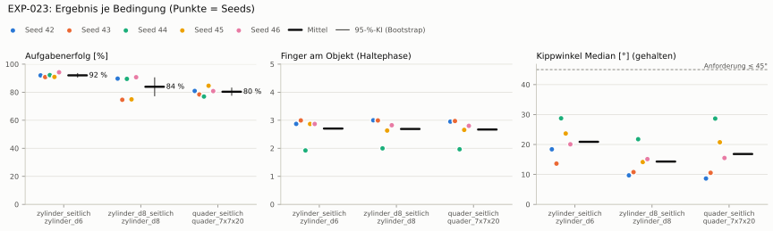
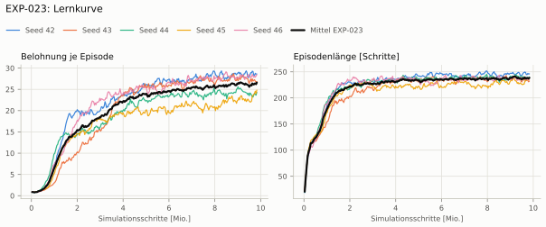
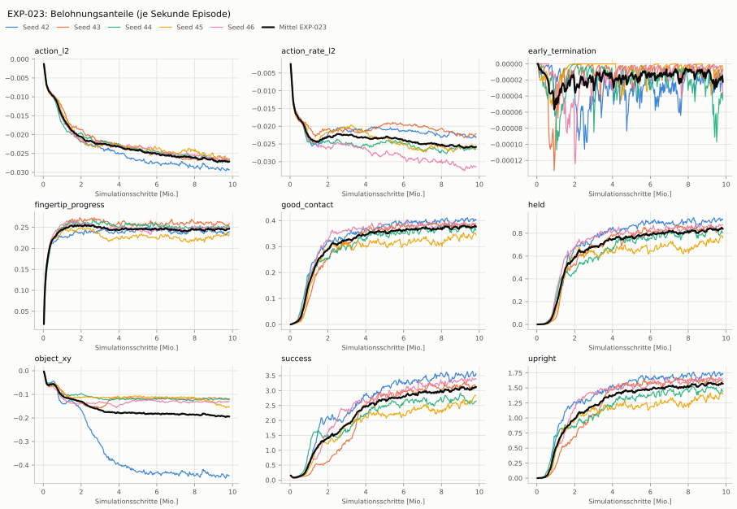
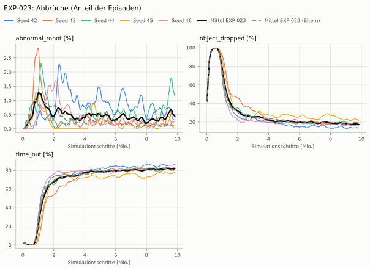
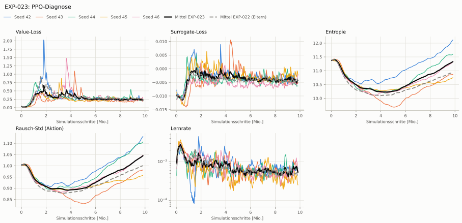

# EXP-023: EXP-022 mit Strafe auf die Verschiebung in der Tischebene

**Leistung** 87 % [83–89 %] (erfolgreiche Seeds, IQM über die Objekte; je Objekt Ø 6 cm 92 % · Ø 8 cm 90 % · Quader 81 %) — ggü. EXP-022: P(besser) = 0.53 [0.31–0.76] → kein Unterschied

**Testobjekte** (nie trainiert, erfolgreiche Seeds, Median): Flasche 86 % · Saftpackung 89 % · Cracker (YCB) 85 % · Zucker (YCB) 87 % · Senf (YCB) 85 %

**Zuverlässigkeit** 5/5 Seeds erfolgreich [48–100 %] — EXP-022: 5/5, exakter Fisher-Test p = 1.00 → nicht unterscheidbar (für eine Aussage ≥ 10 Seeds je Experiment)

**Leitplanken** Unruhe: 1.65 > 0.428; Unruhe wirksam (Aktion auf ±1 begrenzt): 1.65 > 0.428 ✗

**Befund** Engpass Quader (81 %); Unruhe 1.65 (EXP-022: 0.36)

**Urteilsvorschlag** (auswertung-v2): **kein Unterschied, Leitplanke verletzt**

Ergebnisse je Bedingung (eval-v2, Leitplanken, Fehlerarten, Fingernutzung)

#### Bedingung `zylinder_seitlich`

Bedingung `zylinder_seitlich` (Objekt `zylinder_d6`, Kippwinkel ≤ 45°), Protokoll eval-v2, 5 Seed(s); Spalte EXP-022 unter derselben Anforderung

| Metrik | Mittel | 95-%-KI | IQM | Fehlschlag-Seeds (< 50 %) | EXP-022 (Mittel / IQM) |
|---|---|---|---|---|---|
| aufgabenerfolg | 92.0 % | 90.8 % – 93.3 % | 91.7 % | 0.0 % | 88.6 % / 90.7 % |
| haltequote | 93.7 % | 91.8 % – 95.6 % | 93.7 % | 0.0 % | 90.0 % / 92.1 % |
| Kippwinkel Median [°] | 20.9 | | | | 19.7 |
| Unterarm Median [°] | 21.6 | | | | 25.1 |
| Griffkraft Mittel [N] | 80.9 | | | | 104 |
| Kraft > 15 N [Anteil] | 99.3 % | | | | 100.0 % |
| Stall-Anteil [Anteil] | 98.1 % | | | | 97.4 % |
| Absinken [mm] | 0.00388 | | | | 0.00968 |
| Unruhe | 1.65 | | | | 0.356 |
| Unruhe wirksam (Aktion auf ±1 begrenzt) | 1.65 | | | | 0.356 |
| Objektweg Tischebene Ende [mm] | 74.6 | | | | 112 |

Fehlerarten: startfehler 0.0 %, gefallen 6.3 %, instabil 0.0 %, anforderung_verletzt 1.7 %

**Urteilsvorschlag: kein messbarer Unterschied** (gegenüber EXP-022)
Unterschied Aufgabenerfolg +3.4 Prozentpunkte (95-%-KI -2.1 … +10.0)
- Leitplanke: Unruhe: 1.65 > 0.428
- Leitplanke: Unruhe wirksam (Aktion auf ±1 begrenzt): 1.65 > 0.428

Je Seed: 92.0 %, 90.8 %, 92.1 %, 90.9 %, 94.2 %

Fingernutzung (Haltephase): im Mittel 2.70 Finger am Objekt; Kontaktanteil je Seed (Daumen, Zeige, Mittel, Ring, klein): 100/87/100/0/0 · 100/93/0/100/7 · 95/97/0/0/0 · 91/7/100/88/1 · 100/90/84/0/12

#### Bedingung `zylinder_d8_seitlich`

Bedingung `zylinder_d8_seitlich` (Objekt `zylinder_d8`, Kippwinkel ≤ 45°), Protokoll eval-v2, 5 Seed(s); Spalte EXP-022 unter derselben Anforderung

| Metrik | Mittel | 95-%-KI | IQM | Fehlschlag-Seeds (< 50 %) | EXP-022 (Mittel / IQM) |
|---|---|---|---|---|---|
| aufgabenerfolg | 83.9 % | 77.5 % – 90.2 % | 85.2 % | 0.0 % | 84.5 % / 83.7 % |
| haltequote | 84.1 % | 77.5 % – 90.4 % | 85.4 % | 0.0 % | 85.7 % / 85.1 % |
| Kippwinkel Median [°] | 14.3 | | | | 14.9 |
| Unterarm Median [°] | 19.2 | | | | 18.8 |
| Griffkraft Mittel [N] | 73.9 | | | | 93.6 |
| Kraft > 15 N [Anteil] | 100.0 % | | | | 100.0 % |
| Stall-Anteil [Anteil] | 98.2 % | | | | 97.7 % |
| Absinken [mm] | 0.0212 | | | | 0.00899 |
| Unruhe | 1.91 | | | | 0.227 |
| Unruhe wirksam (Aktion auf ±1 begrenzt) | 1.91 | | | | 0.227 |
| Objektweg Tischebene Ende [mm] | 69.8 | | | | – |

Fehlerarten: startfehler 0.0 %, gefallen 15.8 %, instabil 0.1 %, anforderung_verletzt 0.2 %

**Urteilsvorschlag: kein messbarer Unterschied** (gegenüber EXP-022)
Unterschied Aufgabenerfolg -0.5 Prozentpunkte (95-%-KI -9.5 … +8.4)
- Leitplanke: Unruhe: 1.91 > 0.272
- Leitplanke: Unruhe wirksam (Aktion auf ±1 begrenzt): 1.91 > 0.272

Je Seed: 89.7 %, 74.6 %, 89.5 %, 74.9 %, 90.7 %

Fingernutzung (Haltephase): im Mittel 2.69 Finger am Objekt; Kontaktanteil je Seed (Daumen, Zeige, Mittel, Ring, klein): 100/100/100/0/0 · 100/100/0/99/0 · 100/100/0/0/0 · 100/0/100/63/0 · 100/100/82/0/0

#### Bedingung `quader_seitlich`

Bedingung `quader_seitlich` (Objekt `quader_7x7x20`, Kippwinkel ≤ 45°), Protokoll eval-v2, 5 Seed(s); Spalte EXP-022 unter derselben Anforderung

| Metrik | Mittel | 95-%-KI | IQM | Fehlschlag-Seeds (< 50 %) | EXP-022 (Mittel / IQM) |
|---|---|---|---|---|---|
| aufgabenerfolg | 80.3 % | 77.9 % – 82.9 % | 80.1 % | 0.0 % | 78.9 % / 79.0 % |
| haltequote | 80.6 % | 78.4 % – 83.2 % | 80.1 % | 0.0 % | 79.3 % / 79.4 % |
| Kippwinkel Median [°] | 16.8 | | | | 14.8 |
| Unterarm Median [°] | 19.5 | | | | 17.2 |
| Griffkraft Mittel [N] | 73.7 | | | | 87.7 |
| Kraft > 15 N [Anteil] | 99.9 % | | | | 99.9 % |
| Stall-Anteil [Anteil] | 98.2 % | | | | 97.6 % |
| Absinken [mm] | 0.0133 | | | | 0 |
| Unruhe | 2.01 | | | | 0.675 |
| Unruhe wirksam (Aktion auf ±1 begrenzt) | 2.01 | | | | 0.675 |
| Objektweg Tischebene Ende [mm] | 67.7 | | | | – |

Fehlerarten: startfehler 0.0 %, gefallen 19.2 %, instabil 0.2 %, anforderung_verletzt 0.3 %

**Urteilsvorschlag: kein messbarer Unterschied** (gegenüber EXP-022)
Unterschied Aufgabenerfolg +1.4 Prozentpunkte (95-%-KI -2.4 … +4.8)
- Leitplanke: Unruhe: 2.01 > 0.81
- Leitplanke: Unruhe wirksam (Aktion auf ±1 begrenzt): 2.01 > 0.81

Je Seed: 80.9 %, 78.4 %, 76.9 %, 84.6 %, 80.8 %

Fingernutzung (Haltephase): im Mittel 2.67 Finger am Objekt; Kontaktanteil je Seed (Daumen, Zeige, Mittel, Ring, klein): 100/98/98/0/0 · 100/99/0/99/0 · 98/98/0/0/0 · 99/1/100/66/0 · 100/98/82/0/0

#### Bedingung `flasche_seitlich`

Bedingung `flasche_seitlich` (Objekt `flasche_d7x25`, Kippwinkel ≤ 45°), Protokoll eval-v2, 5 Seed(s); Spalte EXP-022 unter derselben Anforderung

| Metrik | Mittel | 95-%-KI | IQM | Fehlschlag-Seeds (< 50 %) | EXP-022 (Mittel / IQM) |
|---|---|---|---|---|---|
| aufgabenerfolg | 77.0 % | 57.3 % – 90.5 % | 84.8 % | 20.0 % | 86.4 % / 86.8 % |
| haltequote | 89.0 % | 83.5 % – 93.6 % | 90.8 % | 0.0 % | 89.0 % / 88.5 % |
| Kippwinkel Median [°] | 21.9 | | | | 16.6 |
| Unterarm Median [°] | 20.3 | | | | 21.3 |
| Griffkraft Mittel [N] | 76.8 | | | | 98.2 |
| Kraft > 15 N [Anteil] | 100.0 % | | | | 100.0 % |
| Stall-Anteil [Anteil] | 98.1 % | | | | 97.6 % |
| Absinken [mm] | 0.0107 | | | | 0.0016 |
| Unruhe | 1.89 | | | | 0.277 |
| Unruhe wirksam (Aktion auf ±1 begrenzt) | 1.89 | | | | 0.277 |
| Objektweg Tischebene Ende [mm] | 72.9 | | | | – |

Fehlerarten: startfehler 0.0 %, gefallen 11.0 %, instabil 0.0 %, anforderung_verletzt 12.0 %

**Urteilsvorschlag: kein messbarer Unterschied** (gegenüber EXP-022)
Unterschied Aufgabenerfolg -9.4 Prozentpunkte (95-%-KI -27.7 … +5.4)
- Leitplanke: Kippwinkel Median [°]: 21.9 > 21.6
- Leitplanke: Unruhe: 1.89 > 0.333
- Leitplanke: Unruhe wirksam (Aktion auf ±1 begrenzt): 1.89 > 0.333

Je Seed: 92.5 %, 85.6 %, 38.1 %, 77.9 %, 90.7 %

Fingernutzung (Haltephase): im Mittel 2.70 Finger am Objekt; Kontaktanteil je Seed (Daumen, Zeige, Mittel, Ring, klein): 100/100/100/0/0 · 100/100/0/99/0 · 100/99/0/0/0 · 100/0/100/71/0 · 100/99/81/0/2

#### Bedingung `saftpackung_seitlich`

Bedingung `saftpackung_seitlich` (Objekt `saftpackung_9x6x19`, Kippwinkel ≤ 45°), Protokoll eval-v2, 5 Seed(s); Spalte EXP-022 unter derselben Anforderung

| Metrik | Mittel | 95-%-KI | IQM | Fehlschlag-Seeds (< 50 %) | EXP-022 (Mittel / IQM) |
|---|---|---|---|---|---|
| aufgabenerfolg | 89.5 % | 87.5 % – 92.0 % | 88.7 % | 0.0 % | 84.8 % / 84.2 % |
| haltequote | 89.8 % | 87.7 % – 92.3 % | 89.3 % | 0.0 % | 85.0 % / 84.3 % |
| Kippwinkel Median [°] | 17.6 | | | | 16.2 |
| Unterarm Median [°] | 19.3 | | | | 18.6 |
| Griffkraft Mittel [N] | 73.8 | | | | 89.3 |
| Kraft > 15 N [Anteil] | 100.0 % | | | | 100.0 % |
| Stall-Anteil [Anteil] | 98.1 % | | | | 97.4 % |
| Absinken [mm] | 0.042 | | | | 0.0138 |
| Unruhe | 1.48 | | | | 0.644 |
| Unruhe wirksam (Aktion auf ±1 begrenzt) | 1.48 | | | | 0.644 |
| Objektweg Tischebene Ende [mm] | 66.6 | | | | – |

Fehlerarten: startfehler 0.0 %, gefallen 10.0 %, instabil 0.2 %, anforderung_verletzt 0.4 %

**Urteilsvorschlag: kein messbarer Unterschied** (gegenüber EXP-022)
Unterschied Aufgabenerfolg +4.7 Prozentpunkte (95-%-KI -0.2 … +9.8)
- Leitplanke: Unruhe: 1.48 > 0.773
- Leitplanke: Unruhe wirksam (Aktion auf ±1 begrenzt): 1.48 > 0.773

Je Seed: 89.2 %, 86.9 %, 88.3 %, 94.3 %, 88.6 %

Fingernutzung (Haltephase): im Mittel 2.76 Finger am Objekt; Kontaktanteil je Seed (Daumen, Zeige, Mittel, Ring, klein): 100/100/100/0/0 · 100/100/0/100/0 · 99/100/0/0/0 · 96/4/100/85/0 · 100/100/89/0/5

#### Bedingung `ycb_cracker_seitlich`

Bedingung `ycb_cracker_seitlich` (Objekt `ycb_003_cracker`, Kippwinkel ≤ 45°), Protokoll eval-v2, 5 Seed(s); Spalte EXP-022 unter derselben Anforderung

| Metrik | Mittel | 95-%-KI | IQM | Fehlschlag-Seeds (< 50 %) | EXP-022 (Mittel / IQM) |
|---|---|---|---|---|---|
| aufgabenerfolg | 83.9 % | 80.2 % – 87.1 % | 84.6 % | 0.0 % | 84.3 % / 83.4 % |
| haltequote | 84.0 % | 80.2 % – 87.4 % | 84.6 % | 0.0 % | 84.4 % / 83.4 % |
| Kippwinkel Median [°] | 12.9 | | | | 12.4 |
| Unterarm Median [°] | 18.2 | | | | 15.6 |
| Griffkraft Mittel [N] | 77 | | | | 92.4 |
| Kraft > 15 N [Anteil] | 100.0 % | | | | 100.0 % |
| Stall-Anteil [Anteil] | 98.2 % | | | | 97.6 % |
| Absinken [mm] | 0.936 | | | | 1.33 |
| Unruhe | 1.37 | | | | 0.49 |
| Unruhe wirksam (Aktion auf ±1 begrenzt) | 1.37 | | | | 0.49 |
| Objektweg Tischebene Ende [mm] | 55.1 | | | | – |

Fehlerarten: startfehler 0.0 %, gefallen 15.9 %, instabil 0.1 %, anforderung_verletzt 0.0 %

**Urteilsvorschlag: kein messbarer Unterschied** (gegenüber EXP-022)
Unterschied Aufgabenerfolg -0.3 Prozentpunkte (95-%-KI -2.9 … +2.5)
- Leitplanke: Unruhe: 1.37 > 0.588
- Leitplanke: Unruhe wirksam (Aktion auf ±1 begrenzt): 1.37 > 0.588

Je Seed: 89.0 %, 84.9 %, 84.2 %, 76.9 %, 84.7 %

Fingernutzung (Haltephase): im Mittel 2.73 Finger am Objekt; Kontaktanteil je Seed (Daumen, Zeige, Mittel, Ring, klein): 100/100/100/0/0 · 100/100/0/100/0 · 100/100/0/0/0 · 100/0/99/71/0 · 100/99/95/0/2

#### Bedingung `ycb_zucker_seitlich`

Bedingung `ycb_zucker_seitlich` (Objekt `ycb_004_zucker`, Kippwinkel ≤ 45°), Protokoll eval-v2, 5 Seed(s); Spalte EXP-022 unter derselben Anforderung

| Metrik | Mittel | 95-%-KI | IQM | Fehlschlag-Seeds (< 50 %) | EXP-022 (Mittel / IQM) |
|---|---|---|---|---|---|
| aufgabenerfolg | 87.1 % | 80.0 % – 93.4 % | 88.2 % | 0.0 % | 88.6 % / 90.1 % |
| haltequote | 87.9 % | 80.9 % – 94.1 % | 89.2 % | 0.0 % | 90.5 % / 91.0 % |
| Kippwinkel Median [°] | 19.7 | | | | 20.8 |
| Unterarm Median [°] | 19.9 | | | | 24.1 |
| Griffkraft Mittel [N] | 77.9 | | | | 102 |
| Kraft > 15 N [Anteil] | 100.0 % | | | | 99.9 % |
| Stall-Anteil [Anteil] | 97.9 % | | | | 96.8 % |
| Absinken [mm] | 1.26 | | | | 2.15 |
| Unruhe | 0.676 | | | | 0.406 |
| Unruhe wirksam (Aktion auf ±1 begrenzt) | 0.676 | | | | 0.406 |
| Objektweg Tischebene Ende [mm] | 67.4 | | | | – |

Fehlerarten: startfehler 0.0 %, gefallen 12.1 %, instabil 0.0 %, anforderung_verletzt 0.8 %

**Urteilsvorschlag: kein messbarer Unterschied** (gegenüber EXP-022)
Unterschied Aufgabenerfolg -1.5 Prozentpunkte (95-%-KI -6.3 … +2.6)
- Leitplanke: Unruhe: 0.676 > 0.487
- Leitplanke: Unruhe wirksam (Aktion auf ±1 begrenzt): 0.676 > 0.487

Je Seed: 95.9 %, 83.4 %, 87.2 %, 94.3 %, 74.8 %

Fingernutzung (Haltephase): im Mittel 2.83 Finger am Objekt; Kontaktanteil je Seed (Daumen, Zeige, Mittel, Ring, klein): 100/87/100/0/6 · 100/99/0/95/6 · 100/96/0/0/6 · 99/0/100/99/0 · 100/100/42/0/80

#### Bedingung `ycb_senf_seitlich`

Bedingung `ycb_senf_seitlich` (Objekt `ycb_006_senf`, Kippwinkel ≤ 45°), Protokoll eval-v2, 5 Seed(s); Spalte EXP-022 unter derselben Anforderung

| Metrik | Mittel | 95-%-KI | IQM | Fehlschlag-Seeds (< 50 %) | EXP-022 (Mittel / IQM) |
|---|---|---|---|---|---|
| aufgabenerfolg | 83.6 % | 77.7 % – 88.0 % | 85.2 % | 0.0 % | 81.6 % / 83.1 % |
| haltequote | 85.7 % | 82.0 % – 89.1 % | 86.5 % | 0.0 % | 84.8 % / 86.1 % |
| Kippwinkel Median [°] | 20.6 | | | | 22.7 |
| Unterarm Median [°] | 19.7 | | | | 19.9 |
| Griffkraft Mittel [N] | 78.7 | | | | 101 |
| Kraft > 15 N [Anteil] | 100.0 % | | | | 100.0 % |
| Stall-Anteil [Anteil] | 98.0 % | | | | 97.2 % |
| Absinken [mm] | 2.14 | | | | 4.91 |
| Unruhe | 0.793 | | | | 0.224 |
| Unruhe wirksam (Aktion auf ±1 begrenzt) | 0.793 | | | | 0.224 |
| Objektweg Tischebene Ende [mm] | 69.2 | | | | – |

Fehlerarten: startfehler 0.0 %, gefallen 14.3 %, instabil 0.0 %, anforderung_verletzt 2.1 %

**Urteilsvorschlag: kein messbarer Unterschied** (gegenüber EXP-022)
Unterschied Aufgabenerfolg +2.1 Prozentpunkte (95-%-KI -3.0 … +6.1)
- Leitplanke: Unruhe: 0.793 > 0.269
- Leitplanke: Unruhe wirksam (Aktion auf ±1 begrenzt): 0.793 > 0.269

Je Seed: 82.8 %, 85.4 %, 87.3 %, 89.4 %, 73.2 %

Fingernutzung (Haltephase): im Mittel 2.83 Finger am Objekt; Kontaktanteil je Seed (Daumen, Zeige, Mittel, Ring, klein): 100/99/100/0/5 · 100/99/0/96/3 · 100/97/0/0/3 · 100/0/100/98/0 · 100/100/62/0/53

Trainingsverlauf

Seeds dünn, Mittel kräftig, Eltern gestrichelt (nur Abbrüche/PPO — Trainings-Belohnung ist zwischen Experimenten nicht vergleichbar); geglättet, x = Simulationsschritte. Endwerte = Mittel der letzten 10 Iterationen (Belohnungsanteile je Sekunde Episode).

| Größe | Seed 42 | Seed 43 | Seed 44 | Seed 45 | Seed 46 | Mittel |
|---|---|---|---|---|---|---|
| mean_reward | 28.9 | 27.2 | 24 | 24.1 | 28.2 | 26.5 |
| action_l2 | -0.0294 | -0.0267 | -0.0269 | -0.0264 | -0.0264 | -0.0272 |
| action_rate_l2 | -0.0231 | -0.0224 | -0.0264 | -0.026 | -0.0313 | -0.0258 |
| early_termination | -1.58e-05 | -1.28e-05 | -3.72e-05 | -8.1e-06 | -1.74e-05 | -1.83e-05 |
| fingertip_progress | 0.236 | 0.257 | 0.251 | 0.234 | 0.25 | 0.245 |
| good_contact | 0.404 | 0.385 | 0.36 | 0.344 | 0.388 | 0.376 |
| held | 0.925 | 0.843 | 0.797 | 0.757 | 0.871 | 0.839 |
| object_xy | -0.448 | -0.12 | -0.119 | -0.154 | -0.131 | -0.194 |
| success | 3.58 | 3.16 | 2.64 | 2.8 | 3.38 | 3.11 |
| upright | 1.74 | 1.62 | 1.43 | 1.39 | 1.65 | 1.57 |
| object_dropped | 13.7 % | 19.3 % | 17.3 % | 22.1 % | 16.8 % | 17.9 % |
| mean_noise_std | 1.12 | 0.98 | 1.1 | 0.956 | 1.04 | 1.04 |

Netz, Training und Konfiguration

Actor [256, 128, 64] (elu), 68808 Parameter, 105 Eingänge (Verlauf 5) · Critic [512, 256, 128] · PPO: Lernrate 0.001, Entropie 0.005, 5 Epochen × 4 Mini-Batches, 32 Schritte/Umgebung · 1024 Umgebungen × 300 Iterationen

Geplante Änderung: Belohnungsterm object_xy = −4 · ‖xy − xy_Start‖ (Objektmitte, Start = Lage bei 0,1 s, gekappt bei 0,2 m), ganze Episode (mdp.object_xy_displacement, Task HeavyMultiProgressClipXY-v0: Env HeavyMultiProgressXY, Agent PibGraspPPORunnerCfg_Clip). Gewicht so, dass 13 cm Ziehen etwa den Gegengriff (0,5/s) aufwiegt; reward_diag mit EXP-022 s42: object_xy −0,35/s vor dem Absenken, −0,59/s in der Haltephase, Gegengriff 0,39/0,49/s. Sonst wie EXP-022.

Konfiguration gegenüber EXP-022 (4 Unterschiede):

- `env.rewards.object_xy.func: ∅ → pib_grasp.mdp:object_xy_displacement`
- `env.rewards.object_xy.params.max_dist: ∅ → 0.2`
- `env.rewards.object_xy.params.ref_s: ∅ → 0.1`
- `env.rewards.object_xy.weight: ∅ → -4.0`

